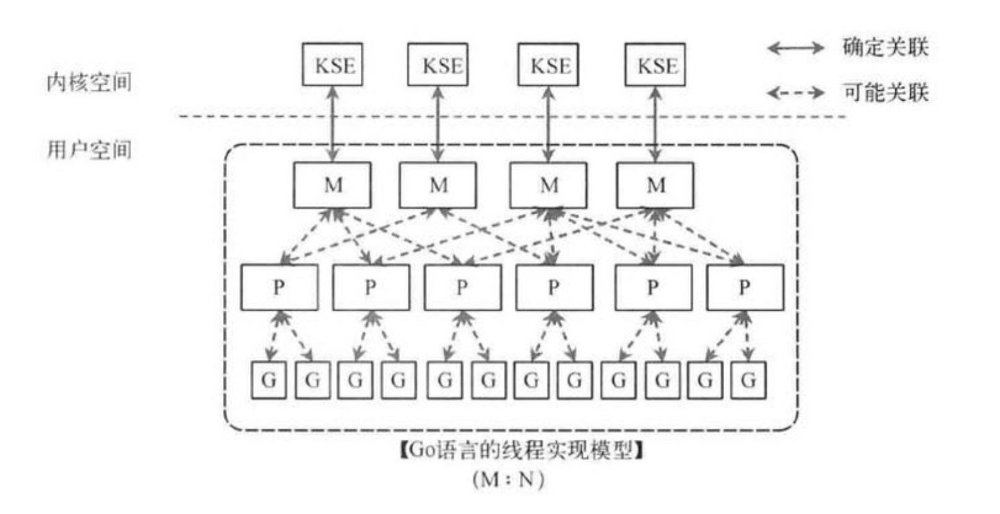
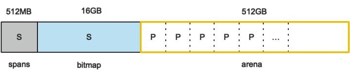

# Go 语言基础学习内容

## Go 语言常用库及功能

|Go语言标准库包名|功能|
|---|---|
|bufio|带缓冲的IO操作|
|bytes|实现字节操作|
|container|封装堆、列表和环形列表等容器|
|crypto|加密算法|
|database|数据库驱动和接口|
|debug|各种调试文件格式访问和调试功能|
|encoding|常见算法如 JSON、XML、Base64 等转换|
|flag|命令行解析|
|fmt|格式化操作|
|go|Go语言的词法、语法树和类型等，可以进行代码信息的提取和修改|
|html|HTML转义及模版系统|
|image|常见图片格式的访问及生成|
|io|提供I/O原始访问接口及访问封装|
|math|数学库|
|net|网络库，支持Socket、HTTP、邮件、RPC、SMTP等|
|os|操作系统平台，不依赖系统封装|
|path|提供各个系统的路径操作实用函数|
|plugin|Go1.7加入的插件系统，支持讲代码编译为插件，可按需加载|
|reflect|语言反射支持，可以动态获取代码中的类型信息，获取和修改变量的值|
|regexp|正则表达式封装|
|runtime|运行时接口|
|sort|排序接口|
|strings|字符串转换、解析及实用函数|
|time|时间接口|
|text|文本模版及Token词法器|

## Go 语言基础语法

### 变量

> **变量的作用域**：局部变量、全局变量、形式参数
> **Go中的所有内存都是被初始化的**：默认都是否定数值
> **变量命名遵循：**： 驼峰法
> **变量的命名：**：标准格式、批量格式、简写模式

### 字符串

> **字符串索引**：
>
> * strings.Index: 正向搜索子字符串
> * strings.LastIndex: 反向搜索子字符串
> * 搜索到起始位置后，可以通过切片偏移操作

|字符串编码|计算长度|遍历
|---|---|---
|ASCII|len()|下标，或for range方式
|Unicode|utf8.RuneCountInString()|for range方式

> **字符串格式化时常用动词及功能**

|动词|功能|
|---|---|
|%v|按值的本来值输出|
|%+v|在 %v 基础上，对结构体字段名和值进行展开|
|%#v|输出 Go 语言语法格式的值|
|%T|输出 Go 语言语法格式的类型和值|
|%%|输出 % 本体|
|%b|整型以二进制方式显示|
|%o|整型以八进制方式显示|
|%d|整型以十进制方式显示|
|%x|整型以十六进制方式显示|
|%X|整型以十六进制、字母大写方式显示|
|%U|Unicode 字符|
|%f|浮点数|
|%p|指针，十六进制方式显示|

#### 字符串和数值类型的相互转换
>
> * string 与 int 类型之间的转换
>   * Itoa()：整型转字符串
>   * Atoi()：字符串转整型
> * Parse 系列函数
>   * ParseBool(): 只能接受：1、0、t、f、T、F、true、false、True、False、TRUE、FALSE，其它的值均返回错误
>   * ParseInt(): 函数用于返回字符串表示的整数值
>   * ParseUint(): 函数的功能类似于 ParseInt() 函数，但 ParseUint() 函数不接受正负号，用于无符号整型
>   * ParseFloat(): 函数用于将一个表示浮点数的字符串转换为 float 类型
> * Format 系列函数
>   * FormatBool() :函数可以一个 bool 类型的值转换为对应的字符串类型
>   * FormatInt() :函数用于将整型数据转换成指定进制并以字符串的形式返回
>   * FormatUint() :函数与 FormatInt() 函数的功能类似，但是参数 i 必须是无符号的 uint64 类型
>   * FormatFloat() :函数用于将浮点数转换为字符串类型
> * Append 系列函数
>   * AppendBool()
>   * AppendFloat()
>   * AppendInt()
>   * AppendUint()
> **数组比较**: 在两个数据类型相同（长度，元素类型都相同的情况） 可以进行比较

### 容器

#### 切片

> * 取出的元素数量为：结束位置 - 开始位置
> * 取出元素不包含结束位置对应的索引，切片最后一个元素使用 slice[len(slice)] 获取；
> * 当缺省开始位置时，表示从连续区域开头到结束位置；
> * 当缺省结束位置时，表示从开始位置到整个连续区域末尾；
> * 两者同时缺省时，与切片本身等效；
> * 两者同时为 0 时，等效于空切片，一般用于切片复位。
>
> **切片内存**
>|切片的定义|写法|内存分配|
>|---|---|---
>|从数组或切片生成新的切片|var newSlice := oldSlice[:]|切片结构指向已经分配好的内存区域,不会分配新内存
>|直接声明新的切片| var newSlice = []int{} |会分配新内存
>|使用 make() 函数构造切片|make([]int, 2, 10)| 直接分配内存
>
> **append** ：为切片添加元素: a = append(a, 1) 或 a = append(a, 1, 2, 3) 或 a = append(a, []int{1,2,3}...) //追加一个切片,切片需要解包
>
> **copy** :切片复制
>
> ```go
> copy( destSlice, srcSlice []T) int
> // 注：copy() 函数的返回值表示实际发生复制的元素个数
> copyDist := make([]int, elementCount)
> copy(copyDist,copySrc)
> ```
>
> **delete**: 切片的删除
>
> ```go
> //从头部删除
> a = a[N:]
> a = append(a[:0], a[N:]...) //不移动 a指针地址
> a = a[:copy(a, a[N:])]  //不移动 a指针地址
> //从尾部删除
> a = a[:len(a)-N] // 删除尾部N个元素
>
> //从中间位置删除
> a = []int{1, 2, 3, ...}
> a = append(a[:i], a[i+1:]...) // 删除中间1个元素
> a = append(a[:i], a[i+N:]...) // 删除中间N个元素
> a = a[:i+copy(a[i:], a[i+1:])] // 删除中间1个元素
> a = a[:i+copy(a[i:], a[i+N:])] // 删除中间N个元素
> //
> ```

### range

> range 返回的是每个元素的副本，而不是直接返回对该元素的引用
>
>`for index, value := range slice { /*do some*/ }`
> `len()` 可以返回切片的长度
> `cap()` 可以返回切片的容量

### map

> **声明**
> `var mapname map[keytype]valuetype`
> `mapname := make(map[keytype]valuetype, cap)`
> `mp2 := make(map[int]*[]int)` // 用切片做map的值
> **删除key**
> `delete(map, key)`
> **利用 map 特性的多键索引及查询**
>
> ```go
> // 查询键
> type queryKey struct {
>     Name string
>     Age  int
> }
> // 创建查询键到数据的映射
> var mapper = make(map[queryKey]*Profile)
> // 构建查询索引
> func buildIndex(list []*Profile) {
>     // 遍历所有数据
>     for _, profile := range list {
>         // 构建查询键
>         key := queryKey{
>             Name: profile.Name,
>             Age:  profile.Age,
>         }
>         // 保存查询键
>         mapper[key] = profile
>     }
> }
> // 根据条件查询数据
> func queryData(name string, age int) {
>     // 根据查询条件构建查询键
>     key := queryKey{name, age}
>     // 根据键值查询数据
>     result, ok := mapper[key]
>     // 找到数据打印出来
>     if ok {
>         fmt.Println(result)
>     } else {
>         fmt.Println("no found")
>     }
> }
> ```
>
> **sync.map** : 提供并发线程安全的map读写
> Store 表示存储，Load 表示获取，Delete 表示删除

### 结构体

#### 方法和接收器

> ```go
> func (接收器变量 接收器类型) 方法名(参数列表) (返回参数) {
>   函数题
> }
> // 指针类型的接收器
> // 修改指针的任意成员变量，方法结束后修改有效
> func (p *Property) SetValue(v int) {
>   // 修改变量的值
>   p.value = v
> }
>
> // 非指针类型接收器
> // 将接收器的值复制一份，由于小对象值复制非常快，在方法结束后，可以返回一个新对象
> func (p Point) Add(other Point) Point {
>   // 成员值运算后返回新的结构
>   return Point{p.X +  other.X, p.Y + other.Y }
> }
>
> ```

## Go runtime

### 协程调度模型

#### PGM模型

* **G**: 即Goroutine, 更轻量级的线程，保存着上下文信息
* **P**: Processor, 是逻辑处理器，把goroutine 绑定逻辑处理器P的本地队列后，才会被调度。Processor提供了相关的执行环境（Context）,如内存分配状态（mcache），任务队列（G）等。
* **M**: 真正的计算资源，系统线程。
* **全局队列（Global Run Queue）**: 未分配Processor的Goroutine保存在全局队列中，Processor或M都可以从全局队列中取出G。
* **本地队列（Local Run Queue）**: 是Processor的队列，当队列为空时，会从全局队列或其他队列中补充Goroutine。
* **sysmon协程**： go runtime 会创建一个sysmon协程，它会定期唤醒检查goroutine和processor，确保goroutine不会长期占用CPU以及Processor可以被执行。


### 垃圾回收（GC）

#### 常用的垃圾回收算法

* **引用计数(reference counting)**: Python 便主要采用的是引用计数的方式，每一个对象都会记录它的引用数，每当有新的引用则值增加，删除则减少，直到引用值为 0 ，则该对象的生命周期结束.
* **标记-清扫(mark & sweep)**: 使用标记清扫算法，未引用的对象并不会立刻被清除，而是被标记. 直到内存耗尽，挂起程序，清扫所有未被引用的对象，然后继续程序. 标记清扫法跟踪了 root 访问的所有对象，它可以有效的处理循环引用. 它有一个问题是需要 STW (stop the world). golang 便是采用的标记-清扫法进行垃圾回收.在 golang 的迭代过程中改进为三色标记清扫法，用来减少 STW 的影响.
* **复制收集(copy and collection)**: 目前许多商业虚拟机都采用这种垃圾回收算法. 它将内存分为两部分，只使用其中一部分，在进行垃圾回收时，将存活的对象复制到另一部分. 然后清理所有第一部分内存使其构成完成一块，从而避免内存碎片.

#### Golang的三色标记法

> golang 的垃圾回收是基于标记清扫算法，这种算法需要进行 STW（stop the world)，这个过程就会导致程序是卡顿的，频繁的 GC 会严重影响程序性能. golang 在此基础上进行了改进，通过三色标记清扫法与写屏障来减少 STW 的时间.

* **三色标记**
  * 所有对象最开始都是白色.
  * 从 root 开始找到所有可达对象，标记为灰色，放入待处理队列。
  * 遍历灰色对象队列，将其引用对象标记为灰色放入待处理队列，自身标记为黑色。
  * 循环步骤3直到灰色队列为空为止，此时所有引用对象都被标记为黑色，所有不可达的对象依然为白色，白色的就是需要进行回收的对象。
  * 

* **写屏障**
  * golang 采用了写屏障，作用就是为了避免这类误清扫问题. 写屏障即在内存写操作前，维护一个约束，从而确保清扫开始前，黑色的对象不能引用白色对象.

#### GC触发的条件

* 当前内存分配达到一定比例则触发
* 2分钟没有触发过GC则触发GC
* 手动触发,调用runtime.GC

### 内存分配

> Tcmalloc(Thread Caching Malloc) 是 google 为 c 语言开发的运行时内存分配算法. 其核心思想是多级管理，从而降低锁的粒度. Go runtime 的内存分配就采用了 Tcmalloc 算法.

#### golang内存分配

* **arena**: 就是堆区，go runtime 在动态分配的内存都在这个区域，并且将内存块分成 8kb 的页，一些组合起来的称为 mspan，成为 go 中内存管理的基本单元，这种连续的页一般是操作系统的内存页几倍大小.
* **bitmap**: 顾名思义，用来标记堆区使用的映射表，它记录了哪些区域保存了对象，对象是否包含指针，以及 GC 的标记信息.
* **spans**: 存放 mspan 的指针，根据 spans 区域的信息可以很容易找到 mspan. 它可以在 GC 时更快速的找到的大块的内存 mspan.
* 


```pdf
./assets/深入浅出GolangRuntime-full.pptx
```
