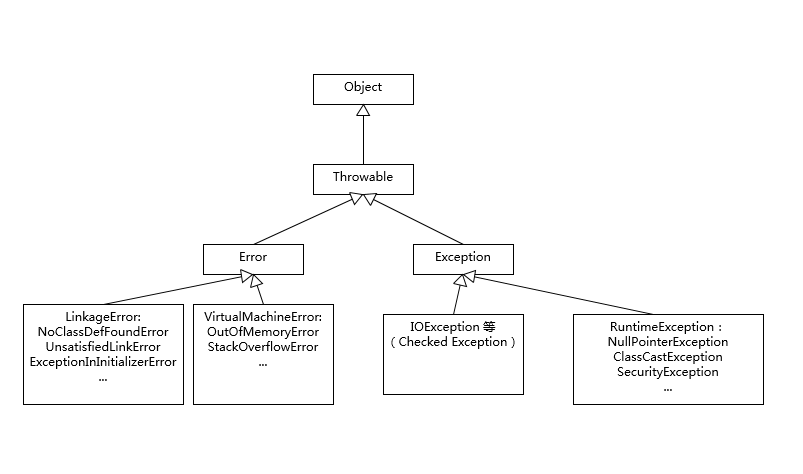

# Java 核心技术36讲

> [极客时间](https://time.geekbang.org/column/article/6845)  

## Java/JVM生态

- Java EE  
- Spring  
- Hadoop  
- Spark  
- Cassandra
- ElasticSearch
- Maven

## Java语言特性

- 面向对象
- 反射
- 泛型

## Java常用类库

- 核心类库：  
  - IO/NIO
  - 网络
  - utils

- 安全类库：

- jdk.management

- 第三方类库

## Java虚拟机

- 垃圾收集
- 运行时
- 动态编译
- 辅助功能

## 工具

- 辅助工具：
  - jlink
  - jar
  - jdeps
- 编译器
  - javac
  - sjavac
- 诊断工具：  
  - jmap
  - jstack
  - jconsole
  - jhsdb
  - jcmd

## Exception 和 Error



```java
1. Exception 是程序正常运行中，可以预料的意外情况，可能并且应该被捕获，进行处理。
2. Error 是正常情况下不会出现的情况，绝大部分Error都会导致程序处理非正常的、不可恢复的状态。既然是非正常情况下，所以不便于也不需要捕获。
```

### 处理原则

  1. 尽量不要捕获类似Exception 这样的通用异常，而是应该捕获特定异常。
  2. 不要生吞（swallow）异常。
  3. 异常打印要制定确定的log收集器。
  4. Throw early
  5. catch late
  6. 追求性能时，谨慎使用try-catch。

- 例如：NoClassDefFoundError 和 ClassNotFoundException 有什么区别
  > NoClassDefFoundError是一个错误(Error)，而ClassNOtFoundException是一个异常，在Java中对于错误和异常的处理是不同的，我们可以从异常中恢复程序但却不应该尝试从错误中恢复程序。
  - ClassNotFoundException的产生原因
  > Java支持使用Class.forName方法来动态地加载类，任意一个类的类名如果被作为参数传递给这个方法都将导致该类被加载到JVM内存中，如果这个类在类路径中没有被找到，那么此时就会在运行时抛出ClassNotFoundException异常。解决该问题需要确保所需的类连同它依赖的包存在于类路径中，常见问题在于类名书写错误。
  - 另外还有一个导致ClassNotFoundException的原因就是：
  > 当一个类已经某个类加载器加载到内存中了，此时另一个类加载器又尝试着动态地从同一个包中加载这个类。通过控制动态类加载过程，可以避免上述情况发生。
  - NoClassDefFoundError产生的原因在于：
  > 如果JVM或者ClassLoader实例尝试加载（可以通过正常的方法调用，也可能是使用new来创建新的对象）类的时候却找不到类的定义。要查找的类在编译的时候是存在的，运行的时候却找不到了。这个时候就会导致NoClassDefFoundError。造成该问题的原因可能是打包过程漏掉了部分类，或者jar包出现损坏或者篡改。解决这个问题的办法是查找那些在开发期间存在于类路径下但在运行期间却不在类路径下的类。

## final、 finally、 finalize的不同

- final

> final修饰class代表不可以继承扩展，final修饰变量代表不可以修改，final修饰方法代表不可以重写。

- finally

> finally是java保证重点代码一定被执行的机制，如try-finally, try-catch-finally关闭JDBC连接。
> java 7 以上更加推荐使用try-with-resource 语句。

```java
static String readFirstLineFromFile(String path) throws IOException {
    try (BufferedReader br = new BufferedReader(new FileReader(path))) {
        return br.readLine();
    }
}
```

- final 不是 immutable

```text
immutable的类实现
- 将class自身声明为final。
- 将所有成员变量声明为private和final，并且不实现setter方法。
- 通常在构建对象时，成员变量使用深度拷贝。
- 如果要实现getter，或者反应内部状态的方法，使用copy-on-write原则，创建私有的copy。
```
