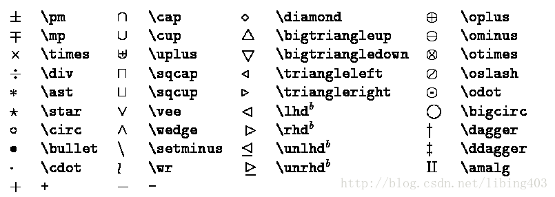
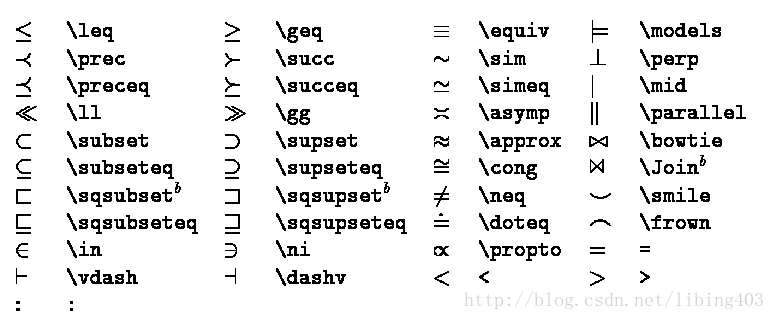
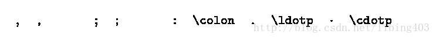
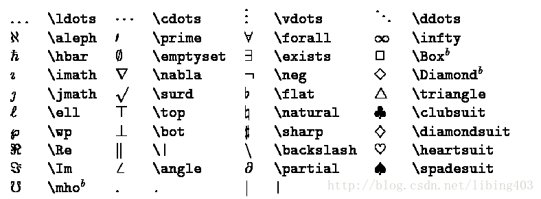
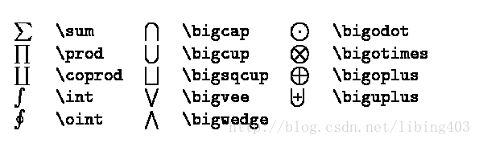
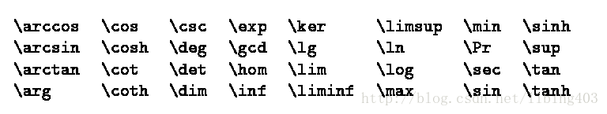
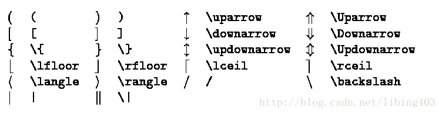
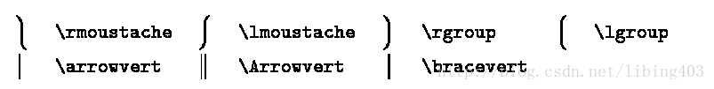
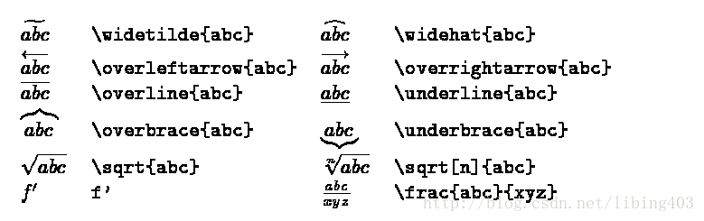

[首页](/)
# 一些简单的markdown 示例

## 一些数学上标

$\vec{a}$  向量  
$\overline{a}$ 平均值  
$\widehat{a}$ (线性回归，直线方程) y尖  
$\widetilde{a}$ 颚化符号  等价无穷小  
$\dot{a}$   一阶导数
$\ddot{a}$  二阶导数

## 常用数学符号和希腊字母

|大写|markdown|小写|markdown|
|---|---|---|---|
|$A$|A|$\alpha$|\alpha|
|$B$|B|$\beta$|\beta|
|$\Gamma$|\Gamma|$\gamma$|\gamma|
|$\Delta$|\Delta|$\delta$|\delta|
|$E$|E|$\epsilon$|\epsilon|
|$\varepsilon$|\varepsilon|||
|$Z$|Z|$\zeta$|\zeta|
|$H$|H|$\eta$|\eta|
|$\Theta$|\Theta|$\theta$|\theta|
|$I$|I|$\iota$|\iota|
|$K$|K|$\kappa$|\kappa|
|$\Lambda$|\Lambda|$\lambda$|\lambda|
|$M$|M|$\mu$|\mu|
|$N$|N|$\nu$|\nu|
|$\Xi$|\Xi|$\xi$|\xi|
|$O$|O|$\omicron$|\omicron|
|$\Pi$|\Pi|$\pi$|\pi|
|$P$|P|$\rho$|\rho|
|$\Sigma$|\Sigma|$\sigma$|\sigma|
|$T$|T|$\tau$|\tau|
|$\Upsilon$|\Upsilon|$\upsilon$|\upsilon|
|$\Phi$|\Phi|$\phi$|\phi|
|$\varphi$|\varphi|||
|$X$|X|$\chi$|\chi|
|$\Psi$|\Psi|$\psi$|\psi|
|$\Omega$|\Omega|$\omega$|\omega|

## 数学运算符号

## 关系运算符号

## 标点符号

## 杂项符号

## 可变大小符号

## 三角函数符号

## 分隔符号

## 大分割符号

## 数学读音符号

## 一些例子

> $J_\alpha(x) = \sum_{m=0}^\infty \frac{(-1)^m}{m! \Gamma (m + \alpha + 1)} {\left({ \frac{x}{2} }\right)}^{2m + \alpha} \text {，行内公式示例}$

$$ J_\alpha(x) = \sum_{m=0}^\infty \frac{(-1)^m}{m! \Gamma (m + \alpha + 1)} {\left({ \frac{x}{2} }\right)}^{2m + \alpha} \text {，独立公式示例} $$

$$ f(n)= \begin{cases} n/2, & \text {if $n$ is even} \\ 3n+1, & \text{if $n$ is odd} \end{cases} $$

$$\sum_{i=1}^n \frac{1}{i^2} \quad and \quad \prod_{i=1}^n \frac{1}{i^2} \quad and \quad \bigcup_{i=1}^{2} R$$

$$ f(x,y,z) = 3y^2z \left( 3+\frac{7x+5}{1+y^2} \right) $$
