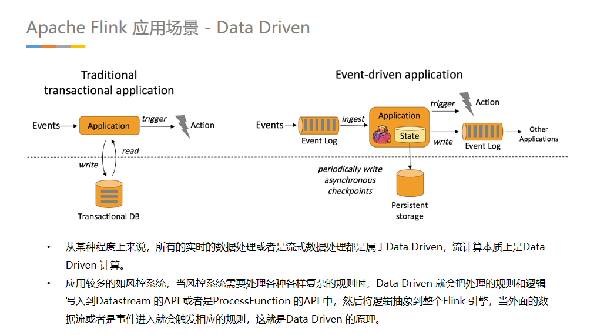

# Flink 入门（一）
>[Apache Flink 入门分享](https://my.oschina.net/dataclub/blog/4760732)

## PPT 内容

> 而阿里是全球第一批使用Flink做大数据计算引擎研发的公司，2015年就引入内部，但最早Flink只能支持小流量互联网场景的数据处理。阿里觉得Flink很有潜力，决定进行改造，并把这个内部版本取名Blink，是英文眨眼的意思：“一眨眼，所有东西都计算好了！😜
> 在2017年双11，Blink就已成功支持全集团（阿里巴巴、阿里云、菜鸟）所有交易数据的实时计算任务，也验证了Flink可以通过改造支持企业大规模数据计算的场景 。
> 目前，国内诸多互联网大厂都已经完全拥抱了Flink。本次的分享就是围绕实时计算Flink和Alibaba Cloud Realtime Compute相关的知识点（能力、限制、典型场景，区别）进行分析。

> 如果用一句话聊聊什么是 Apache Flink 的命脉?
> 那我的答案可能是：Apache Flink 是以"批是流的特例"的认知进行系统设计的。
> 就目前最热的两种流计算引擎 Apache Spark 和 Apache Flink 而言，谁最终会成为No1呢?
> 单从 “低延时” 的角度看，Spark是Micro Batching(微批式)模式，延迟Spark能达到0.5~2秒左右，Flink是Native Streaming(纯流式)模式，延时能达到微秒。
> 很显然是相对较晚出道的 Apache Flink 后来者居上。那么为什么Apache Flink能做到如此之 "快"呢?根本原因是 Apache Flink 设计之初就认为 “批是流的特例”，整个系统是 Native Streaming 设计，每来一条数据都能够触发计算。相对于需要靠时间来积攒数据 Micro Batching 模式来说，在架构上就已经占据了绝对优势。
> 那么为什么关于流计算会有两种计算模式呢?
> 归其根本是因为对流计算的认知不同，是"流是批的特例" 和 “批是流的特例” 两种不同认知产物。

> 首先，我觉得 Flink 应用开发需要先理解 Flink 的 Streams、State、Time 等基础处理语义以及 Flink 兼顾灵活性和方便性的多层次API。

> Streams：流，分为有限数据流与无限数据流，unbounded stream 是有始无终的数据流，即无限数据流；而bounded stream 是限定大小的有始有终的数据集合，即有限数据流，二者的区别在于无限数据流的数据会随时间的推演而持续增加，计算持续进行且不存在结束的状态，相对的有限数据流数据大小固定，计算最终会完成并处于结束的状态。
> 在 Spark 的世界观中，一切都是由批次组成的，离线数据是一个大批次，而实时数据是由一个一个无限的小批次组成的。
> 而在 Flink 的世界观中，一切都是由流组成的，离线数据是有界限的流，实时数据是一个没有界限的流，这就是所谓的有界流和无界流。

> State：状态是计算过程中的数据信息，在容错恢复和 Checkpoint 中有重要的作用，流计算在本质上是Incremental Processing（增量处理），因此需要不断查询保持状态；另外，为了确保Exactly- once 语义，需要数据能够写入到状态中；而持久化存储，能够保证在整个分布式系统运行失败或者挂掉的情况下做到Exactly- once，这是状态的另外一个价值。
> 流式计算分为无状态和有状态两种情况。无状态的计算观察每个独立事件，并根据最后一个事件输出结果。- 例如，流处理应用程序从传感器接收温度读数，并在温度超过 90 度时发出警告。
> 有状态的计算则会基于多个事件输出结果。以下是一些例子：
>
> * 所有类型的窗口。例如，计算过去一小时的平均温度，就是有状态的计算
> * 所有用于复杂事件处理的状态机。例如，若在一分钟内收到两个相差 20 度以上的温度读数，则发出警告，这是有状态的计算
> * 流与流之间的所有关联操作，以及流与静态表或动态表之间的关联操作，都是有状态的计算

> Time，分为Event time、Ingestion time、Processing time，Flink 的无限数据流是一个持续的过程，时间是我们判断业务状态是否滞后，数据处理是否及时的重要依据。

> EventTime，因为我们要根据日志的生成时间进行统计。
>
> * 在不同的语义时间有不同的应用场景
> * 我们往往更关心事件时间 EventTime

> API 通常分为三层，由上而下可分为SQL / Table API、DataStream API、ProcessFunction 三层，API 的表达能力及业务抽象能力都非常强大，但越接近SQL 层，表达能力会逐步减弱，抽象能力会增强，反之，ProcessFunction 层API 的表达能力非常强，可以进行多种灵活方便的操作，但抽象能力也相对越小。
> 实际上，大多数应用并不需要上述的底层抽象，而是针对核心 API（Core APIs） 进行编程，比如 DataStream API（有界或无界流数据）以及 DataSet API（有界数据集）。这些 API 为数据处理提供了通用的构建模块，比如由用户定义的多种形式的转换（transformations），连接（joins），聚合（aggregations），窗口操作（windows）等等。DataSet API 为有界数据集提供了额外的支持，例如循环与迭代。这些 API处理的数据类型以类（classes）的形式由各自的编程语言所表示。

> 第一：Flink 具备统一的框架处理有界和无界两种数据流的能力。
> 第二：部署灵活，Flink 底层支持多种资源调度器，包括 Yarn、Kubernetes 等。Flink 自身带的 Standalone 的调度器，在部署上也十分灵活。
> 第三：极高的可伸缩性，可伸缩性对于分布式系统十分重要，阿里巴巴双 11 大屏采用 Flink 处理海量数据，使用过程中测得 Flink 峰值可达 17 亿 / 秒。
> 第四：极致的流式处理性能。Flink 相对于 Storm 最大的特点是将状态语义完全抽象到框架中，支持本地状态读取，避免了大量网络 IO，可以极大提升状态存取的性能。

> 接下来聊聊 Flink 常见的三种应用场景

> **实时数仓**
> 当下游要构建实时数仓时，上游则可能需要实时的Stream ETL。这个过程会进行实时清洗或扩展数据，清洗完成后写入到下游的实时数仓的整个链路中，可保证数据查询的时效性，形成实时数据采集、实时数据处理以及下游的实时Query。
> **搜索引擎推荐**
> 搜索引擎这块以淘宝为例，当卖家上线新商品时，后台会实时产生消息流，该消息流经过Flink 系统时会进行数据的处理、扩展。然后将处理及扩展后的数据生成实时索引，写入到搜索引擎中。这样当淘宝卖家上线新商品时，能在秒级或者分钟级实现搜索引擎的搜索。

> 移动应用中的用户行为分析
> 消费者技术中的实时数据即席查询

> 实时推荐（例如在客户浏览商家页面的同时进行商品推荐）
> 模式识别或复杂事件处理（例如根据信用卡交易记录进行欺诈识别）
> 异常检测（例如计算机网络入侵检测）

> 如果项链上有很多珠子，大家显然不想从头再数一遍，尤其是当三人的速度不一样却又试图合作的时候，更是如此(比如想记录前一分钟三人一共数了多少颗珠子，回想一下一分钟滚动窗口。
> 于是，我们可以想一个比较好的办法: 在项链上每隔一段就松松地系上一根有色皮筋，将珠子分隔开; 当珠子被拨动的时候，皮筋也可以被拨动; 然后，你安排一个助手，让他在你和朋友拨到皮筋时记录总数。用这种方法，当有人数错时，就不必从头开始数。相反，你向其他人发出错误警示，然后你们都从上一根皮筋处开始重数，助手则会告诉每个人重数时的起始数值。

> 在执行流应用程序期间，Flink会定期保存状态的一致检查点 如果发生故障，Flink将会使用最近的检查点来一致恢复应用程序的状态，并重新启动处理流程遇到故障后
>
> * 第一步就是重新启动
> * 第二步是从 checkpoint 中读取状态，将状态重置 从检查点重新启动应用程序后，其内部状态与检查点完成时的状态完全相同
> * 第三步：开始消费并处理检查点到发生故障之间的所有数据 这种检查点的保存和恢复机制可以为应用程序提供“精确一次”（exactly-once）的一致性，因为所有的算子都会保存检查点并恢复其所有的状态，这样一来所有的输入流就都会被重置到检查点完成时的位置
>
> 一种简单的想法暂停应用，保存状态到检查点，再重新恢复应用
> Flink 的改进实现基于Chandy-Lamport 算法的分布式快照 将检查点的保存和数据处理分离开，不暂停整个应用

> 检查点分界线（Checkpoint Barrier）
>
> * Flink 的检查点算法用到了一种称为分界线（barrier）的特殊形式，用来吧一条流上数据按照不同的检查点分开
> * 分界线之前来的数据导致的状态更改，都会被包含在当前分界线所属的检查点中；而基于分界线之后的数据导致的所有更改，就会被包含在之后的检查点中

> 在以上的基础上，当数据源收到Checkpoint barrier N 之后会先将自己的状态保存，以读取Kafka资料为例，数据源的状态就是目前它在Kafka 分区的位置，这个状态也会写入到上面提到的表格中。
> 下游的Operator 1 会开始运算属于Checkpoint barrier N 的数据，当Checkpoint barrier N 跟着这些数据流动到Operator 1 之后,Operator 1 也将属于Checkpoint barrier N 的所有数据都反映在状态中，当收到Checkpoint barrier N 时也会直接对Checkpoint去做快照。

> 分布式快照可以用来做状态容错，任何一个节点挂掉的时候可以在之前的Checkpoint 中将其恢复。继续以上Process，当多个Checkpoint 同时进行，Checkpoint barrier N 已经流到Job manager 2，Flink job manager 可以触发其他的Checkpoint，比如Checkpoint N + 1，Checkpoint N + 2 等等也同步进行，利用这种机制，可以在不阻挡运算的状况下持续地产生Checkpoint。
>
> * 完整的表格就可以做容错

> 算子状态的作用范围限定为算子任务。这意味着由同一并行任务所处理的所有数据都可以访问到相同的状态，状态对于同一任务而言是共享的。算子状态不能由相同或不同算子的另一个任务访问。键控状态是根据输入数据流中定义的键（key）来维护和访问的。Flink 为每个键值维护一个状态实例，并将具有相同键的所有数据，都分区到同一个算子任务中，这个任务会维护和处理这个 key 对应的状态。
> Flink 为算子状态提供三种基本数据结构 …. Keyed State 支持四种数据类型 …
> MemoryStateBackend  / FsStateBackend / RocksDBStateBackend
> JVM Heap 状态后端会在每一次运算值需要读取状态时，用Java object read / writes 进行读或写，不会产生较大代价，但当Checkpoint 需要将每一个运算值的本地状态放入Distributed Snapshots 的时候，就需要进行序列化。
> 在Runtime 的本地状态后端让使用者去读取状态的时候会经过磁盘，相当于将状态维护在磁盘里，与之对应的代价可能就是每次读取状态时，都需要经过序列化和反序列化的过程。当需要进行快照时只将应用序列化即可，序列化后的数据直接传输到中央的共享DFS 中。

> Flink实际上是用 Watermarks 来实现Event – Time 的功能。
> Watermarks 在Flink 中也属于特殊事件，其精髓在于当某个运算值收到带有时间戳“ T ”的 Watermarks 时就意味着它不会接收到新的数据了。使用Watermarks 的好处在于可以准确预估收到数据的截止时间。
> 举例，假设预期收到数据时间与输出结果时间的时间差延迟5 分钟，那么Flink 中所有的 Windows Operator 搜索3 点至4 点的数据，但因为存在延迟需要再多等5分钟直至收集完4：05 分的数据，此时方能判定4 点钟的资料收集完成了，然后才会产出3 点至4 点的数据结果。这个时间段的结果对应的就是 Watermarks 的部分。
> Watermark 就是触发前一窗口的“关窗时间”，一旦触发关门那么以当前时刻为准在窗口范围内的所有所有数据都会收入窗中。只要没有达到水位那么不管现实中的时间推进了多久都不会触发关窗。

> Savepoint 跟Checkpoint 的差别在于Checkpoint是Flink 对于一个有状态应用在运行中利用分布式快照持续周期性的产生Checkpoint，而Savepoint 则是手动产生的Checkpoint，Savepoint 记录着流式应用中所有运算元的状态。
> Savepoint产生的原理是在Checkpoint barrier 流动到所有的Pipeline 中手动插入从而产生分布式快照，这些分布式快照点即Savepoint。Savepoint 可以放在任何位置保存，当完成变更时，可以直接从Savepoint 恢复、执行。

> 在设计一个低延迟、exactly once、流和批统一的，能够支撑足够大体量的复杂计算的引擎时，Spark Streaming 等的劣势就显现出来。
> Spark Streaming的本质还是一个基于microbatch计算的引擎。这种引擎一个天生的缺点就是每个microbatch的调度开销比较大，当我们要求的延迟越低，额外的开销就越大。这就导致了Spark Streaming实际上不是特别适合于做秒级甚至亚秒级的计算。
> Kafka Streams 是从一个日志系统做起来的，它的设计目标是足够轻量，足够简洁易用。这一点很难满足我们对大体量的复杂计算的需求。
> Storm是一个没有批处理能力的数据流处理器，除此之外Storm只提供了非常底层的API，用户需要自己实现很多复杂的逻辑。

> 简单地说，Blink就是阿里巴巴开发的基于开源Flink的企业版计算引擎。如前面所说，虽然Flink在理论模型和架构方面有很多创新，但是在工程实现上还有不少问题。
> 2015年以来，阿里巴巴团队主要专注于解决Blink的runtime稳定性和scalability的问题。
> 在拥有了稳定的runtime之后，开始专注于增强Blink的易用性 。所以在2016年底到现在，阿里巴巴团队大力开发Blink实时计算SQL，通过SQL作为统一API服务于各种复杂业务。
> 从规范Streaming SQL的语义和标准，到实现UDX、join、aggregation、window等一系列SQL最重要的算子，几乎一手打造了完整的Streaming SQL，并且将这些工作推回了FLink社区，得到Flink社区的认可。

