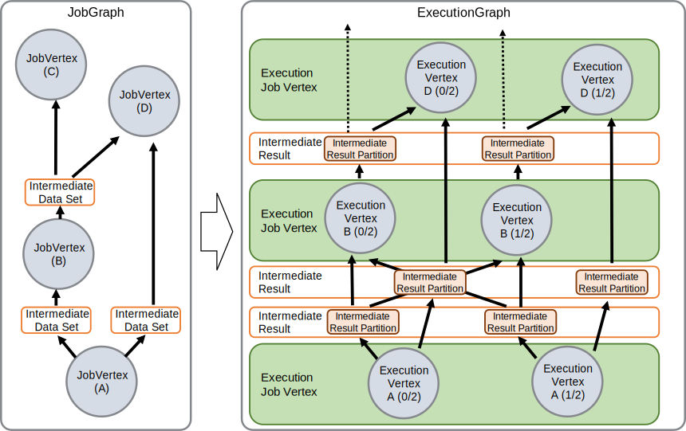
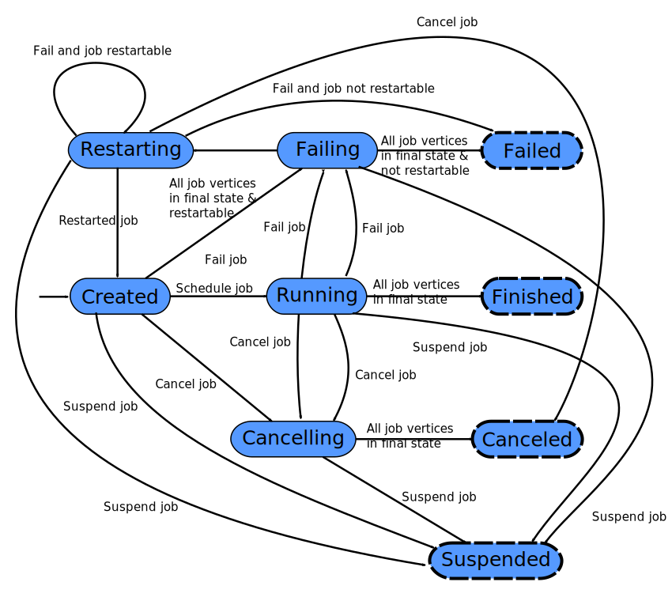
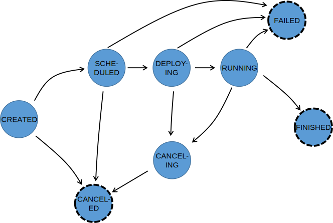
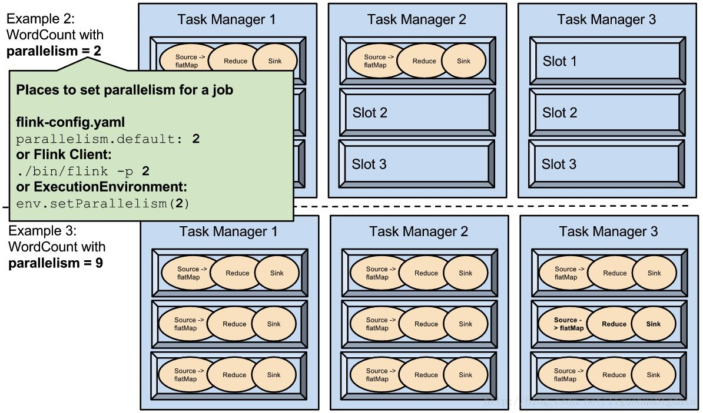

# Flink

## 入门书籍

```pdf
2.组件工具/Flink/assets/零基础入门_Apache_Flink.pdf
```

## 应用场景

[腾讯看点基于 Flink 的实时数仓及多维实时数据分析实践](https://developer.aliyun.com/article/772472)
[Flink 生态：一个案例快速上手 PyFlink](https://developer.aliyun.com/article/750240)

### 事件驱动型应用

> 一类具有状态的应用，它从一个或多个事件流提取数据，并根据到来的事件触发计算、状态更新或其他外部动作。


### 数据分析型应用

> 数据分析任务需要从原始数据中提取有价值的信息和指标


### 数据管道应用

> 提取-转换-加载（ETL）是一种在存储系统之间进行数据转换和迁移的常用方法。数据管道是以持续流模式运行，而非周期性触发。


## Flink 名词汇总

### Flink Application Cluster

> Flink Application Cluster 是一个专用的 Flink Cluster，它仅用于执行单个 Flink Job。Flink Cluster的生命周期与 Flink Job的生命周期绑定在一起。以前，Flink Application Cluster 也称为job mode的 Flink Cluster。和 Flink Session Cluster 作对比。

### Flink Cluster

> 一般情况下，Flink 集群是由一个 Flink Master 和一个或多个 Flink TaskManager 进程组成的分布式系统。

### Event

> Event 是对应用程序建模的域的状态更改的声明。它可以同时为流或批处理应用程序的 input 和 output，也可以单独是 input 或者 output 中的一种。Event 是特殊类型的 Record。

### ExecutionGraph、Physical Graph

> Physical graph 是一个在分布式运行时，把 Logical Graph 转换为可执行的结果。节点是 Task，边表示数据流或数据集的输入/输出关系或 partition。

### Function

> Function 是由用户实现的，并封装了 Flink 程序的应用程序逻辑。大多数 Function 都由相应的 Operator 封装。

### Instance

> Instance 常用于描述运行时的特定类型(通常是 Operator 或者 Function)的一个具体实例。由于 Apache Flink 主要是用 Java 编写的，所以，这与 Java 中的 Instance 或 Object 的定义相对应。在 Apache Flink 的上下文中，parallel instance 也常用于强调同一 Operator 或者 Function 的多个 instance 以并行的方式运行。

### Flink Job

> Flink Job 代表运行时的 Flink 程序。Flink Job 可以提交到长时间运行的 Flink Session Cluster，也可以作为独立的 Flink Application Cluster 启动。

### JobGraph、Logical Graph

> Logical Graph 是一种描述流处理程序的高阶逻辑有向图。节点是Operator，边代表输入/输出关系、数据流和数据集中的之一。

### Flink JobManager

> JobManager 是在 Flink Master 运行中的组件之一。JobManager 负责监督单个作业 Task 的执行。以前，整个 Flink Master 都叫做 JobManager。

### Managed State

> Managed State 描述了已在框架中注册的应用程序的托管状态。对于托管状态，Apache Flink 会负责持久化和重伸缩等事宜。

### Flink Master

> Flink Master 是 Flink Cluster 的主节点。它包含三个不同的组件：Flink Resource Manager、Flink Dispatcher、运行每个 Flink Job 的 Flink JobManager。

### Operator

> Logical Graph 的节点。算子执行某种操作，该操作通常由 Function 执行。Source 和 Sink 是数据输入和数据输出的特殊算子。

### Operator Chain

> 算子链由两个或多个连续的 Operator 组成，两者之间没有任何的重新分区。同一算子链内的算子可以彼此直接传递 record，而无需通过序列化或 Flink 的网络栈。

### Partition

> 分区是整个数据流或数据集的独立子集。通过将每个 Record 分配给一个或多个分区，来把数据流或数据集划分为多个分区。在运行期间，Task 会消费数据流或数据集的分区。改变数据流或数据集分区方式的转换通常称为重分区。

### Record

> Record 是数据集或数据流的组成元素。Operator 和 Function接收 record 作为输入，并将 record 作为输出发出。

### Flink Session Cluster

> 长时间运行的 Flink Cluster，它可以接受多个 Flink Job 的执行。此 Flink Cluster 的生命周期不受任何 Flink Job 生命周期的约束限制。以前，Flink Session Cluster 也称为 session mode 的 Flink Cluster，和 Flink Application Cluster 相对应。

### State Backend

> 对于流处理程序，Flink Job 的 State Backend 决定了其 state 是如何存储在每个 TaskManager 上的（ TaskManager 的 Java 堆栈或嵌入式 RocksDB），以及它在 checkpoint 时的写入位置（ Flink Master 的 Java 堆或者 Filesystem）。

### Sub-Task

> Sub-Task 是负责处理数据流 Partition 的 Task。”Sub-Task”强调的是同一个 Operator 或者 Operator Chain 具有多个并行的 Task 。

### Task

> Task 是 Physical Graph 的节点。它是基本的工作单元，由 Flink 的 runtime 来执行。Task 正好封装了一个 Operator 或者 Operator Chain 的 parallel instance。

### Flink TaskManager

> TaskManager 是 Flink Cluster 的工作进程。Task 被调度到 TaskManager 上执行。TaskManager 相互通信，只为在后续的 Task 之间交换数据。

### Transformation

> Transformation 应用于一个或多个数据流或数据集，并产生一个或多个输出数据流或数据集。Transformation 可能会在每个记录的基础上更改数据流或数据集，但也可以只更改其分区或执行聚合。虽然 Operator 和 Function 是 Flink API 的“物理”部分，但 Transformation 只是一个 API 概念。具体来说，大多数（但不是全部）Transformation 是由某些 Operator 实现的。

## JobManager 的数据结构

### JobGraph & ExecutionGraph



#### Job Status



#### Execution Status



## Event_time

* 事件时间(event time)： 事件产生的时间，记录的是设备生产(或者存储)事件的时间
* 摄取时间(ingestion time)： Flink 读取事件时记录的时间
* 处理时间(processing time)： Flink pipeline 中具体算子处理事件的时间


## DataStream Transformations

|Transformation|Result|Description
|---|---|---
|Map|DataStream --> DataStream|Takes one element and produces one element.
|FlatMap|DataStream --> DataStream|Takes one element and produces zero, one, or more elements.
|Filter|DataStream --> DataStream|Evaluates a boolean function for each element and retains those for which the function returns true
|KeyBy|DataStream --> KeyedStream|Logically partitions a stream into disjoint partitions. All records with the same key are assigned to the same partition. Internally, keyBy() is implemented with hash partitioning.
|Fold|KeyedStream --> DataStream|A "rolling" fold on a keyed data stream with an initial value. Combines the current element with the last folded value and emits the new value.
|Aggregations|KeyedStream --> DataStream|Rolling aggregations on a keyed data stream. The difference between min and minBy is that min returns the minimum value, whereas minBy returns the element that has the minimum value in this field
|Window|KeyedStream --> WindowedSteam|Windows can be defined on already partitioned KeyedStreams. Windows group the data in each key according to some characteristic
|WindowAll|DataStream --> AllWindowedStream|Windows can be defined on regular DataStreams. Windows group all the stream events according to some characteristic
|Window Apply|WindowedStream --> DataStream </br>AllWindowedStream --> DataStream|Applies a general function to the window as a whole.
|Window Reduce|WindowedStream --> DataStream|Applies a functional reduce function to the window and returns the reduced value.
|Window Fold|WindowedStream --> DataStream|Applies a functional fold function to the window and returns the folded value.
|Aggregations on windows|WindowedStream --> DataStream|Aggregates the contents of a window. The difference between min and minBy is that min returns the minimum value, whereas minBy returns the element that has the minimum value in this field
|Union|DataStream*--> DataStream|Union of two or more data streams creating a new stream containing all the elements from all the streams.
|Window Join|DataStream,DataStream --> DataStream|Join two data streams on a given key and a common window.
|Interval Join|KeyedStream,KeyedStream --> DataStream|Join two elements e1 and e2 of two keyed streams with a common key over a given time interval, so that e1.timestamp + lowerBound <= e2.timestamp <= e1.timestamp + upperBound
Window CoGroup|DataStream,DataStream → DataStream|Cogroups two data streams on a given key and a common window.
|Connect|DataStream,DataStream --> ConnectedStream|"Connects" two data streams retaining their types. Connect allowing for shared state between the two streams.
|CoMap, CoFlatMap|ConnectedStreams --> DataStream|Similar to map and flatMap on a connected data stream
|Split|DataStream --> SplitStream|Split the stream into two or more streams according to some criterion.
|Select|SplitStream --> DataStream|Select one or more streams from a split stream.
|Iterate|DataStream --> IterativeStream --> DataStream|Creates a "feedback" loop in the flow, by redirecting the output of one operator to some previous operator. This is especially useful for defining algorithms that continuously update a model.
|Extract Timestamps|DataStream --> DataStream|Extracts timestamps from records in order to work with windows that use event time semantics.
|Project|DataStream --> DataStream|Selects a subset of fields from the tuples

### Physical partitioning

|Transformation|Result|Description
|---|---|---
|Custom partitioning|DataStream --> DataStream|Uses a user-defined Partitioner to select the target task for each element.
|Random partitioning|DataStream --> DataStream|Partitions elements randomly according to a uniform distribution.
|Rebalancing|DataStream --> DataStream|Partitions elements round-robin, creating equal load per partition. Useful for performance optimization in the presence of data skew.
|Rescaling|DataStream --> DataStream|Partitions elements, round-robin, to a subset of downstream operations.
|Broadcasting|DataStream --> DataStream|Broadcasts elements to every partition.

### Task chaining and resource groups

|Transformation|Description|example
|---|---|--
|Start new chain|Begin a new chain, starting with this operator. The two mappers will be chained, and filter will not be chained to the first mapper.|someStream.filter(...).map(...).startNewChain().map(...);
|Disable chaining|Do not chain the map operator|someStream.map(...).disableChaining();
|Set slot sharing group|Set the slot sharing group of an operation. Flink will put operations with the same slot sharing group into the same slot while keeping operations that don't have the slot sharing group in other slots. This can be used to isolate slots. The slot sharing group is inherited from input operations if all input operations are in the same slot sharing group. The name of the default slot sharing group is "default", operations can explicitly be put into this group by calling slotSharingGroup("default").|someStream.filter(...).slotSharingGroup("name");

## flink parallelism & slot



## send&receive data to TaskManager

### Send data

* 变量

```java
final String genre = "Action";

lines.filter((FilterFunction<Tuple3<Long, String, String>>) movie -> {
    String[] genres = movie.f2.split("\\|");

    //使用变量
    return Stream.of(genres).anyMatch(g -> g.equals(genre));
}).print();
```

* 实现Rich函数,并用`withParameters`传递参数

```java
// Configuration 类来存储参数
Configuration configuration = new Configuration();
configuration.setString("genre", "Action");

lines.filter(new FilterGenreWithParameters())
        // 将参数传递给函数
        .withParameters(configuration)
        .print();

// 其他
...

class FilterGenreWithParameters extends RichFilterFunction<Tuple3<Long, String, String>> {

    String genre;

    @Override
    public void open(Configuration parameters) throws Exception {
        //读取配置
        genre = parameters.getString("genre", "");
    }

    @Override
    public boolean filter(Tuple3<Long, String, String> movie) throws Exception {
        String[] genres = movie.f2.split("\\|");

        return Stream.of(genres).anyMatch(g -> g.equals(genre));
    }
}
```

* 使用全局作业参数

```java
    //读取命令行参数
    ParameterTool parameterTool = ParameterTool.fromArgs(args);

    final ExecutionEnvironment env = ExecutionEnvironment.getExecutionEnvironment();
    // 设置全局作业参数
    env.getConfig().setGlobalJobParameters(parameterTool);

    class FilterGenreWithGlobalEnv extends RichFilterFunction<Tuple3<Long, String, String>> {

        @Override
        public boolean filter(Tuple3<Long, String, String> movie) throws Exception {
            String[] genres = movie.f2.split("\\|");
            //获取全局的配置
            ParameterTool parameterTool = (ParameterTool) getRuntimeContext().getExecutionConfig().getGlobalJobParameters();
            //读取配置
            String genre = parameterTool.get("genre");

            return Stream.of(genres).anyMatch(g -> g.equals(genre));
        }
    }
```

* 使用广播变量

```java
DataSet<Integer> toBroadcast = env.fromElements(1, 2, 3);
// 获取要忽略的单词集合
DataSet<String> wordsToIgnore = ...

data.map(new RichFlatMapFunction<String, String>() {

    // 存储要忽略的单词集合. 这将存储在 TaskManager 的内存中
    Collection<String> wordsToIgnore;

    @Override
    public void open(Configuration parameters) throws Exception {
        //读取要忽略的单词的集合
        wordsToIgnore = getRuntimeContext().getBroadcastVariable("wordsToIgnore");
    }

    @Override
    public String map(String line, Collector<String> out) throws Exception {
        String[] words = line.split("\\W+");
        for (String word : words)
            //使用要忽略的单词集合
            if (wordsToIgnore.contains(word))
                out.collect(new Tuple2<>(word, 1));
    }
    //通过广播变量传递数据集
}).withBroadcastSet(wordsToIgnore, "wordsToIgnore");
```

* 读取第三方系统

```java
ExecutionEnvironment env = ExecutionEnvironment.getExecutionEnvironment();

//从 HDFS 注册文件
env.registerCachedFile("hdfs:///path/to/file", "machineLearningModel")

...

class MyClassifier extends RichMapFunction<String, Integer> {

    @Override
    public void open(Configuration config) {
      // 从分布式文件系统中读取
      File machineLearningModel = getRuntimeContext().getDistributedCache().getFile("machineLearningModel");
      ...
    }

    @Override
    public Integer map(String value) throws Exception {
      ...
    }
}

```

* 累加器Accumulator

```java
lines.flatMap(new RichFlatMapFunction<String, Tuple2<String, Integer>>() {

    //创建一个累加器
    private IntCounter linesNum = new IntCounter();

    @Override
    public void open(Configuration parameters) throws Exception {
        //注册一个累加器
        getRuntimeContext().addAccumulator("linesNum", linesNum);
    }

    @Override
    public void flatMap(String line, Collector<Tuple2<String, Integer>> out) throws Exception {
        String[] words = line.split("\\W+");
        for (String word : words) {
            out.collect(new Tuple2<>(word, 1));
        }
        // 处理每一行数据后 linesNum 递增
        linesNum.add(1);
    }
})
.groupBy(0)
.sum(1)
.print();

//获取累加器结果
int linesNum = env.getLastJobExecutionResult().getAccumulatorResult("linesNum");
System.out.println(linesNum);
```

## 为什么flink自己参与状态管理

### 状态管理的优势

* **本地性**:Flink状态是存储在使用它们的机器本地，并且可以以内存访问速度来获取
* **持久性**:Flink状态是容错，例如，它可以按照一定的时间间隔产生checkpoint，并且在任务失败后进行恢复。
* **纵向可扩展性**:Flink状态可以存储在集成的RocksDB实例中，这种方式可以通过增加本地磁盘来扩展空间。
* **横向可扩展性**:Flink状态可以随着集群的扩缩容重新分布。
* **可查询性**:Flink状态可以通过使用[状态查询API](https://ci.apache.org/projects/flink/flink-docs-release-1.12/zh/dev/stream/state/queryable_state.html)从外部进行查询。

## flink任务部署方式

* Flink Session 集群
* Flink Job 集群
* Flink Application 集群

## flink 预设的诸多方法

### flink sources

* File-based:
  * readTextFile(path)
  * readFile(fileInputFormat, path)
  * readFile(fileInputFormat, path, watchType, interval, pathFilter, typeInfo)
* Socket-based:
  * socketTextStream
* Collection-based:
  * fromCollection(Collection)
  * fromCollection(Iterator, Class)
  * fromElements(T ...)
  * fromParallelCollection(SplittableIterator, Class)
  * generateSequence(from, to)
* Custom:
  * addSource

### Data Sinks

* writeAsText() / TextOutputFormat
* writeAsCsv(...) / CsvOutputFormat
* print() / printToErr()
* writeUsingOutputFormat() / FileOutputFormat
* writeToSocket
* addSink

### 用户自定义Function的方式

* 实现接口
* 匿名类
* Java 8 Lambdas
* Rich functions
  * Rich functions 还提供了四个方法：open、close、getRuntimeContext 和 setRuntimeContext。
