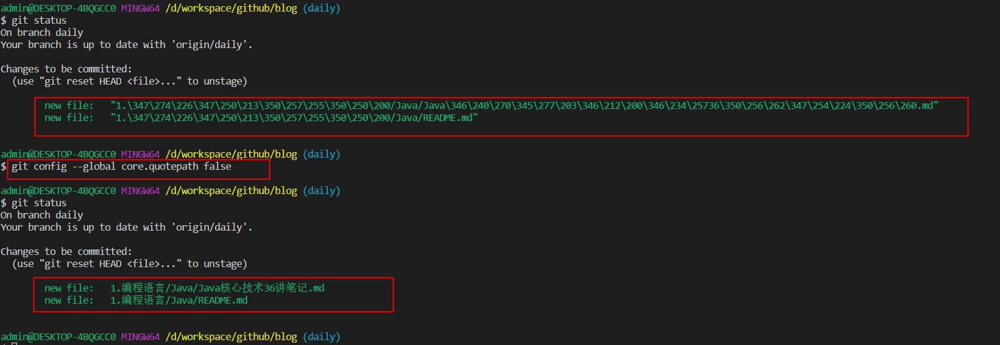

# Git 工具的学习

## git bash 显示中文和解决乱码

- git status 不显示中文问题
  - 症状：在默认设置下，中文文件名在工作区状态输出，中文名不能正确显示，而是显示为八进制的字符编码。
  - 解决：
  - > git config --global core.quotepath false
  - 

- git 中文乱码问题
  - 修改gitconfig配置文件
    - 编辑etc\gitconfig文件，也有些windows系统是存放在C:\Users\Administrator\.gitconfig路径或安装盘符:\Git\mingw64\etc\gitconfig，在文件末尾增加以下内容

```bash
[gui]  
encoding = utf-8  
# 代码库统一使用utf-8  
[i18n]  
    commitencoding = utf-8  
    # log编码  
[svn]  
    pathnameencoding = utf-8  
    # 支持中文路径  
[core]
    quotepath = false
    # status引用路径不再是八进制（反过来说就是允许显示中文了）
```

### git submodule git的子项目管理  

> 有时需要建立一个父项目，来统一管理各个子项目，进行版本兼容性测试，统一发布，统一编排等等。

```bash
git submodule add/status/init/deinit/summary/foreach/sync/

# 添加子模块：
git submodule add URL

# 带有submodule的项目进行本地clone。
git clone URL --recursive

# 更新子模块：
git submodule init/update
git submodule update --init --recursive


# 获取子模块更新：
git submodule foreach git pull

# 删除子模块：
git rm --cached MODULENAME
git -rf MODULENAME
vim .git/config  # 中删除相关的submodule中的MODULENAME信息

```

## git fork后跟踪原始repo的方法

> 有时自己需要fork别人的项目来进行一些定制化开发。一段时间后别人的项目也进行了bug修复和新功能开发，这时就需要跟踪并且合并到自己项目中。

```bash
git remote 命令添加多个远程仓库，然后进行远程仓库的本地化合并。

# 查看远程仓库
git remote -v

# 添加远程仓库URL
git remote add upstreamName URL

# 更新远程仓库信息到本地。
git fetch upstreamName

# 合并远程仓库内容到本地分支。
git checkout master  # 回到想要合并的分支。
git merge upstreamName/master  # 合并更新内容。

# 如果本地仓库和upstreamName仓库是自己fork，并且独立管理的，会出现报错：
# Error: Git refusing to merge unrelated histories
git merge upstreamName/master --allow-unrelated-histories
```
