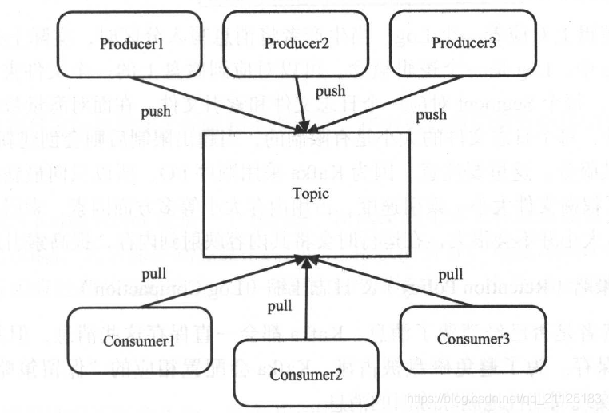
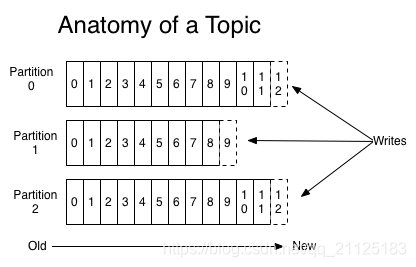
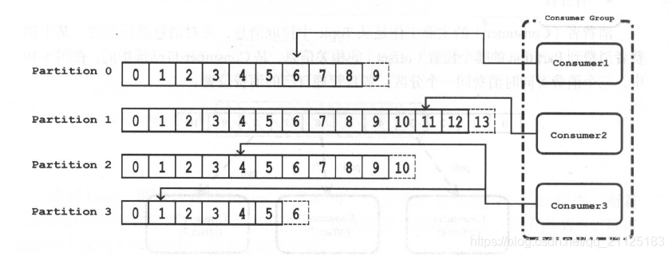
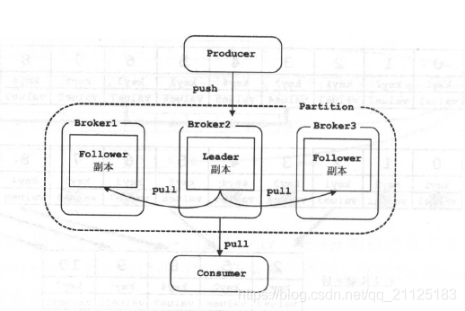
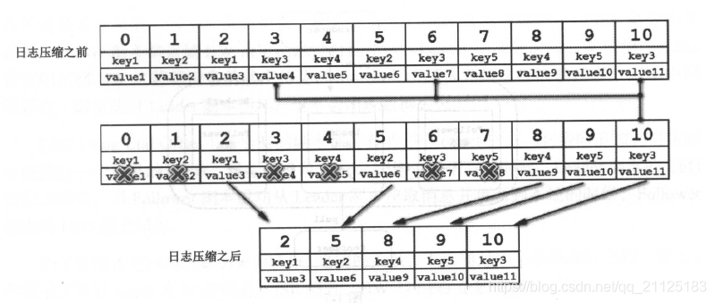
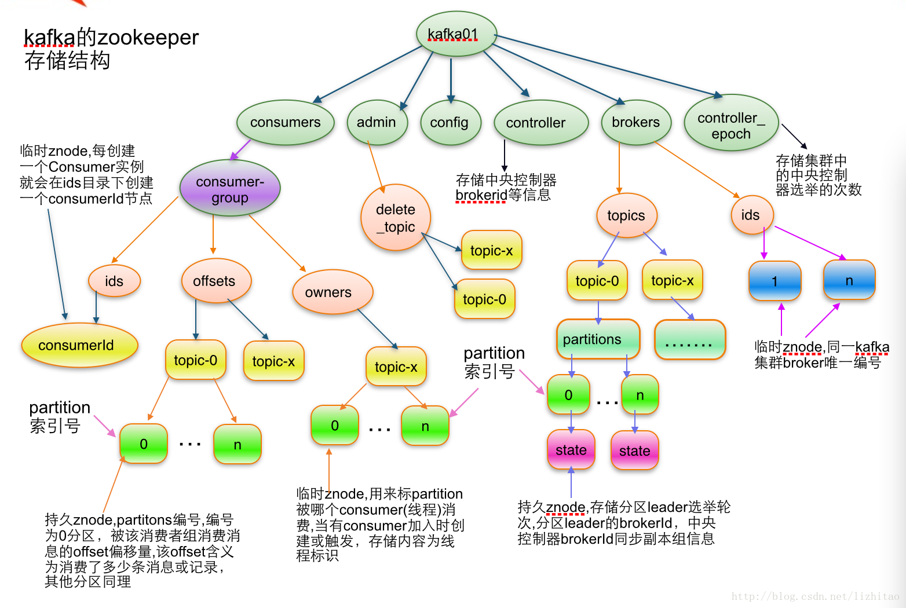
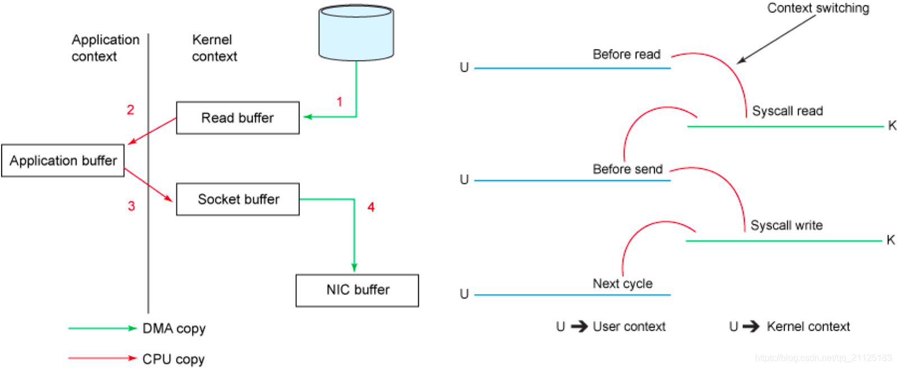
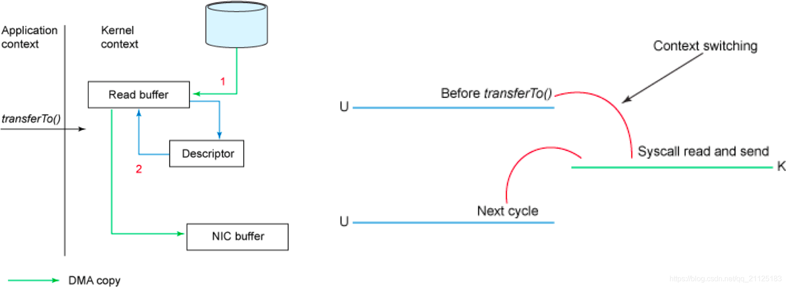

# Kafka核心概念

## 1、消息系统简介

### 1.1 为什么要用消息系统 ？

> **解耦** 各位系统之间通过消息系统这个统一的接口交换数据，无须了解彼此的存在；  
**冗余** 部分消息系统具有消息持久化能力，可规避消息处理前丢失的风险；
**灵活性和消除峰值** 在访问量剧增的情况下，应用仍然需要继续发挥作用，使用消息队列能够使关键组件顶住突发的访问压力，而不会因为突发的超负荷的请求而完全崩溃；（节省资源）  
**可恢复性** 系统中部分组件失效并不会影响整个系统，它恢复后仍然可从消息系统中获取并处理数据；
**顺序保障** 在大多使用场景下，数据处理的顺序都很重要。大部分消息队列本来就是排序的，并且能保证数据会按照特定的顺序来处理。Kafka保证一个Partition内的消息的有序性；  
**异步通信** 在不需要立即处理请求的场景下，可以将请求放入消息系统，合适的时候再处理。

### 1.2 有哪些消息系统 ？

> **RabbitMQ** Erlang编写，支持多协议 AMQP，XMPP，SMTP，STOMP。支持负载均衡、数据持久化。同时支持Peer-to-Peer和发布/订阅模式；  
**Redis** 基于Key-Value对的NoSQL数据库，同时支持MQ功能，可做轻量级队列服务使用。就入队操作而言， Redis对短消息(小于10KB)的性能比RabbitMQ好，长消息的性能比RabbitMQ差；  
**ZeroMQ** 轻量级，不需要单独的消息服务器或中间件，应用程序本身扮演该角色，Peer-to-Peer。它实质上是 一个库，需要开发人员自己组合多种技术，使用复杂度高；  
**ActiveMQ** JMS实现，Peer-to-Peer，支持持久化、XA事务；
**MetaQ/RocketMQ** 纯Java实现，发布/订阅消息系统，支持本地事务和XA分布式事务；  
**Kafka** 高性能跨语言的分布式发布/订阅消息系统，数据持久化，全分布式，同时支持实时在线处理和离线数据处理。Apache Kafka相对于ActiveMQ是一个非常轻量级的消息系统，除了性能非常好之外，还是一个工作良好的分布式系统。

### 1.3 Kafka设计目标是什么？

> **高吞吐率** 在廉价的商用机器上单机可支持每秒100万条消息的读写；  
**消息持久化** 所有消息均被持久化到磁盘，无消息丢失，支持消息重放；  
**完全分布式** Producer，Broker，Consumer均支持水平扩展，同时适应在线流处理和离线批处理。

## 2、Kafka简介和架构

### 2.1 kafka架构

>kafka是生产者生产消息、kafka集群、消费者获取消息这样一种架构，如下图：  


### 2.2 kafka核心概念

#### （1）消息

> 消息是kafka中最基本的数据单元，其ProducerRecord如下所示：

```java
public class ProducerRecord<K, V> {

    private final String topic;
    private final Integer partition;
    private final Headers headers;
    private final K key;
    private final V value;
    private final Long timestamp;
    //略...}12345678910
```

> 其中key/value是producer发送数据时指定，key的主要作用是根据一定的策略，将此消息路由到指定的Partition中，这样可以保证同一key的消息全部写入同一分区中（key可以为null）。

#### （2）Topic & 分区 & Log

> **Topic：** 存储消息的逻辑概念，可以看作是一个消息集合。每个Topic可以有多个生产者向其中push消息，也可以任意多个消费者消费消息。



**Partition：** 每个Topic可以划分成多个分区，同一Topic下的不同分区包含的消息是不同的。一个消息被添加到Topic时，会分配唯一的一个offset，Kafka通过offset保证消息在分区内时顺序的。即：Kafka保证一个分区内的消息是有序的；同一Topic的多个分区的消息，Kafka并不保证其顺序性，如下图：


注：同一Topic的不同分区会分配在不同Broker上，分区是Kafka水平扩展性的基础。

**Log：** 分区在逻辑上对应一个Log，当生产者将消息写入分区时，实际就是写入到对应的Log中。

Log是逻辑概念，对应到磁盘中的一个文件夹。Log是由多个Segment组成的，每个Segment对应一个日志文件和索引文件，注意Segment的大小是由限制的，当超过限制后会产生新的Segment。注意的是：Kafka采取的是顺序磁盘IO，所以只允许向最新的Segment追加数据。索引文件采用稀疏索引的方式，运行时会将其映射到内存，提高索引速度。

#### （3）Broker

一个单独的Kafka server就是一个Broker，主要工作是接收生产者发送的消息，分配offset，之后保存到磁盘中；同时，接收消费者、其他Broker的请求，根据请求类型进行相应处理并返回响应。

#### （4）Producer

主要工作是生产消息，将消息按照一定的规则推送到Topic的分区中。如：根据消息key的Hash值选择分区、或者按序轮询全部分区。

#### （5）Consumer

主要工作是从Topic拉取消息进行消费。某个消费者消费Partition的哪个位置（offset）是由Consumer自己维护的。

这么设计的目的：

* 避免KafkaServer端维护消费者消费位置的开销；
* 防止KafkaSever端出现延迟或者消费状态丢失时，影响大量的Consumer；
* 提高了Consumer的灵活性，Consumer可以修改消费位置对某些消息反复消费。

#### （6）Consumer Group

Kafka中可以让多个Consumer组成一个 Consumer Group（下面简称CG），一个Consumer只能属于一个CG。Kafka保证其订阅的Topic的每个Partition只会分配给此CG的一个消费者进行处理。如果不同CG订阅了同一个Topic，CG之间是不会互相影响的。



CG可以实现 **“独占”和“广播”** 模式的消息处理。

“独占”：即实现一个消息只被一个消费者消费的效果，则将每个Consumer单独放入一个CG中。

“广播”：即实现一个消息被多个消费者消费的效果，则将所有消费者放在一个CG中。

Kafka还通过CG实现了Consumer的水平扩展和故障转移。

“水平扩展”：如上图，当Consumer3能力不足以处理两个分区时，可以向CG添加一个Consumer4，并触发Rebalance重新分配分区与消费者的对应关系，实现水平扩展，是Consumer4对Partition3进行消费。

“故障转移”：若此时，Consumer4宕机了，CG又会重新分配分区，Consumer3将会接管Consumer4的分区。

注意：CG中的消费者数量不是越多越好，当 CG消费者数量 > 分区数量 时，将会造成消费者的浪费。

#### （7）副本

Kafka对消息进行了冗余备份，每个分区可以有多个副本，每个副本包含的消息是一样的。（同一时刻，副本之间其实并不完全一样）

每个分区的副本集合有两种角色：一个leader副本、多个follower副本。kafka在不同的场景下会采用不同的选举策略。所有的读写请求都由选举出的leader提供服务，其他都作为follower副本，如下图所示：



follower副本仅仅只是把leader副本数据拉取到本地后，同步更新到自己的Log中。

一般情况下，同一分区的多个副本是被分到不同Broker上的，这样当leader所在的Broker宕机后，可以重新选举新的leader继续对外提供服务。

#### （8）保留策略 & 日志压缩

无论消费者是否消费过消息，Kafka为了保证磁盘不被占满，会配置相应的“保留策略”，以实现周期性地删除陈旧的消息。

kafka有2种保留策略：

1. 根据消息保留的时间，当消息在kafka中保存的时间超过指定时间，就会被删除；
2. 根据Topic存储的数据大小，当Topic所占日志文件大于一个阈值时，则可以开始删除最旧的消息。

kafka会启动一个后台线程，定期检查是否有可以删除的消息。“保留策略”可以有全局配置，也可以针对某个Topic覆盖全局配置。

“日志压缩”：有些场景下，用户只关心key对应的最新value值，这是就可以开启其日志压缩功能，会启动一个线程，定期将相同key的消息合并，只保留最新的value。如下所示：


#### （9）Cluster & Controller

多个Broker构成一个Cluster（集群）对外提供服务，每个集群会选取一个Broker来担任Controller。

Controller职责：管理分区的状态、管理每个分区的副本状态、监听Zookeeper中数据的变化等工作。

其他Broker：监听Controller Leader的状态。

当Controller出现故障时会重新选取Controller Leader。

#### （10）ISR集合

ISR是In-Sync Replica的缩写，ISR集合表示的是 **目前“可用”（alive）**且 消息量与Leader相差不多的副本集合。ISR集合中的副本必须满足下面两个条件：

1. 副本所在节点必须维持着与zookeeper的连接；
2. 副本最后一条消息的offset 与 leader副本的最后一条消息的offset之间 的差值不能超出指定的阈值。

每个分区的leader副本会维护此分区的ISR集合，会将违反上面两个条件的副本踢出ISR集合外。

#### （11）HW & LEO

HW（HightWatermark，水位线）标记了一个特殊的offset，消费者处理消息的时候，HW之后的消息对于消费者是不可见的。HW也是由leader副本管理的。

Kafka官网将HW之前的消息状态称为“commit”，此时就算leader副本损坏了，也不会造成HW之前的数据丢失。当ISR集合中全部的Follower副本都拉取HW指定消息进行同步后，Leader副本会递增HW。

LEO（Log End Offset）是所有副本都会有的一个offset标记，它指向当前副本的最后一个消息的offset。

现在考虑kafka为什么要这样设计？

在分布式存储中，冗余备份一般有两种方案：同步复制 和 异步复制。

**同步复制：** 要求所有Follower副本全部复制完，这条消息才会被认为提交成功。此时若有一个副本出现故障，会导致HW无法完成递增，消息无法提交，故障的Follower副本就会拖慢系统性能，甚至造成不可用。

**异步复制：** Leader副本收到生产者推送的消息，就会认为消息提交成功。Follower副本异步地从Leader副本中同步消息，这可能会造成Follower副本的消息量总是远远落后于Leader副本。

**Kafka怎么解决的？** kafka权衡了上述两种策略，引入了ISR集合的概念，当Follower副本延迟过高时，Follower副本被踢出ISR集合，使得消息依然能快速被提交。

* 可以通过从ISR集合中踢出高延迟的Follower副本，避免高延迟副本影响集群性能；
* 当Leader副本宕机时，kafka会优先将ISR集合中的Follower副本选举为Leader副本，新副本包含了HW之前的全部消息，从而避免消息丢失。

注意：Follower副本更新消息时采用的是批量写磁盘，加速了磁盘IO，极大减少了Follower与Leader的差距。

## 2.3 zookeeper在kafka的作用

其在Kafka的作用有：

* Broker注册
    Zookeeper上会有一个专门用来进行Broker服务器列表记录的节点：/brokers/ids。每个Broker在启动时，都会到Zookeeper上进行注册，即到/brokers/ids下创建属于自己的节点，如/brokers/ids/\[0…N\]。不同的Broker必须使用不同的Broker ID进行注册，创建完节点后，每个Broker就会将自己的IP地址和端口信息记录到该节点中去。其中，Broker创建的节点类型是临时节点，一旦Broker宕机，则对应的临时节点也会被自动删除。
* Topic注册
    在Kafka中，同一个Topic的消息会被分成多个分区并将其分布在多个Broker上，这些分区信息及与Broker的对应关系也都是由Zookeeper在维护，由专门的节点来记录，如：/borkers/topics。Broker服务器启动后，会到对应Topic节点（/brokers/topics）上注册自己的Broker ID并写入针对该Topic的分区总数，如/brokers/topics/login/3->2，这个节点表示Broker ID为3的一个Broker服务器，对于"login"这个Topic的消息，提供了2个分区进行消息存储，同样，这个分区节点也是临时节点。
* 生产者负载均衡
    由于同一个Topic消息会被分区并将其分布在多个Broker上，因此，生产者需要将消息合理地发送到这些分布式的Broker上，那么如何实现生产者的负载均衡，Kafka支持传统的四层负载均衡，也支持Zookeeper方式实现负载均衡。
    (1) 四层负载均衡，根据生产者的IP地址和端口来为其确定一个相关联的Broker。通常，一个生产者只会对应单个Broker，然后该生产者产生的消息都发往该Broker。这种方式逻辑简单，每个生产者不需要同其他系统建立额外的TCP连接，只需要和Broker维护单个TCP连接即可。但是，其无法做到真正的负载均衡，因为实际系统中的每个生产者产生的消息量及每个Broker的消息存储量都是不一样的，如果有些生产者产生的消息远多于其他生产者的话，那么会导致不同的Broker接收到的消息总数差异巨大，同时，生产者也无法实时感知到Broker的新增和删除。
    (2) 使用Zookeeper进行负载均衡，由于每个Broker启动时，都会完成Broker注册过程，生产者会通过该节点的变化来动态地感知到Broker服务器列表的变更，这样就可以实现动态的负载均衡机制。
* 消费者负载均衡
    与生产者类似，Kafka中的消费者同样需要进行负载均衡来实现多个消费者合理地从对应的Broker服务器上接收消息，每个消费者分组包含若干消费者，每条消息都只会发送给分组中的一个消费者，不同的消费者分组消费自己特定的Topic下面的消息，互不干扰。
* 记录 分区 与 消费者组 的关系
    在Kafka中，规定了每个消息分区 只能被同组的一个消费者进行消费，因此，需要在 Zookeeper 上记录 消息分区 与 Consumer 之间的关系，每个消费者一旦确定了对一个消息分区的消费权力，需要将其Consumer ID 写入到 Zookeeper 对应消息分区的临时节点上，例如：
    /consumers/\[group\_id\]/owners/\[topic\]/\[broker\_id-partition_id\]
    其中，\[broker\_id-partition\_id\]就是一个 消息分区 的标识，节点内容就是该 消息分区 上 消费者的Consumer ID。
* offset的记录
    在消费者对指定消息分区进行消息消费的过程中，需要定时地将分区消息的消费进度Offset记录到Zookeeper上，以便在该消费者进行重启或者其他消费者重新接管该消息分区的消息消费后，能够从之前的进度开始继续进行消息消费。Offset在Zookeeper中由一个专门节点进行记录，其节点路径为:
    /consumers/\[group\_id\]/offsets/\[topic\]/\[broker\_id-partition_id\]
    节点内容就是Offset的值。
* 消费者注册
    消费者服务器在初始化启动时加入消费者分组的步骤如下
    注册到消费者分组。每个消费者服务器启动时，都会到Zookeeper的指定节点下创建一个属于自己的消费者节点，例如/consumers/\[group\_id\]/ids/\[consumer\_id\]，完成节点创建后，消费者就会将自己订阅的Topic信息写入该临时节点。
    对 消费者分组 中的 消费者 的变化注册监听。每个 消费者 都需要关注所属 消费者分组 中其他消费者服务器的变化情况，即对/consumers/\[group_id\]/ids节点注册子节点变化的Watcher监听，一旦发现消费者新增或减少，就触发消费者的负载均衡。
    对Broker服务器变化注册监听。消费者需要对/broker/ids/\[0-N\]中的节点进行监听，如果发现Broker服务器列表发生变化，那么就根据具体情况来决定是否需要进行消费者负载均衡。
    进行消费者负载均衡。为了让同一个Topic下不同分区的消息尽量均衡地被多个 消费者 消费而进行 消费者 与 消息 分区分配的过程，通常，对于一个消费者分组，如果组内的消费者服务器发生变更或Broker服务器发生变更，会发出消费者负载均衡。

Kafka的zookeeper存储结构如下：


### 2.4 kafka高性能的原因

#### （1）高效使用磁盘

* Kafka的整个设计中，Partition相当于一个非常长的数组，而Broker接收到的所有消息顺序写入这个大数组中。同时Consumer通过Offset顺序消费这些数据，并且不删除已经消费的数据，从而避免了随机写磁盘的过程。
* Kafka顺序存写数据，故删除时删除对应的Segment(物理文件，disk)，避免对文件的随机写操作。
* 充分利用了页缓存PageCache。
* 支持多DIsk Drive。Broker的`log.dirs`配置项，允许配置多个文件夹。如果机器上有多个Disk Drive，可将不同的Disk挂载到不同的目录，然后将这些目录都配置到`log.dirs`里。Kafka会尽可能将不同的Partition分配到不同的目录，也即不同的Disk上，从而充分利用了多Disk的优势。

#### （2）零拷贝技术

Kafka中存在大量的网络数据持久化到磁盘（Producer到Broker）和磁盘文件通过网络发送（Broker到Consumer）的过程。这一过程的性能直接影响Kafka的整体吞吐量。对比传统模式的拷贝来看看kafka如何实现零拷贝

传统模式下的四次拷贝与四次上下文切换

以将磁盘文件通过网络发送为例。传统模式下，一般使用如下伪代码所示的方法先将文件数据读入内存，然后通过Socket将内存中的数据发送出去。

```text
buffer = File.read
Socket.send(buffer)12
```

这一过程实际上发生了四次数据拷贝。首先通过系统调用将文件数据读入到内核态Buffer（DMA拷贝），然后应用程序将内存态Buffer数据读入到用户态Buffer（CPU拷贝），接着用户程序通过Socket发送数据时将用户态Buffer数据拷贝到内核态Buffer（CPU拷贝），最后通过DMA拷贝将数据拷贝到NIC Buffer(网卡缓冲)。同时，还伴随着四次上下文切换，如下图所示。


sendfile和transferTo实现零拷贝

Linux 2.4+内核通过`sendfile`系统调用，提供了零拷贝。数据通过DMA拷贝到内核态Buffer后，直接通过DMA(Direct Memory Access，直接内存存取)拷贝到NIC Buffer，无需CPU拷贝。这也是零拷贝这一说法的来源。除了减少数据拷贝外，因为整个读文件-网络发送由一个`sendfile`调用完成，整个过程只有两次上下文切换，因此大大提高了性能。零拷贝过程如下图所示。


从具体实现来看，Kafka的数据传输通过TransportLayer来完成，其子类`PlaintextTransportLayer`通过Java NIO的FileChannel的`transferTo`和`transferFrom`方法实现零拷贝，如下所示。

```java
@Overridepublic long transferFrom(FileChannel fileChannel, long position, long count) throws IOException {
    return fileChannel.transferTo(position, count, socketChannel);}1234
```

注： `transferTo`和`transferFrom`并不保证一定能使用零拷贝。实际上是否能使用零拷贝与操作系统相关，如果操作系统提供`sendfile`这样的零拷贝系统调用，则这两个方法会通过这样的系统调用充分利用零拷贝的优势，否则并不能通过这两个方法本身实现零拷贝。

#### （3）减少网络开销

批处理

批处理是一种常用的用于提高I/O性能的方式。对Kafka而言，批处理既减少了网络传输的Overhead，又提高了写磁盘的效率。

Kafka 0.8.1及以前的Producer区分同步Producer和异步Producer。同步Producer的send方法主要分两种形式。一种是接受一个KeyedMessage作为参数，一次发送一条消息。另一种是接受一批KeyedMessage作为参数，一次性发送多条消息。而对于异步发送而言，无论是使用哪个send方法，实现上都不会立即将消息发送给Broker，而是先存到内部的队列中，直到消息条数达到阈值或者达到指定的Timeout才真正的将消息发送出去，从而实现了消息的批量发送。

Kafka 0.8.2开始支持新的Producer API，将同步Producer和异步Producer结合。虽然从send接口来看，一次只能发送一个ProducerRecord，而不能像之前版本的send方法一样接受消息列表，但是send方法并非立即将消息发送出去，而是通过`batch.size`和`linger.ms`控制实际发送频率，从而实现批量发送。

由于每次网络传输，除了传输消息本身以外，还要传输非常多的网络协议本身的一些内容（称为Overhead），所以将多条消息合并到一起传输，可有效减少网络传输的Overhead，进而提高了传输效率。

数据压缩降低网络负载

Kafka从0.7开始，即支持将数据压缩后再传输给Broker。除了可以将每条消息单独压缩然后传输外，Kafka还支持在批量发送时，将整个Batch的消息一起压缩后传输。数据压缩的一个基本原理是，重复数据越多压缩效果越好。因此将整个Batch的数据一起压缩能更大幅度减小数据量，从而更大程度提高网络传输效率。

Broker接收消息后，并不直接解压缩，而是直接将消息以压缩后的形式持久化到磁盘。Consumer Fetch到数据后再解压缩。因此Kafka的压缩不仅减少了Producer到Broker的网络传输负载，同时也降低了Broker磁盘操作的负载，也降低了Consumer与Broker间的网络传输量，从而极大得提高了传输效率，提高了吞吐量。

#### （4）高效的序列化方式

Kafka消息的Key和Payload（或者说Value）的类型可自定义，只需同时提供相应的序列化器和反序列化器即可。因此用户可以通过使用快速且紧凑的序列化-反序列化方式（如Avro，Protocal Buffer）来减少实际网络传输和磁盘存储的数据规模，从而提高吞吐率。这里要注意，如果使用的序列化方法太慢，即使压缩比非常高，最终的效率也不一定高。
