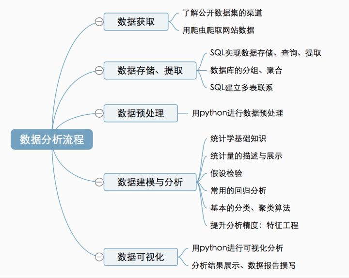
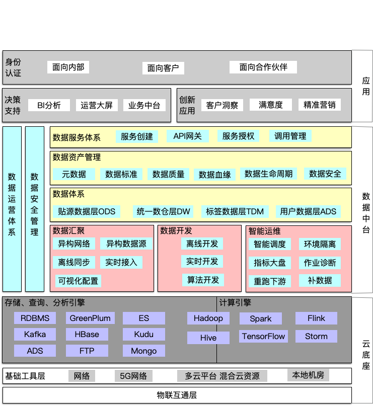

# 关于数据

> 本次分享，给大家一个简单的“数据”全貌。
> 不涉及深入原理，不要纠结名词，要有自己的理解。

## 大纲

- 数据
- 业内最佳实践
- 公司内应用

## 数据理解

### What

> 数据(data)是事实或观察的结果，是对客观事物的逻辑归纳，是用于表示客观事物的未经加工的原始素材。
> 数据可以是连续的值，比如声音、图像，称为模拟数据。也可以是离散的，如符号、文字，称为数字数据。

### Why

> 重要;
> 数据中包含信息，信息是有价值的

### How

1、定义你所关心的数据；
2、数据存储&处理;
3、数据利用;

## 业内实践

### 数据分析

#### 分析师岗位

- 一种类似产品经理

  - 商业分析
  - 数据运营
  - 用户研究
  - 策略分析

- 一种偏向数据挖掘
  - 编程语言基础
  - 算法
  - 数据结构
  - 统计学

> 入门要求：

- SQL（数据库）
- 统计学基础
  - Tableau、Excel
- Python 或者 R 的基础
  - R、Python

#### 举个例子

### 数据挖掘

> 数据挖掘过程的总体目标是从一个数据集中提取信息，并将其转换成可理解的结构，以进一步使用[1]。除了原始分析步骤，它还涉及到数据库和数据管理方面、数据预处理、模型与推断方面考量、兴趣度度量、复杂度的考虑，以及发现结构、可视化及在线更新等后处理[1]。数据挖掘是“数据库知识发现”（Knowledge-Discovery in Databases,KDD）的分析步骤[4] ，本质上属于机器学习的范畴。

#### 数据挖掘工程师

> 对大规模数据进行自动或半自动的分析，以提取过去未知的有价值的潜在信息，例如数据的分组（通过聚类分析）、数据的异常记录（通过异常检测）和数据之间的关系（通过关联式规则挖掘）

- 入门要求：
  - 熟悉 Hadoop 生态圈
  - 常见的数据挖掘算法

#### 数据中台

参考：[数据中台](https://miaowenting.site/2020/03/24/%E5%85%B3%E4%BA%8E%E6%95%B0%E6%8D%AE%E4%B8%AD%E5%8F%B0%E7%9A%84%E6%80%9D%E8%80%83%E4%B8%8E%E6%80%BB%E7%BB%93/)

### 人工智能

> 人工智能是计算机科学的一个分支，它企图了解智能的实质，并生产出一种新的能以人类智能相似的方式做出反应的智能机器，该领域的研究包括机器人、语言识别、图像识别、自然语言处理和专家系统等。

#### 领域

- 自然语言生成(Natural Language Generation)
- 语音识别(Speech Recognition)
- 虚拟助理(Virtual Agents)
- 机器学习平台(Machine Learning Platforms)
- 人工智能硬件优化(AI-optimized Hardware)
- 决策管理(Decision Management)
- 深度学习平台(Deep Learning Platforms)
- 生物信息(Biometrics)
- 机器处理自动化(Robotic Processes Automation)
- 文本分析和自然语言处理(Text Analytics and Natural Language Processing)
- 数字孪生/AI 建模(Digital Twin/AI Modeling)
- 网络防御(Cyber Defense)
- 合规( Compliance)
- 知识工作辅助(Knowledge Worker Aid)
- 内容创作(Content Creation)
- P2P 网络( Peer-to-Peer Networks)
- 情绪识别(Emotion Recognition)
- 图像识别( Image Recognition)

#### 常见的应用

- 分类&识别：
  - 机器视觉，指纹识别，人脸识别，视网膜识别，虹膜识别，掌纹识别，
- 知识图谱：
  - 专家系统，智能搜索，
- 推理：
  - 自动规划，定理证明，博弈，
- 其他：
  - 自动程序设计，智能控制，机器人学，语言和图像理解，遗传编程等。

#### 入门基础

[人工智能基础](../人工智能基础.md)

## 公司内应用

###
