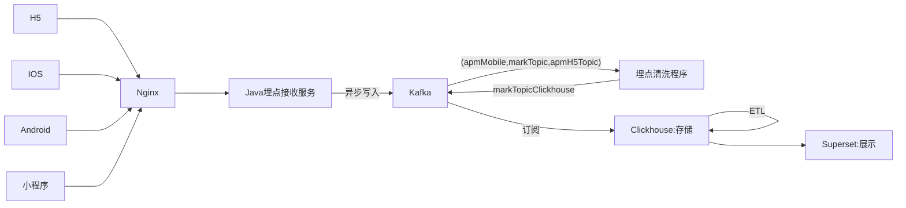
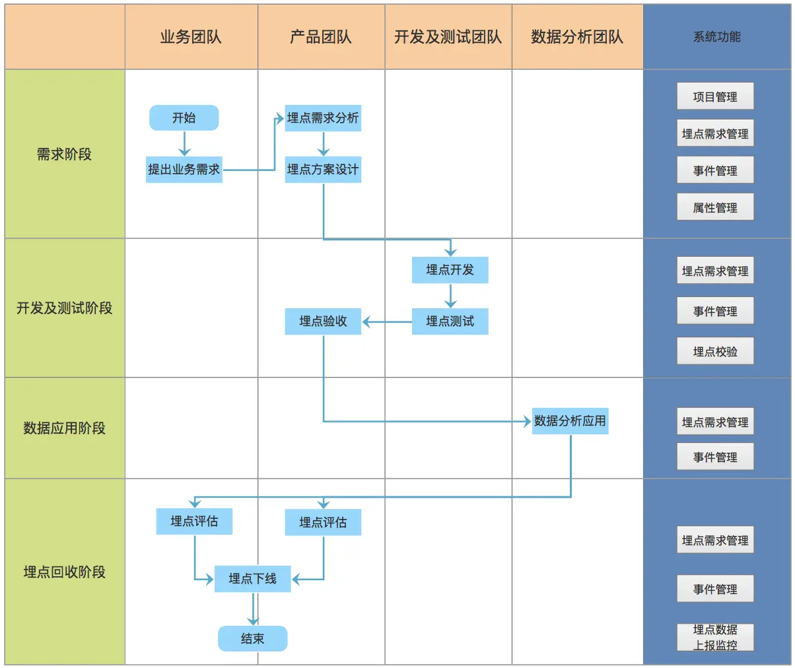
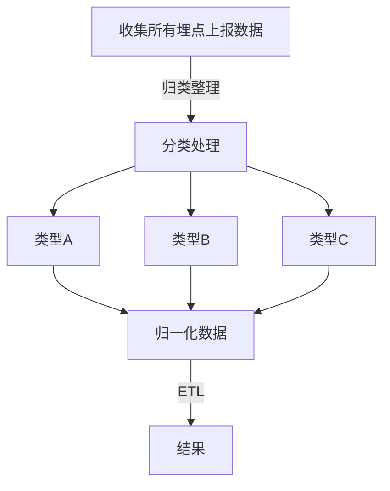
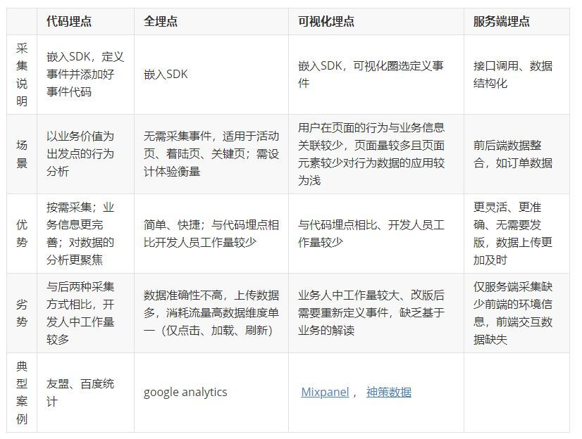

# 埋点系统

## 了解埋点系统

>解决什么问题

* 产品: 产品的运行情况  
* 运营: 用户行为及业务情况  
* 研发: 用户端运行状态（后端APM一起）  
* 数据: 用户画像有力的支持数据  

>什么样埋点系统更好  

|想法|成本|
|---|---|  
|采集数据越多越好|---|
|存储数据越大越好|---|
|配置速度越快越好|---|
|处理速度越快越好|---|
|分析越精确越好|---|

## 埋点系统架构图



## 埋点建设

正向建设


逆向建设



## 埋点系统建设

[埋点系统概述](https://zhuanlan.zhihu.com/p/353575619)  
[埋点系列-采集SDK架构与原理](https://zhuanlan.zhihu.com/p/355536700)  

部分代码实现:

```javascript
//  监听多页面用户停留时长

let stopTime
window.onpageshow = ()=>{
  stopTime = new Date().getTime()
}
window.onpagehide = ()=>{
  stopTime = new Date().getTime() - stopTime
  localStorage.setItem(window.location.href+'stopTime', stopTime)
}

// 监听单页面用户停留时长
// 也可放在路由拦截中做
let stopTime
window.addEventListener('onload',(e)=>{
  stopTime = new Date().getTime()
})
window.addEventListener('popstate',()=>{
  let t = new Date().getTime() - stopTime
  stopTime = new Date().getTime()
  localStorage.setItem(window.location.href+'stopTime', stopTime)
})

// 监听请求响应时长

// 这部分代码应该在全局封装的Ajax中做，或者在前端框架里的http请求与相应拦截中做

let requestTime
// 请求拦截
myAjax.request.use(config => {
   ...
   requestTime = new Date().getTime()
   localStorage.setItem(res.url, JSON.stringify([{"startTime":requestTime,"endTime":0}]))
   ...
}, error => {
   ...
   return Promise.reject(error)
})

// 响应拦截
myAjax.response.use(res => {
   ...
   let data = JSON.parse(localStorage.getItem(res.url))
   let obj = data.requestTime.find(e=>e.startTime === requestTime)
   obj.endTime = new Date().getTime()
   localStorage.setItem(res.url+requestRandom, JSON.stringify(data))
   ...
}, error => {
   ...
   return Promise.reject(error)
})

```

[埋点系列-如何准确标识用户](https://zhuanlan.zhihu.com/p/365465349)  
[埋点系列-埋点数据质量如何保障](https://mp.weixin.qq.com/s/wGrCJ9p7ZHRPFc5psBwAJA)  
[埋点系列-埋点管理系统](https://www.jianshu.com/p/0d890810a1e6)  
[埋点系列-埋点测试功能](https://www.jianshu.com/p/8be8f271c682)  
[埋点系列-数据埋点的分析意义](.)

1.分析运营机制的合理性
>2.如移动 APP 上大多都有用户分享的功能，一般的营销手段是通过老拉新的方式，运营设定一些奖励机制，用来提高 APP 的注册量。
>3.提前在用户分享键返回后台重新进入购买页面埋点，就能记录到页面的访问次数和转化率，用于分析奖励机制对用户的刺激性，指导策略方向。

4.分析产品功能的合理性
>5.如产品设计了新功能想提高下用户的满意度。提前在新功能的各个按钮上进行埋点，就能获取到用户使用新功能的次数，以及在新功能的使用行为，可以分析用户是否对新功能比较感兴趣，页面的跳转设置是否合理等。

6.分析用户消费行为，挖掘流失点
>7.如老板问你为什么最近收益这么少。在用户消费的核心页面和按钮进行埋点，就能记录到每个流程的转化率，用于分析用户漏斗的哪一个阶段出现了问题，结合业务输出解决方案。

8.监控产品的流畅性
>9.如产品刚上线阶段，需要监控用户使用过程中，各个页面或按钮响应的流畅性是否存在问题。提前在核心功能页面和按钮进行埋点，就能记录到每个页面和按钮的衔接情况，发现问题及时解决，以免影响用户体验。

10.分析不同渠道的用户行为差异
>11.如市场推广常常需要分析不同渠道的用户转化情况，以便减少推广成本。提前在各个渠道进行埋点，记录各渠道用户在 APP 中的后续行为，调整推广策略。  
