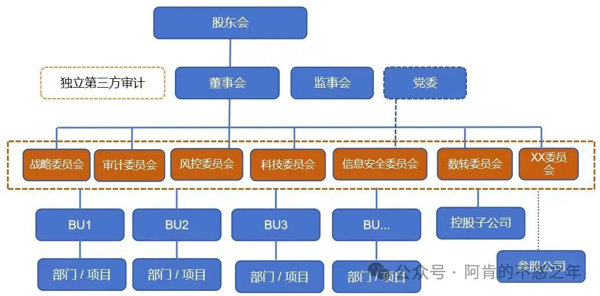
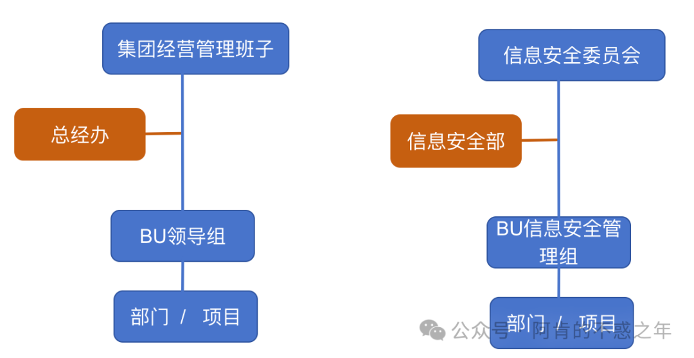
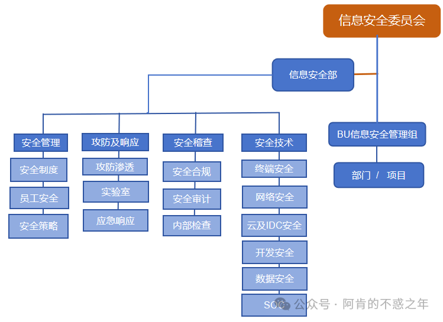
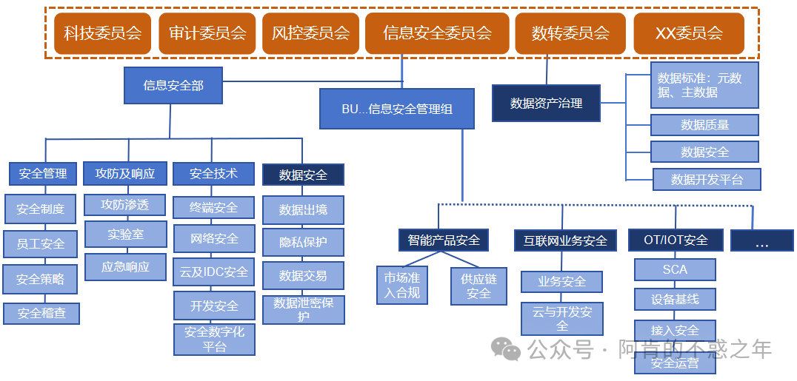

> 转自公众号--阿肯的不惑之年

## 一、前言

为什么说这个话题，其实一直想写，但碍于时间，一直没有落实。**最近身边很多CIO/CISO朋友经常会提到如何建立一个适合自己企业的安全组织，以便更好去开展安全建设和运营工作。比如：**

* 集团性企业，面临很多子公司或分支。有些是集团完全控股，推行安全政策措施还好，有些只是财务管控型，安全又要集团承接，CIO想知道如何一盘棋布局安全；
* 有些企业因为监管需要，会通过外包或厂家不断做些安全措施，但是一直没有形成完整的安全体系，几年下来安全能力并没有提升，为什么？
* 还有些企业，因为业务数字化不断发展、新监管对安全的要求变化，CISO朋友也经常会问到是否有更好的安全组织去适应企业和监管的新要求；
* 当然，也有很多安全负责人做了很多安全建设工作，但依然感觉得不到公司和业务部门的认可，希望有一个好的安全组织能持续与公司管理层保持良好沟通和对齐；
* 有些企业内部费了很大力气成立了虚拟的安全组织，但是没有发挥啥作用。比如：一年开了多少次安全会议？做了几个安全决策？产生了什么效果？
* ......

这些问题其实并不难回答，各行业的企业都有很好的实践，**本文也是基于三位从业者过往的安全经验，以及身边大型金融、科技制造、和互联网等行业CISO朋友的企业安全组织运作情况，总结一下企业安全组织的意义、架构及运作机制，仅供参考。**

## 二、企业为什么要安全组织

任何一个组织的存在都是为了解决企业的某些问题，对于安全也是一样。**我们尝试从以下三个角度讲一下企业为什么要安全组织：承接企业的安全要求、保障企业安全底线、促进企业安全能力持续提升。**说明一下，这里说的安全组织不仅是专业的安全部门，还包含安全决策、管理、执行这些上下贯通的虚拟组织。‍‍‍‍‍‍‍‍‍‍‍‍‍‍‍‍‍‍‍‍‍

### 第一，理解企业业务战略，承接企业对各业务部门、分子公司的安全要求。

任何企业战略的落地都需要有对应的组织去执行，否则战略就是空中楼阁。不同企业因为行业、规模、产品形态、公司文化等不同，承接公司战略的组织架构的方式也不一样。甚至同一个公司，在面临变革的时候，因为战略调整，组织也会面临调整，否则战略就难于有效落地。比如：一个企业想要做好数字化转型，却没有一个大数据团队，数字化要持续落地时很难的；企业想开拓海外市场，如果没有为海外业务负责的组织，海外业务肯定也做不起来。

对于安全也是一样，**在企业内部也需要有一个组织去承接公司对于信息安全的要求，这个组织需要根据公司的情况去建立企业内部安全建设和运营的目标、明确落地路径、建立考评和持续运作机制。**只是不同行业、不同规模、不同阶段对于安全的诉求不一样，安全组织形式也不一样。比如：

* 科技制造业因为有技术机密，需要有安全专业人员来保护企业的核心资产，保持产品壁垒不会轻易被对手超越；

* OEM/ODM企业，因为大客户对安全要求高，需要组建安全团队去满足客户要求；

* 关基企业需要应对各种行业的合规监管和HW；互联网企业因为业务系统天生就需要安全去保障企业业务稳定运行；

* 涉及国家重要数据的企业也会需要一个数据安全组织，去承接行业监管对于重要数据的安全保护要求。

一句话，安全组织是被企业需要而存在，哪天企业不需要考虑安全了，安全组织自然也就不需要了。当然，数字化、物联化、人工智能的加速发展过程中，大部分企业对安全的诉求也是不断变化的。

### 第二，安全组织要行使安全风险监管的职能，发挥安全底线保障作用。

首先，安全是做风险管理的。从公司的稳健发展来看，安全也是公司稳定发展的底线，需要一个安全组织能站在公司层面考虑安全建设的事情，明确并坚守企业安全的底线，将安全底线要求纳入到各个部门的利益体系中。**这件事情不是某个人或部门能持续推进，一个适合企业文化的安全组织就显得特别重要，它会让安全在公司里面形成一种机制往前推进，让各种要求、规范、基线在各个部门得到执行和落地，“政令畅通”。**

另外，安全对公司的各个部门来讲只是个成本中心，又会影响业务部门工作的效率，还有点监管的意思，各部门打心里就不太想做。但业务部门又是风险的第一感知人，如果业务部门不理解或者不发自内心去落实安全要求，安全工作也很难持续做好。比如：

* 很多安全团队是在IT部门下面，IT部门是服务部门，安全又是监管组织，需要以服务促监管。如果沟通不好，安全会完全被看做是服务部门，安全项目落地推动就会变得很难；

* 在一些大企业，集团总部安全团队人少，又没有明确的考核，只是制定并告知一个风险管理的方法，具体的执行还是需要各业务部门/分子公司执行安全的日常管理工作，这种情况，安全的底线也很难有保障。‍‍‍‍

**所以，安全是监管型工作，但是我们要以服务促管控。这就需要有个能上下拉通的安全组织让管理层、各业务部门、分子公司就业务中存在的安全风险达成共识，并根据业务的优先级落实安全措施，至少也要满足安全底线要求。**

### 第三，安全组织要与公司上下对齐安全建设的目标、措施、落地计划，让大家理解安全对公司的作用和价值，促进安全能力持续提升。

上面说了安全是做风险管理的，企业安全风险又是木桶原理，并且随着企业业务变化，风险也会变化，安全也需要在企业发展变化过中，不断优化策略，持续运营，提高安全防护水位。但是安全是一个麻雀虽小、五脏俱全的完整体系。安全作为一个成本中心，不是业务本身，又如何做到持续拿到投资、推动项目落地、体现风险管理的价值？

**简单来说，企业老板是商业经营视角，安全人员是风险管理视角，在认知上的这种差异会让沟通变得困难。这就需要一个安全组织能消除认知差异，建立沟通的机制。**类似于企业中一个产品立项一样，需要按照立项程序，拉起一个包含行销、运营、产品、技术的项目组，大家一起沟通对齐，达成一致。安全组织对于安全的作用也是如此。比如：

* 为了管理层能够批准安全项目，安全人员可以通过安全组织，跟技术人员讲方案、跟业务人员讲风险接受度、跟财务讲ROI、跟法务人员讲合法合规；‍‍‍‍

* 为了推动安全项目落地，在立项时通过安全组织，推动成立专项组织，拉项目干系人，做好职责分工，保障项目落地；‍‍‍‍‍‍‍‍‍‍

* 在安全价值认同上，通过安全组织，可以跟法务谈法律风险，跟审计和财务谈风控，跟HR谈员工风险，让业务部门谈感受；

总之，**站在企业业务角度**：安全工作要做到被企业需要、被接受、被企业理解每个安全项目对公司和业务的作用，就需要一个从上到下的安全组织，与公司管理层就安全规划达成共识；与业务部门相互融合，做到知行合一；感受内外环境变化，让安全策略适应企业发展的需要。**站在企业CISO的角度**：安全组织需要解决安全投入少问题多、重大风险没人决策、确定的工作难于落实、确定策略没有人执行、不出事没人关注，出了事没人帮忙等头疼问题。

## 三、适合企业的安全组织架构和运作机制，才能更好护航企业业务发展

不同阶段、不同规模、不同行业的企业，安全组织形态也不一样，比如：

有些企业规模还小，可能一个兼职的安全人员就行，大企业一般会有完整的安全组织，包含虚拟组织和实体组织。

下面以某大型科技制造公司为例说一下集团企业安全组织的架构、职责和运作机制。

### 1、组织架构和职责

比如某大型科技企业的经营组织架构有三层：

* 最顶层是经营管理层，一般会有一个实体部门叫总裁办或运营管理办公室，为经营管理层做具体事务的组织协调；

* 中间层是各BU，分为研发、营销、供应链、法律规划、人力资源等；

* 最末梢是部门和项目。

企业的安全组织也是三层。其中，委员会和各BU信息安全领导小组都是虚拟组织，与企业经营组织架构对应：

* **最顶层是信息安全管理委员会**，主要负责企业信息安全治理工作的决策和议事协调的机构，一般由董事长或者分管信息安全的副总裁担任委员会主任，而央企是发了规定要求党政一把手担任网络安全第一责任人；同时，由于信息安全管理涉及方方面面，所以一定要由各专业领域（职能部门）和主业务流程的中层管理者担任委员，专业领域包括人力资源、信息化建设、物理区域、研发物料管理，主业务流程领域比如研发、生产、营销、供应链。委员会具体负责制定企业信息安全管理的顶层框架、目标和方针原则；审议信息安全规划和重大风险事项；审议重大信息安全策略的制定和修订。**信息安全部作为信息安全管理委员会的办公室，主要是搭台唱戏，负责委员会日常运作支持，为各单位信息安全管理工作提供专业的技术和业务指导，提供专业的安全工具和平台。**

* **中间层是各BU信息安全领导小组**，是各企业单位信息安全工作的责任机构，应由各BU单位一把手担任组长，指定核心中层管理者担任小组成员，并任命一名综合协调能力强的中层管理者兼任该BU的信息安全总监，按BU规模大小和区域分布任命合适数量的专职信息安全主管。这里有资源的企业可以为安排专职的总监。该小组负责为该BU的信息安全管理工作推动提供所需人、财、物等资源支持；负责将委员会制定的信息安全规划和制度，结合自身业务场景制定相应的规范，并推进落地；负责组织识别该BU的核心资产清单；组织BU层面信息安全管理状况和效果进行检查和管理评审，推动改进；该小组的具体事务由总监、主管来推进，领导小组组织和成员进行评审，决议。

* **最末梢的执行组织，对应各部门和项目**，是信息安全工作的具体执行机构，各部门、项目组的一把手是该单位的第一责任人，按部门人员数量和区域分布指定合适数量的业务员工担任信息安全专员。这里强调下一定要让懂业务的人管安全。部门具体负责按识别该部门核心资产清单，将信息安全管控要求嵌入业务流程和日常管理，实现信息安全与业务同规划、同部署、同落实；组织部门信息安全自检自查自改进。该小组的具体组织事务由信息安全专员（BP）来推进，管理者进行评审，决议，同时，管理者平时在关键业务中强调信息安全要求，就是最好的管理支持。用好这个末梢组织做事就能事半功倍，反之亦然。比如，某公司安全负责人为了快速消除高危风险，一开始采取了简单粗暴的方式，直接跟安委会汇报后下发各分子公司执行，虽然风险快速得到消减，也收获了很多的“投诉、抱怨、谩骂”。经过这次踩坑后，第二次处理类似情况的时候，安全负责人就充分利用了安全专员懂业务、与业务部门接触密切的优点，在执行措施前充分收集并采纳了各分子公司业务部门的建议。年底安全部门满意度调查的结果就非常的好。

* 对于集团控股的企业，集团给出建设指导标准，企业自行建设，通过定期的安全审计促进其安全建设和管理提升。参股/财务投资型公司，可以年度做一次审计，或者针对出现重大事件后要求进行复盘改进。

* **安全的本质是风险管理，很多大型企业都会有多道防护体系去做好安全风险的管控。**比如金融等管理水平较高的行业就坚持按照三道防线管控安全风险：第一道防线是企业业务本身，是业务过程中安全控制风险最重要的防线，企业90%以上的精力都放在这一防线上；第二道防线合规和企业风控，主要确保第一道防线执行的控制和风险管理流程的设计是合理的，并能有效执行，如：风控委员会、消防安全委员会、健康委员会等；第三道防线内部审计，负责监督检查管理职责，包括对第一道和第二道防线的监督和检查，以避免疏漏。

关于企业安全组织架构，这里强调3点：

* **要一致：**信息安全组织架构设计要与企业的经营架构保持一致，才能将信息安全管理要求在一线落地，发挥出组织作战动员能力。

* **懂业务：**信息安全组织成员，都要懂业务，安全是业务的一个属性，信息安全管理涉及到人、事、物方方面面，不能脱离业务谈安全，所以从人员选择上就要懂专业。同时，从组织职责上，至上而下做分解。

* **高站位：**委员会站位要高，从企业治理架构上，委员会本质是为董事会服务的，董事会是公司的最高领导机构，负责决策公司的战略方向和监督执行层的运营。在董事会下设专业委员会，是为了弥补董事会在决策时候的专业不足问题，目的协助董事会做好专业决策，确保董事会决策的准确性。要充分发挥参谋作用，对公司的重大决策提出审议、评价和咨询意见，为董事会决策提供建议。

从企业完整的治理组织架构看，委员会是隶属于董事会的，一般上市公司会为董事会设立几大专门委员会，分别是战略、审计、提名、薪酬与考核等方面的专门委员会，根据公司治理需要，还可以设立信息安全委员会、风控委员会等。这个治理结构想说明的是，委员会的领导一般是分管该专业领域的高管，委员分别是专业领域的中层管理者，但在决策意见上是要高站位的。

### 2、机制和流程

很多企业设立了信息安全委员会，但是一年都不开一次会，也没有具体工作，这个组织就变成了一个摆设。**而好的机制流程，以及细节的设计，就能够让大家一起共建，成事为乐。比如上面提到大型科技制造企业的委员会，就有会议、评议、通报、检查、表彰等机制流程。**

* **会议，就是定期开会（比如季度、半年、年终）**，由信息安全部负责人汇报全集团过去一阶段工作总结、下一阶段工作目标和规划，明确需要各单位协同事宜及任务，并邀请公司高管点评工作。这种会议的目的，一方面是邀请高管站台推动工作，另一方面也是将目标达成和工作任务分配不断复盘，跟进和组织驱动的过程。会议中会点评各单位信息安全工作水平，并对这一阶段内做出突出贡献单位表达感谢。也会安排优秀的单位进行分享，表现欠佳的单位上台发言表决心。这里需要注意一点，业务单位的发言材料，集团CSO应该提前评议，保障现场会议效果。对于参会单位/部门是否现场参会不强求，每个企业可根据实际情况选择线上线下方式。因为开会不是目的，会议的议题设计，内容呈现，演讲者要表达的思想和目标才是最关键的，从而才能达成开会想要达成的效果，当然现场开会的效果一定是最好的。

* **评议，就是通过线下或在线等多种不同方式，选择合适的专项议题让委员参与评审，给出意见和建议。** 每一次议题的评议，其实是对参与的高管和核心中层管理者进行信息安全宣传教育和达成共识的过程。所以议题的选择，一方面最好和当期重点工作或者企业治理理念保持一致性，另一方面有一定的讨论空间，如果全部一致就调不动大家的参与感和积极性。更为重要的是要在评议前找一些同盟支持自己，保障大方向不会偏离。比如：评议企业数据分类分级的顶层分级标准（分几级？如何定义描述？）会议，分级是为了便于管理，但是级别分太多会带来管理复杂度，分太少可能层次不清。一方面，企业有自己基于企业利益的核心商秘需要保护，这与业务信息相关。另外，国家数安法和个保法以及各国法律法规又基于国家利益、公众利益、个人利益由管理诉求。评议中，如何做分级和定义描述，都是可以探讨的，不会过于纠结在技术细节，同时也科普了一波。要知道委员其实是很多不同业务背景的，所以选题至关重要。 再比如：评议处罚原则，对一个信息安全管理成熟度很高的企业，流程性的违规是否能松一松？而造成实际损失的违规行为保持乃至加大处罚力度？什么情况下管理者要被连带，什么情况下可以免责？因为大家最关心的就是利益和责任，评议过程往往非常热烈而深刻，当收集了各个业务线条的综合意见，设计的处罚原则往往能更符合企业治理趋势。

* **检查，就像企业业务风控一样（GRC）**，信息安全部根据评议通过的安全风险检查清单（checklist），每年组织一次集团层面的安全风险检查工作，评估各BU存在的安全风险及合规遵守情况，最终根据检查结果进行综合评分，给各BU颁发金、银、铜牌，不断推动各单位整体安全风险管理能力的提升。为了检查的公平和全面性，安全部可以邀请总部职能部门、各BU的安全BP一起组成检查小组，并就近区域交叉检查。这样也能增加安全体系内具体执行人员的参与感。‍‍‍‍‍‍‍‍‍‍‍‍
* **通报，就是集团内出现了安全事件，需要在集团内进行延展，并提醒集团内其他企业/单位关注，事件驱动是加强安全管理的重要措施之一**。出现攻击违规泄密等需要在集团层面通报的事件，需要按照事件的一二三四等级（处罚包括法律责任/开除/绩效/降职/内部警告等），跟出现事件的业务部门安全负责人和领导达成一致，并经过严格的审批程序方可发布。这样做的目的是在通报发挥警钟长鸣的同时，也不太会影响到安全组织内部的后续合作。‍‍‍‍‍‍‍‍‍‍‍‍‍‍‍‍‍‍‍‍‍‍‍‍

* **表彰，企业年底会搞些表彰大会，表扬先进的组织和个人，请参会的高管给颁奖合影下，发些奖状、礼品，最好会后还同步发宣传稿，学习人民日报不断表扬群众的好人好事。**毕竟大家一年忙到头，对协作的各单位，看见、肯定、表达对他们的付出和成绩至关重要（比如专项工作中做的很好的企业、检查中得到金牌的企业或有大幅提升的企业、全年工作中有创新的部门/个人）。信息安全归根结底还是一个利用技术和管理的综合治理工作，真正的本质是激发他人的善意，让各单位一起守望相助。

### 3、安全组织运作举例

基于上面介绍的安全组织架构、机制和流程，这里以数据分类分级工作为例，来看下集团与各个单位之间具体是如何运作的。

#### 第一步：收集信息，策划项目‍‍‍‍

信息安全部，作为信息安全管理委员会的办公室，是一个实体团队，有专业人员和能力。可以由这个专业部门研究相关法律法规、安全标准、同行实践，然后会同自己企业自身的商业秘密，制定数据分类分级的分级标准，识别流程和工具规划，以及推动工作的项目策划。

#### 第二步：高层共识

如果企业安全委员会运作机制比较成熟，可直接通过委员会来做项目推进的评议，言简意赅讲清楚这个工作的背景，目标。数据分类分级是信息安全管理的源头性，至关重要，定的准不准，决定管的对不对。同时，国家也在强调数据分类分级，以及数安法、个保法的立法执法，在这种管理趋势下应进行推进。同时明确做这个工作的职责和时间节点，比如信息安全部门负责数据分级的顶层标准，识别流程和工具；一线业务部门负责基于标准和流程和模板，识别业务数据，并使用工具做好标识；法律合规部门负责对国家法定的重要数据、个人信息定义、解释和指导。各委员一旦表决心，后续推动工作更加顺畅。评议通过后，应进行对评议记录和决议进行发布。

如果没有安全委员会，或者还没有常态化运作起来，建议考虑寻找公司自身的运营管理机制去推动工作。比如项目立项，企业要事上报的专项会议等来推动这个工作在较高管理层的一致认知，一旦同意就是获得了管理政策支持。

**需要注意的是，在上会前一定要和主要单位的中层管理干部提前做好沟通，拉同盟，获得支持和理解，也能提前知道对方的业绩诉求或困难，从而调整好方案。**上会的目的是达成共识，获取管理政策支持，资源支持，而不是把矛盾放到会上解决。这里还有一点，平时和关键干系部门多走动，多支持，才能在关键时刻获得支持。比如：某科技企业要立一个项目解决企业存在的高危风险，但涉及金额数千万，需要上升到董事会决策，安全负责人当时通过提前与安全委员会主要成员逐一沟通，并得到支持，再上会汇报。汇报过程中，某研发负责人在会上就从他的角度阐述了项目的必要性，以及他之前所在500强企业也是类似做法，最终项目顺利立项。

#### 第三步：向下推动

如果评议通过，向下推动时，主要有3个主要举措：

* 发布通知：通知是一个管理依据，让各单位推动工作有法可依。可以通过委员会邮箱或者企业的OA系统，向各BU信息安全领导小组发布通知，阐明工作目的、意义、各方职责、输出物、里程碑、操作指导，以及答疑的渠道。这个通知事前也应让主要干系人进行会签，让管理层签发。

* 项目启动会： 良好的开始是成功的一半。建议发布通知后，有必要召开项目启动会，启动会就是在执行层达成共识，同时也是一个动员大会，统一思想，开完会就要撸起袖子把活干。

* 项目日常管理：会议启动后，不等于工作就会顺其自然的完成，要通过周月报的分解，定期项目例会来推进工作。后续都是项目管理的一些精髓了。同时，专业部门要提供好操作指导和工具。比如数据分类分级，应该提供分级的标准，识别的流程，包括标识的工具。

#### 第四步：业绩宣传

大家跟着一起折腾这么久，都希望能有业绩。这时候通过宣传渠道，来表扬合作中表现优异的单位，表扬他人就是宣传了项目的业绩。这点至关重要。当然，在项目启动时我们应该想好最终会怎么做宣传来推动工作。比如数据分类分级，可以从业务单位如何认知和参与这个事情，识别的更加精准、聚焦，提供了工具来做自动化识别提效等方面来做立体的宣传。

**总之，安全负责人如果能推动企业建立安全决策层、管理层和执行层的三层组织，集团的安全舞台就搭建起来了，大家可以一起唱戏。如果能把会议、评议、检查、通报、表彰等机制运作起来，集团上下就能形成共同的安全方向和原则、大家协同共建、安全投入与产出的价值达成一致、业务效率与安全效果达成平衡，安全体系将逐步走向成熟。‍‍‍‍‍**

## 四、企业安全组织的变与不变‍

国家经济发展方式正在从中低端，走向高端设计制造和服务业提升的过程中，产业互联、数字化、AI会进一步加快，整个社会的方方面面都会发生变化。在这个变化过程中，**进入存量博弈阶段，企业间的竞争加剧，能力较强的企业，**会通过数字化帮助业务提效降本，企业安全也会走向数字化，提高风险管理的效率，网络安全人员投入**将会逐渐收缩，并成立单独的数据安全团队与数据资产治理部门配合做好数据资产的安全。而从事高端设计、制造和服务类企业，安全建设的关注点会从传统的信息安全，走向数据安全、智能产品安全以及物联安全，企业安全组织也会随之变化。当然，这里说的安全组织变化主要是作为实体组织的信息安全部和执行组织。企业作为一个整体，安全委员会大概率还是会保持不变。**

图：变化前

图：变化后