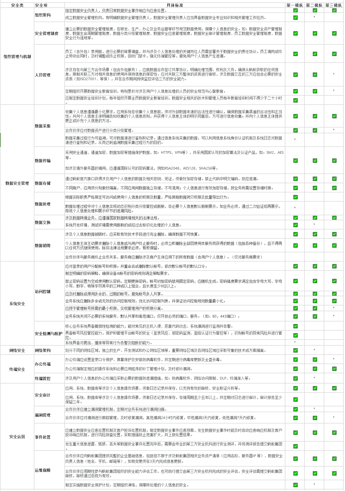

# 合作伙伴安全能力标准
>在为用户提供产品和服务的过程涉及个人信息处理时，必须严格遵守中华人民共和国相关法律法规的要求（如：《中华人民共和国数据安全法》、《中华人民共和国个人信息保护法》），应当参照相关国家标准（如：《信息安全技术个人信息安全规范GB/T35273—2020》），规范个人信息处理行为，最大程度地保障用户的合法权益和社会公共利益。
根据中华人民共和国相关法律法规要求，保障用户的个人信息安全和合法权益，对于涉及个人信息处理的合作伙伴，制定了安全能力分级要求，合作伙伴应遵循达到对应要求。未能达到对应安全能力要求或不能按时在配合完成安全能力评估的，合作伙伴获取个人信息接口权限及相关服务或将受到影响。

