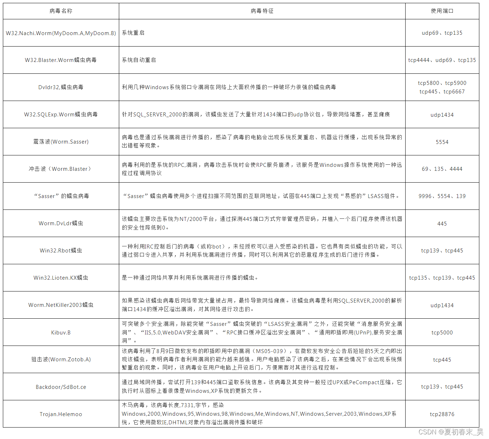
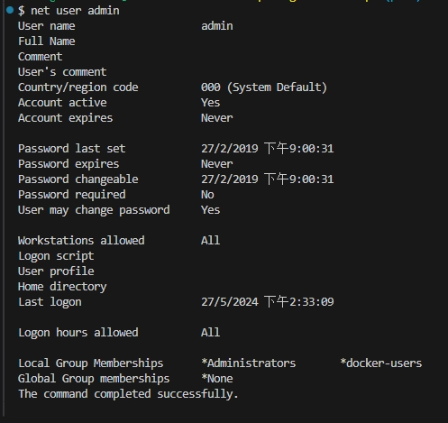
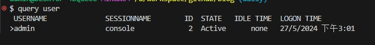
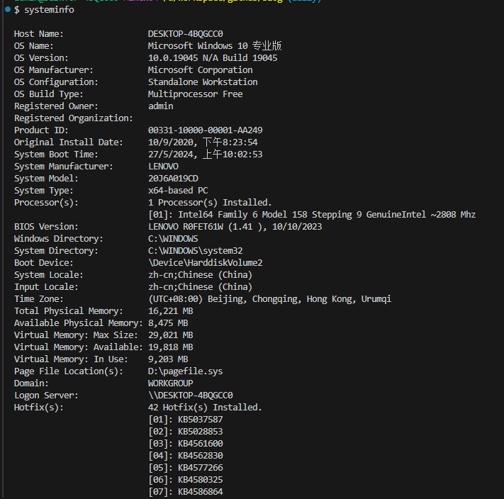
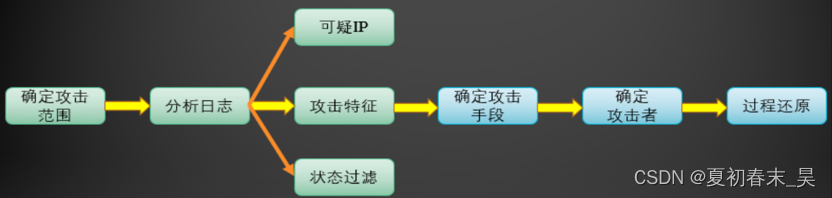

# 1、概念及应急响应流程
应急响应流程是一种在突发事件发生时组织和协调资源、快速响应并减轻损失的计划。一个有效的应急响应流程可以帮助组织提高应对风险的能力，保障人员安全和财产
>2、PDCERF(6阶段)
>**（1）事件预警/发现：**
通过安全监控系统或日志报警、告警等方式发现异常或有风险的行为。
**（2）事件确认：**
事件预警后需要进行核实，确认事件的具体情况，确定事件的类型、影响范围、紧急程度等。
**（3）事件分类：**
根据事件的类型和影响程度对事件进行分类，并作出响应计划。
**（4）紧急响应：**
根据响应计划，启动紧急响应模式，调集相关的人员和资源，进行紧急处理和控制事件。
**（5）事件调查：**
对事件进行深入分析，找出事件的成因，并根据分析结果调整相关防护策略和措施，降低风险。
**（6）事件修复/恢复：**
恢复受影响的系统、数据和业务功能，确保业务恢复正常运作。
**（7）事件总结/报告：**
回顾事件处理过程，总结经验教训，撰写事件报告，并需要对相关人员进行培训和宣传，提高业务人员的安全意识和技能水平。
# 2、Windows排查
## 2.1文件排查
（1）查看开机启动有无异常文件
【开始】➜【运行】➜【msconfig】、或者任务管理器中查看启动TAB.
（2）各个盘下的temp( tmp)相关目录下查看有无异常文件 ：Windows产生的临时文件
（3）浏览器浏览痕迹、浏览器 下载文件、浏览器cookie信息，根据不同浏览器进行排查；例如：IE浏览器，打开IE浏览器点击【查看】➜【浏览器栏】➜【历史记录】（快捷键是Ctrl+Shift+H）
（4）Recent是系统文件夹，里面存放着你最近使用的文档的快捷方式，查看用户recent相关文件，通过分析最近打开分析可疑文件：
【开始】➜【运行】➜【%UserProfile%\Recent】
（5）根据文件夹内文件列表时间 进行排序，查找可疑文件。当然也可以搜索指定日期范围的文件及文件
>1.了解应急的时间轴，以及确定攻击ip
>2.根据发生安全事件的时间轴梳理事件流程
>3.根据时间轴查找可疑文件，减少可疑文件范围）

（6）查看文件时间，创建时间、修改时间、访问时间 ，黑客通过菜刀类工具改变的是修改时间。所以如果修改时间在创建时间之前明显是可疑文件
（7）搜索webshell 相关内容
>例如：PHP webshell
>findstr Window系统自带的命令，查找指定的一个或多个文件
>`findstr /S /M /I "eval" *.php`
>`findstr -m -s -i "eval" *.php`

## 2.2、进程排查
### （1）netstat -ano 查看目前的网络连接，定位可疑的ESTABLISHED
netstat 显示网络连接、路由表和网络接口信息；
> LISTENING      侦听状态
ESTABLISHED    建立连接
CLOSE_WAIT     对方主动关闭连接或网络异常导致连接中断
### （2）根据netstat定位出的pid，再通过tasklist 命令进行进程定位
tasklist 显示运行在本地或远程计算机上的所有进程
> `tasklist |findstr /i "pid"`
### （3）根据wmic process 获取进程的全路径 [任务管理器也可以定位到进程路径]
>`wmic process | findstr chrome`
很多种类的病毒都依赖网络进行传播和复制，并感染局域网中的大量终端。可以通过开放端口进行分析，有助于病毒对象的确认；下面提供一些常用的病毒使用的端口 信息，可以作为参考：


## 2.3、系统信息排查
### （1）查看环境 变量的设置
【我的电脑】➜【属性】➜【高级系统设置】➜【高级】➜【环境变量】
排查内容：temp变量的所在位置的内容；后缀映射PATHEXT是否包含有非windows的后缀；有没有增加其他的路径到PATH变量中(对用户变量和系统变量都要进行排查)；
### （2）Windows 计划任务
【程序】➜【附件】➜【系统工具】➜【任务计划程序】
### （3）Windows帐号信息，如隐藏帐号等
【开始】➜【运行】➜【compmgmt.msc】➜【本地用户和组】➜【用户】 (用户名以$结尾的为隐藏用户，如：admin $)

> 命令行方式：net user，可直接收集用户信息（此方法看不到隐藏用户），若需查看某个用户的详细信息，可使用命令➜net user username；

### （4）查看当前系统用户的会话
使用➜ query user 查看当前系统的会话，比如查看是否有人使用远程终端登录服务器;

使用 logoff 踢出对应用户。
5）查看systeminfo 信息，系统版本以及补丁信息


## 2.4、工具排查
### （1）PC Hunter 下载地址：http://www.xuetr.com/
PC Hunter是一个Windows系统信息查看软件
功能列表如下：

>1.进程、线程、进程模块、进程窗口、进程内存信息查看，杀进程、杀线程、卸载模块等功能
2.内核驱动模块查看，支持内核驱动模块的内存拷贝
3.SSDT、Shadow SSDT、FSD、KBD、TCPIP、Classpnp、Atapi、Acpi、SCSI、IDT、GDT信息查看，并能检测和恢复ssdt hook和inline hook
4.CreateProcess、CreateThread、LoadImage、CmpCallback、BugCheckCallback、Shutdown、Lego等Notify Routine信息查看，并支持对这些Notify Routine的删除
5.端口信息查看，目前不支持2000系统
6.查看消息钩子
7.内核模块的iat、eat、inline hook、patches检测和恢复
8.磁盘、卷、键盘、网络层等过滤驱动检测，并支持删除
9.注册表编辑
10.进程iat、eat、inline hook、patches检测和恢复
11.文件系统查看，支持基本的文件操作
12.查看（编辑）IE插件、SPI、启动项、服务、Host文件、映像劫持、文件关联、系统防火墙规则、IME
13.ObjectType Hook检测和恢复
14.DPC定时器检测和删除
15.MBR Rootkit检测和修复
16.内核对象劫持检测
17.WorkerThread枚举
18.Ndis中一些回调信息枚举
19.硬件调试寄存器、调试相关API检测
20.枚举SFilter/Fltmgr的回调

### （2）ProcessExplorer
Windows系统和应用程序监视工具;
### （3）Microsoft Network Monitor
一款轻量级网络协议数据分析工具；
### （4）D盾Webshell 排查
### （5）河马webshell查杀

## 2.5、日志排查
### （1）Windows登录日志排查
> **a）打开事件管理器**
【开始】➜【管理工具】➜【事件查看】
【开始】➜【运行】➜【eventvwr】
> **b）查看系统日志主要分析安全日志，可以借助自带的筛选、查找、导出功能**
可以把日志导出为文本格式，然后使用notepad++ 打开，使用正则模式去匹配远程登录过的IP地址，在界定事件日期范围的基础。
正则：
### （2）IIS日志排查
> a）查找IIS日志存放位置
【开始】➜【IIS管理器】➜【网站】➜【日志】
IIS7.0：%SystemDrive%\inetpub\logs\LogFiles
> b）Log Parser 快速日志分析工具
Log Parser是一个用于日志文件分析的使用简单又强大的工具，多用于分析IIS web服务器的日志，支持基于文本的日志文件、XML 文件、CSV（逗号分隔符）文件以及注册表、文件系统等内容，它可以把相应的分析结果以图形的形式展现出来，大大地方便了运营人员；
下载地址：
https://www.microsoft.com/en-us/download/confirmation.aspx?id=24659

# 3、Linux排查
## 3.1、文件排查
### （1）敏感目录的文件分析 [类/tmp目录，命令目录 /usr/bin /usr/sbin等]
ls 用来显示目标列表
### （2） 查看tmp目录下的文件
### （3） 查看开机启动项内容，/etc/init.d 是 /etc/rc.d/init.d 的软链接
### （4） 按时间排序查看指定目录下文件
### （5） 查看历史命令记录文件~/.bash_history
查找~/.bash_history命令执行记录，主要分析是否有账户执行过恶意操作系统；命令在linux系统里，只要执行过命令的用户，那么在这个用户的HOME目录下，都会有一个.bash_history的文件记录着这个用户都执行过什么命令；
### （6） 查看操作系统用户信息文件/etc/passwd
查找/etc/passwd文件， /etc/passwd这个文件是保存着这个linux系统所有用户的信息，通过查看这个文件，我们就可以尝试查找有没有攻击者所创建的用户，或者存在异常的用户。我们主要关注的是第3、4列的用户标识号和组标识号，和倒数一二列的用户主目录和命令解析程序。一般来说最后一列命令解析程序如果是设置为nologin的话，那么表示这个用户是不能登录的，所以可以结合我们上面所说的bash_history文件的排查方法。首先在/etc/passwd中查找命令解释程序不是nologin的用户，然后再到这些用户的用户主目录里，找到bash_history，去查看这个用户有没执行过恶意命令。
### （7） 查看新增文件
find：在指定目录下查找文件
### （8） 特殊权限的文件查看
查找777 的权限的文件
### （9）隐藏的文件 （以 "."开头的具有隐藏属性的文件）PS：在文件分析过程中，手工排查频率较高的命令是 find grep ls 核心目的是为了关联推理出可疑文件

## 3.2、进程排查
### （1）使用top命令 实时动态地查看系统的整体运行情况，主要分析CPU和内存多的进程，是一个综合了多方信息监测系统性能和运行信息的实用工具**
### （2）用netstat 网络 连接命令，分析可疑端口、可疑IP、可疑PID及程序进程**
netstat用于显示与IP、TCP、UDP和ICMP协议相关的统计数据，一般用于检验本机各端口的网络连接情况。选项参数如下：
>netstat –antlp | more
```SHELL
a） "Recv-Q"和"Send-Q"指的是接收队列和发送队列。
b） Proto显示连接使用的协议；RefCnt表示连接到本套接口上的进程号；Types显示套接口的类型；State显示套接口当前的状态；Path表示连接到套接口的其它进程使用的路径名。
c）  套接口类型：
-t	TCP
-u 	UDP
-raw   RAW类型
--unix  UNIX域类型
--ax25  AX25类型
--ipx    ipx类型
--netrom  netrom类型
d）状态说明：
LISTENING    侦听状态
ESTABLISHED  建立连接
CLOSE_WAIT   对方主动关闭连接或网络异常导致连接中断
```
### （3）根据netstat 定位出的pid，使用ps命令，分析进程
```shell
ps -ef
ps aux --sort -pcpu

-a  	代表 all。同时加上x参数会显示没有控制终端的进程
-aux  	显示所有包含其他使用者的行程（ps -aux --sort -pcpu | less根据cpt使用率进行排序）
-C 	  	显示某的进程的信息
-axjf   以树形结构显示进程
-e  	显示所有进程。和 -A 相同。
-f	  	额外全格式
-t 		ttylist by tty 	显示终端ID在ttylist列表中的进程
```
**可以使用lsof -i:1677 查看指定端口对应的程序**
### （4）使用ls 以及 stat 查看系统命令是否被替换

### （5）隐藏进程查看
## 3.3、系统信息排查
### （1）查看分析history ，曾经的命令操作痕迹，以便进一步排查溯源。运气好有可能通过记录关联到如下信息：
>a) wget 远程某主机（域名&IP）的远控文件；
b) 尝试连接内网某主机（ssh scp），便于分析攻击者意图;
c) 打包某敏感数据或代码，tar zip 类命令
d) 对系统进行配置，包括命令修改、远控木马类，可找到攻击者关联信息…

### （2）查看分析用户相关分析
```shell
a) useradd userdel 的命令时间变化（stat），以及是否包含可疑信息
b) cat /etc/passwd 分析可疑帐号，可登录帐号
查看UID为0的帐号➜➜➜awk -F: '{if($3==0)print $1}' /etc/passwd
查看能够登录的帐号➜➜➜cat /etc/passwd | grep -E "/bin/bash$"

PS：UID为0的帐号也不一定都是可疑帐号，Freebsd默认存在toor帐号，且uid为0.（toor 在BSD官网解释为root替代帐号，属于可信帐号）；
```
### （3）查看分析任务计划
```shell
crontab -u  <-l, -r, -e>
-u 指定一个用户
-l 列出某个用户的任务计划
-r 删除某个用户的任务
-e 编辑某个用户的任务（编辑的是/var/spool/cron下对应用户的cron文件，也可以直接修改/etc/crontab文件）
```
### （4）查看linux 开机启动程序
查看rc.local文件（/etc/init.d/rc.local /etc/rc.local）
查看开机启动项内容，/etc/init.d 是 /etc/rc.d/init.d 的软链接
### （5）查看系统用户登录信息
a） 使用lastlog命令，系统中所有用户最近一次登录信息。
b） 使用lastb命令，用于显示用户错误的登录列表；
c） 使用last命令，用于显示用户最近登录信息

### （6）系统路径分析
### （7）查看ssh相关目录有无可疑的公钥存在

## 3.4、后门排查
>`find /var/www/html/ -type f -name  '*.php'|xargs grep 'eval' |more`

> 除了通过grep去找webshell，我们还可以用类似 D盾之类的webshell查杀工具，把源码拖下来在本机查杀。
有时候黑客在上传完webshell后门，获取到自己想要的信息后，就会删除掉webshell，又或者遇到了一些变形过的webshell后门，我们的关键字没有搜索到，这时候通过文件去找到webshell的方法就不适用了。那么这个时候就只能通过分析web日志，来找到黑客的webshell文件。直接分析web日志的最直接方式就是通过web日志中的特征来判断是否存在恶意的webshell后门，比如上面列表展示的这些常见webshell会传递的get参数。常见webshell后门日志特征如下：

> 不过这种方式能发现的问题不多，因为很多时候web后门接收参数的方式都是post，前面说了大部分中间件默认情况下只能记录get，如果需要记录post的话，就需要安装第三方模块。
Ps：常规黑客攻击流程，一个黑客通常通过web漏洞获取管理员密码进入后台，然后上传webshell，这个webshell文件在以前的访问记录是没有的，那么我们就可以通过统计每天访客所访问过的动态脚本文件，来列出每天新增加的文件入口的记录，快速查找webshell后门，最后我们可以根据统计低频访问的动态脚本文件，来找出可能是webshell的文件，因为一般来说webshell的访问ip只有几个，并且访问的次数也不多，那么根据这个分析模型，我们就可以发现可能是恶意的动态脚本文件。此排查需要懂一点了解编程，作为思路了解。

## 3.5、日志排查
### （1）日志类型
下面是和应急相关的常见日志类型，但并不是所有的Linux发行版都包含这些类型：
类型 说明
```SHELL
auth		用户认证时产生的日志，如login命令、su命令。
authpriv	与 auth 类似，但是只能被特定用户查看。
console		针对系统控制台的消息。
cron		系统定期执行计划任务时产生的日志。
daemon		某些守护进程产生的日志。
ftp			FTP服务。
kern		系统内核消息。
mail		邮件日志。
mark		产生时间戳。系统每隔一段时间向日志文件中输出当前时间，每行的格式类似于 May 26 11:17:09 rs2 -- MARK --，可以由此推断系统发生故障的大概时间。
news		网络新闻传输协议(nntp)产生的消息。
ntp			网络时间协议(ntp)产生的消息。
user		用户进程。
```
### （2）日志优先级：
```SHELL
优先级	说明
emerg	紧急情况，系统不可用（例如系统崩溃），一般会通知所有用户。
alert	需要立即修复，例如系统数据库损坏。
crit	危险情况，例如硬盘错误，可能会阻碍程序的部分功能。
err		一般错误消息。
warning	警告。
notice	不是错误，但是可能需要处理。
info	通用性消息，一般用来提供有用信息。
debug	调试程序产生的信息。
none	没有优先级，不记录任何日志消息。
```
### （3）常用日志文件
```SHELL
日志目录					作用
/var/log/message	包括整体系统信息
/var/log/auth.log	包含系统授权信息，包括用户登录和使用的权限机制等
/var/log/userlog	记录所有等级用户信息的日志
/var/log/cron		记录crontab命令是否被正确的执行
/var/log/vsftpd.log	记录Linux FTP日志
/var/log/lastlog	记录登录的用户，可以使用命令lastlog查看
/var/log/secure		记录大多数应用输入的账号与密码，登录成功与否
var/log/wtmp		记录登录系统成功的账户信息，等同于命令last
var/log/faillog		记录登录系统不成功的账号信息，一般会被黑客删除
```
### 3.5.1、基于时间的日志管理
/var/log/wtmp是一个二进制文件，记录每个用户的登录次数和持续时间等信息；
```SHELL

last命令
last命令用于显示用户最近登录信息。单独执行last命令，它会读取/var/log/wtmp的文件，并把该给文件的内容记录的登入系统的用户名单全部显示出来；
-f:		<记录文件>：指定记录文件
-a：	把从何处登入系统的主机名称或ip地址，显示在最后一行

utmp
/var/run/utmp是一个二进制文件，记录当前登录系统的用户信息。
可用who命令显示当中的内容，Who的缺省输出包括用户名、终端类型、登录日期及远程主机；

lastlog
/var/log/lastlog记录用户最后登录的时间和登录终端的地址，可使用lastlog命令查看；

lastb
/var/log/btmp记录错误登录的日志，可使用lostb查看，有很多黑客试图使用密码字典登录ssh服务，可以使用此日志查看恶意ip试图登录次数；
```
### 3.5.2、系统日志管理
```shell
/var/log/secure

# 安全日志secure包含验证和授权方面信息，比如最常用的远程管理协议ssh，就会把所有授权信息都记录在这里。
# 所以通过查看该日志，我们就能查看是否有人爆破ssh，通过查看存在过爆破记录的ip是否有成功登录的行为，我们就能知道是否有攻击者通过ssh暴力破解的方式成功攻击进来了。
# 通过时间的纬度去判断，可以查看出是机器行为还是人为的，机器登录事件间隔特别密； 主要分析点：是否有ip爆破ssh成功

grep "Failed password for root" /var/log/secure | awk '{print $11}' | sort | uniq -c | sort -nr | more

grep "Accepted " /var/log/secure | awk '{print $11}' | sort | uniq -c | sort -nr | more

```
### 3.5.3、中间件日志
```shell
# Web攻击的方法多种多样，但是默认情况下Web日志中所能记录的内容并不算丰富，最致命的是web日志是不会记录post内容的，想要从Web 日志中直接找出攻击者的webshell是非常难的，所以一般来说我们的分析思路都是先通过文件的方式找到webshell，然后再从日志里找到相应的攻击者ip，再去分析攻击者的整个攻击路径，来回溯攻击者的所有行为；
# 但各种各样的原因，如黑客在入侵完了之后把webshell删除了，通过文件搜索的方式找不到webshell或者客户因为一些原因不能让你登录服务器上去排查，只能给你一份日志排查，导致我们只能通过分析web日志去发现webshell，比如这时候要排查的话，难度会稍大。Web日志主要分析access_log，本文以常见的中间件apache为例，其他中间件日志格式和分析思路大同小异；
# Apache默认自动生成两个日志文件，访问日志access_log和error_log；

# 在url中视图搜索所有关键词为“union”的请求，可以发现172.24.123.120在尝试SQL注入，类似，通过通过特殊的关键词搜索web攻击。如/etc/passwd，alert等。但单凭web日志无法判断攻击者是否攻击成功了，只能知道攻击者在尝试攻击；

查询访问量前十的IP地址：
```
在对WEB日志进行安全分析时，可以按照下面两种思路展开，逐步深入，还原整个攻击过程；
1）首先确定受到攻击、入侵的时间范围，以此为线索，查找这个时间范围内可疑的日志，进一步排查，最终确定攻击者，还原攻击过程；


### 3.5.4、数据库日志
数据库日志以常用的数据库Mysql数据库为例。Mysql数据库有五种日志，错误日志、查询日志、慢查询日志、更新日志、二进制日志，重点关注查询日志；
`show global variables like '%log%'`

查看数据库文件：路径为/var/log/mysql/，记录一次数据库的连接、查询和退出中间的数据库操作；
`cat mysql.log |grep union`


### 3.5.6、相关处置
通过网络连接锁定的可疑进程，进行定位恶意程序后删除(kill)：
`kill -9`
对设定文件不能删除、改名等权限，移除该权限：
`chattr –i`
对发现的webshell和恶意文件进行删除：
`rm –rfv`