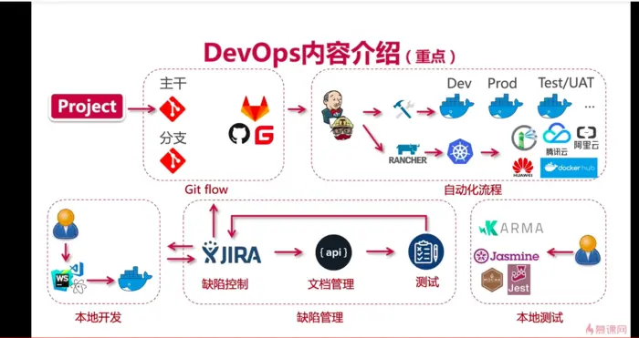
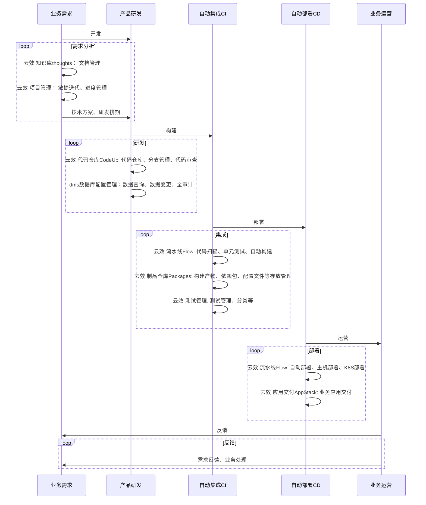
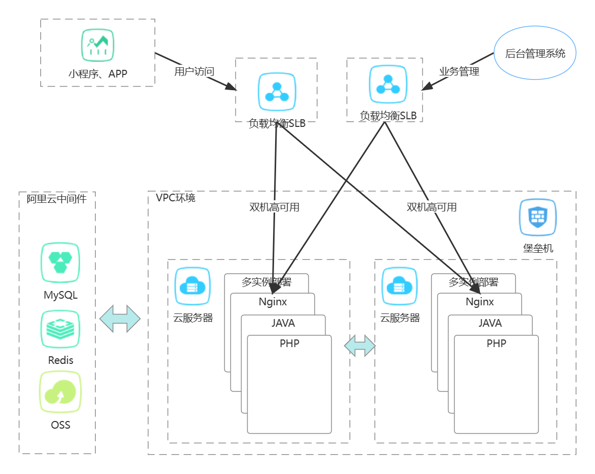

# 讨论产研中台

## Devops

### 什么是DevOps流程

> 使用敏捷方法，提供业务驱动的协作和自动化交付解决方案

> DevOps流程包含：计划（plan）、编码(code)、编译(build)、测试(test)、发布(release)、部署(deploy)、运营(operate)、监控（monitor），这是一个循环的过程。DevOps是依托容器、自动化、云计算等技术及精益化管理形成的一种项目过程,有效的促进了开发、测试、运营、运维、QA等团队间的协作，使得团队内、跨团队之间的协作得到极大的提升，可以帮助企业做到产品精益化、运营精益化、管理精益化。

### 最佳实践

**敏捷项目管理**  
敏捷开发是一种项目管理和软件开发的迭代方法，可帮助团队更快地为客户创造价值，同时减少问题。敏捷开发团队专注于以较小的增量交付工作，而不是等到单个大规模发布日期来交付工作。持续评估需求、计划和结果，使团队能够对反馈做出响应并根据需要进行调整。

以下是敏捷开发项目管理的关键概念：
>从四阶段工作流程开始：待办、进行中、代码审查和完成。  
>团队需要将大型项目分解为较小的任务，并在取得进展的同时对需求或范围的变更做出响应。  
>Scrum 和看板是团队实践敏捷开发方法的核心框架。  

​​​​​​**​使用 CI/CD 实现左移**  
当团队“左移”时，他们会尽早将测试引入代码开发流程中。在整个编码过程中执行各种测试，而不是将多项变更发送给单独的测试或 QA 团队，这样开发人员就可以在处理代码库的相关部分时修复缺陷或提高代码质量。持续集成和持续交付 (CI/CD) 以及部署的实践可巩固左移能力。

**​​​​​​​使用适当工具进行构建**  
DevOps 工具链要求在 DevOps 生命周期的每个阶段使用适当的工具，并具备提高软件质量和交付速度的关键功能。

**​​​​​​​实现自动化**  
持续集成和交付允许开发人员定期将代码合并到主存储库中。CI/CD 可自动执行该流程，即从在指定窗口中进行批处理到频繁提交，而不是手动检查代码。除了 CI/CD 之外，自动化测试对于 DevOps 实践的成功也至关重要。自动化测试可能包括端到端测试、单元测试、集成测试和性能测试。  

**​​​​​​​监控 DevOps 管道和应用**  
监控 DevOps 管道非常重要，借助它，构建中断或测试失败就不会造成不必要的延迟。自动化极大地提高了开发速度，但是如果自动化流程出现故障而且没人知道，那么最好手动完成这些工作。同样，监控生产应用至关重要，以便在客户反馈之前就识别出故障或性能缺陷。

**​​​​​​​可观察性**  
随着行业从单一的本地系统和应用转向基于微服务的原生云应用，监控如今变得更加复杂。因此，人们对可观察性越来越感兴趣。人们常说，可观察性的三个支柱是日志、跟踪和指标。日志由大多数系统组件和应用生成，包含有关系统或应用运行的时间序列数据。跟踪则用于跟踪应用中的逻辑流程。指标包括 CPU/RAM 预留或使用情况、磁盘空间、网络连接等。可观察性只是意味着综合利用这三种信息来源对复杂系统的运行进行发现和预测，否则这将很难实现。  

**​​​​​​​收集持续反馈**  
持续反馈可确保团队成员获得及时完成工作所需的所有信息。从开发角度来看，这意味着团队会立即收到所有管道故障的警报。同时，这也意味着开发人员能够尽快获得清晰、全面的代码测试结果。从产品管理角度来看，团队可以了解到任何生产故障或性能缺陷或报告的缺陷。过去，人们普遍认为开发团队只能在速度或质量方面进行优化。持续反馈是 DevOps 的要素之一，它可以实现速度和质量方面的优化。

**​​​​​​​改变文化**
DevOps 需要协作、透明度、信任和同理心。最常见的组织结构是孤立的，这意味着不同团队有不同的所有权和责任范围，而且几乎没有跨团队沟通或协作。为了实现 DevOps 成功，必须通过采用“谁构建，谁运行”实践来消除这些障碍。这并不意味着没有专门的人员或团队，只是开放并实施了团队之间的沟通和协作渠道。  

### 选型讨论

|对比|云产品|开源|自研|
|---|---|---|---|
|**特点**|云部署 安全 低成本|免费 可定制 |贴近业务需求 自由定制|
|**代表**|云效[阿里云]|蓝鲸|内部运维系统|
|**费用**|小规模免费 收费版本|社区版本 企业服务版本收费|内部开发免费|
|**成本**|使用|使用 维护|开发 维护 使用|
|**人力**|操作|操作、运维|研发、运维、操作|
|**适用规模**|小团队 重业务轻研发|中等团队 业务变动频繁 有定制化需求|大规模团队 业务变动频繁 有定制化需求 运维团队追求效率|

### 基于阿里云云效的实践

> ***阿里云云效优势***  
安全性高、稳定性强  
综合成本低、边际成本低  
单体应用部署简单、开箱即用  
全流程可审计、权限管理完整  

 

#### 实施方案参考

1、阿里云环境分配运维管理账户
>使用现有阿里云账户、或者新建阿里云账户，最好需要公司认证  

2、云环境基础设施
> 运维新建VPC网络环境(云上的私有网络环境)  

包年包月：  
**网络环境**:VPC网络（免费）、交换机（免费）、路由（免费）、NAT网关（2000/年）  
**云服务器**:
prod生产环境:2C8G服务器2台（4800/台/年）
test测试环境:2C8G服务器1台（4800/台/年）
test测试环境:2C8G服务器1台（4800/台/年）  
**云数据库**:
    关系型数据库RDS: 2C8G数据库MYSQL存储50G（9800/台/年）
    非关系型Redis:2C8G数据库Redis存储

按量付费：  
弹性公网IP \*2  
OSS对象存储

3、研发上线流程方案  
代码托管服务：代码管理Codeup  
制品管理： 云效仓库Packages， java表存maven仓库，前端和php存通用仓库  
测试管理：集成测试、测试用例管理  
流程管理： 云效流水线Flow， 提供上线申请、构建、单元测试、部署、健康检查、通知等能力。  

### 基于开源产品的方案

**业务需求分析工具：**  
>文档系统： atlassian Confluence  
项目跟踪管理: atlassian Jira、Trello

**产品研发：**  
>代码管理： gitlab  
数据库查询及工单系统：Yearning开源MySQL管理

**自动化编译构建：**  
>制成品仓库： Sonatype Nexus Repository Manager
代码构建：Bitbucket  
流水线管理： Jenkins  
代码部署操作：Ansible  
应用程序部署：Kubernetes、containerd  

**运维管理：**  
>堡垒机：JumpServer
监控：prometheus、Grafana
