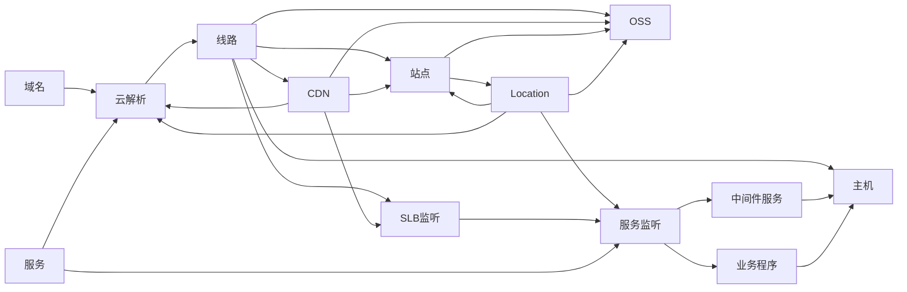

# cmdb



## 添加数据

```graphql
# 添加Host数据
mutation addHost($host: [AddHostInput!]!) {
  addHost(input: $host) {
    host {
      id
      name
      ip
    }
  }
}

# gqlvariables
{
  "host": {
    "ip": "10.103.27.177",
    "name": "jenkins"
  }
}

```

## 修改数据

```graphql
mutation updateHost($host: UpdateHostInput!) {
  updateHost(input: $host){
    host {
      id
      name
      ip
    }
  }
}

# gqlvariables

{
  "host": {
    "filter": {
      "ip": {"alloftext": "10.103.27"}
    },
    "set": {
      "name": "jenkins177-base-prod-ds"
    }
  }
}

```

## 查询数据

```graphql
query queryHost {
  queryHost(filter: { name: { anyoftext: "base" } }) {
    id
    name
    ip
  }
}
```
