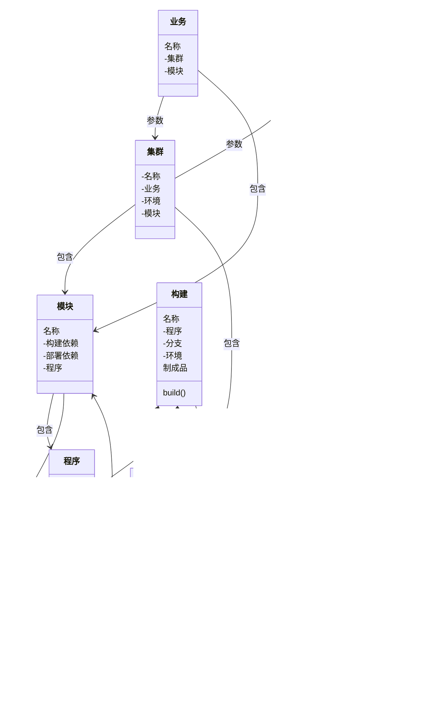

# cmdb




## Schema 信息

```schema
enum ServiceStatus {
  active
  reloading
  inactive
  failed
  activating
  deactivating
}


enum TaskStatus {
  success
  running
  failed
  skipped
  up_for_reschedule
  up_for_retry
  queued
  no_status
}


union Status = ServiceStatus | TaskStatus

enum Healthy {
  0
  1
}

interface Node {
  id: ID!
  name: String @search(by: [fulltext])
  status:  Status!
  healthy: Healthy!
  createAt: DateTime!
  updateAt: DateTime!
}

type Biz implements Node {
  set: [Set!] @hasInverse(field: biz) 
  module: [Module!] @hasInverse(field: biz) 
}

type Set implements Node {
  biz: Biz!
  env: Env!
  module: [Module!] @hasInverse(field: set)
}

type Env implements Node {
  host: [Host!] @hasInverse(field: env)
  set: [Set!] @hasInverse(field: env)
  build: [Build!] @hasInverse(field: env)
} 

type Module implements Node {
  buildDeps:[Module!]
  deployDeps:[Module!]
  code: [Code!] @hasInverse(field: module)
  biz: Biz!
  set: Set 
}

type Code implements Node {
  cType: String
  ports: [Int!]!
  gitURL: String!
  module: Module!
  package: [Package!] @hasInverse(field: code)
}

type Package implements Node {
  version: string!
  md5: string!
  code: Code!
  refurl: String
  build: [Build!]! @hasInverse(field: package)
  deploy: [Deploy!]! @hasInverse(field: package)
}

type Host implements Node {
  ip: String @search(by:[fulltext])
  admin: [String] @search(by:[fulltext])
  netCard: [String] @search(by:[fulltext])
}

type Build implements Node {
  code:Code!
  branch: String!
  env: Env! 
  package: [Package!] 
}

type Deploy implements Node {
  set: Set!
  package: [Package!]!
  process: [Process!]! hasInverse(field: deploy)
}

type Process implements Node {
  pid:[Int!]!
  processName: String @search(by:[fulltext])
  startcmd: String! @search(by:[fulltext])
  workdir: String!
  workuser: String
  files: [String!]!
  listenservice: [ListenService!]! @hasInverse(field: process)
  host: [Host!]! @hasInverse(field: process)
}

enum NetProtocol {
  TCP
  UDP 
}

type ListenService implements Node {
  ipaddress: [String!]!
  port: [Int!]!
  netProtocol: NetProtocol!
}

```


## Schema 信息

```s
# schema 格式
interface Node {
  id: ID!
  name: String @search(by: [fulltext])
}

type Host implements Node {
  ip: String @search(by: [fulltext])
  process: [Process!] @hasInverse(field: hosts)
}

type Process implements Node {
  procs: [Int!]!
  workdir: [String!]
  files: [String!]
  hosts: [Host!]
  service: [Service!] @hasInverse(field: processes)
  listenservice: [ListenService!] @hasInverse(field: processes)
}

type ListenService implements Node {
  processes: [Process!]
  ports: [Int!]!
  service: [Service!] @hasInverse(field: listenservice)
}

enum ServiceCategory {
  Middleware
  BizProcess
}

type Service implements Node {
  listenservice: [ListenService!]
  processes: [Process!]
  stype: ServiceCategory!
  biz: [Biz!] @hasInverse(field: services)
}

type Biz implements Node {
  services: [Service!]
}

# ------- 不需要反向关联

interface Node {
  id: ID!
  name: String @search(by: [fulltext])
}

type Host implements Node {
  ip: String @search(by: [fulltext])
}

type Process implements Node {
  procs: [Int!]!
  workdir: [String!]
  files: [String!]
  hosts: [Host!]
}

type ListenService implements Node {
  processes: [Process!]
  ports: [Int!]!
}

enum ServiceCategory {
  Middleware
  BizProcess
}

type Service implements Node {
  listenservice: [ListenService!]
  processes: [Process!]
  stype: ServiceCategory!
}

type Biz implements Node {
  services: [Service!]
}


```

## 添加数据

```graphql
# 添加Host数据
mutation addHost($host: [AddHostInput!]!) {
  addHost(input: $host) {
    host {
      id
      name
      ip
    }
  }
}

# gqlvariables
{
  "host": {
    "ip": "10.103.27.177",
    "name": "jenkins"
  }
}

```

## 修改数据

```graphql
mutation updateHost($host: UpdateHostInput!) {
  updateHost(input: $host){
    host {
      id
      name
      ip
    }
  }
}

# gqlvariables

{
  "host": {
    "filter": {
      "ip": {"alloftext": "10.103.27"}
    },
    "set": {
      "name": "jenkins177-base-prod-ds"
    }
  }
}

```

## 查询数据

```graphql
query queryHost {
  queryHost(filter: { name: { anyoftext: "base" } }) {
    id
    name
    ip
  }
}
# ----
query{
 queryProcess{
  id
  name
  hosts {
   id
   name
   ip
  }
  workdir
  procs
 }
}
```

## 基于nacos构建 cmdb

*协议定义*  
tenant[namespace]:devops  
group:class: 类型字段  
dataId: 字段title
tags:更加配置参数，进行标记及分组。
content[json|txt]:具体协议内容  

关系[tag]：通过数据间的tag进行关联。
页面情况:
配置中心：
  项目配置页面：
    dataId=project.{projectName}
    group={projectName}
  项目部署页面:
    dataId=deploy.{projectName}.{env}
    group={projectName}
服务状态：
  注册服务及实例
操作中心:
  发版操作
