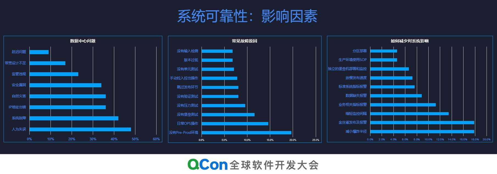
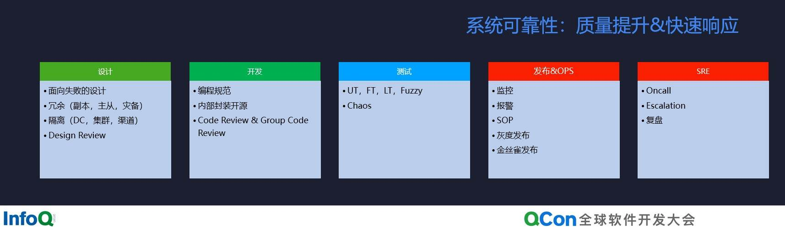
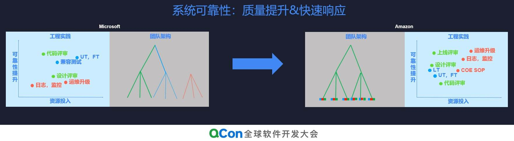
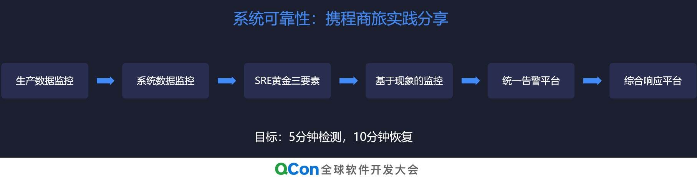
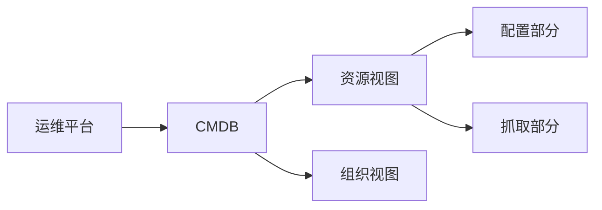

# 运维体系建设

```text
方案一：蓝鲸
    优势：
        传统运维体系的典范，开源版本有人持续维护，常见运维体系都包含。
        一次性较为全面的提高整体运维能力
    缺点：
        组件太多太复杂，不符合微服务化的设计，导致运维压力大。
        系统改动麻烦，部分模块未开源。
    投入：
        除机器投入外。
        至少一人对接开发。
        一到二人的运维投入。
方案二：webank
    研究中
方案三：bigops等
    缺点：
        闭源或者代码质量不高。
        没有CICD逻辑等。
    投入：
        无底洞
方案四：基于jenkins逻辑优化
    优点：
        已经有流程，只需要优化即可
    缺点:
        脚本驱动，需要优化大量脚本。
        不够体系化，只能解决单一问题，无法发现未知的内容。
    投入：
        一个人根据业务及大家的要求，持续优化即可

方案五：自建完整的运维体系
    优点：
        能够根据自己的需求进行开发。
        功能完全贴合业务场景。
        能够用完整的运维体系，交叉验证，保障服务的高可用。
    缺点：
        从头开始造轮子。
        开发代码质量不可控
        很多内容无法保障可移植性
    投入：
        一个或两个全职开发
        一个专业运维，兼任产品、测试、运维。
```

## 携程分享








```json
# 查询 devops|cmdb|root
# 查询 devops|cmdb|model
[{
    "name":"ZLH",
    "nodeType":""
}]

```

## 通知聚合平台

|功能点|说明|具体实现方式|
|---|---|---|
|订阅管理|用户接受信息的逻辑|增删查改,订阅取消|
|Topic管理|消息处理的核心功能|分布式处理、对接消息中间件、消息自监督、延迟发送、合并发送、事件回调,设置消息可见范围,已阅管理|
|模板管理|不同消息的套用内容|占位符、内置变量、模板解析|
|通道管理|实际发送介质|通道管理、监控验证|
|消息监控分析|核心监控内容,核心分析干预功能|分析报表、监控预警|

### 底层设计

```json
消息结构：
{
    msgId: "UUID",
    content: "内容",
    topicId: "消息对象"
}
消息Topic结构:
{
    topicId: "UUID",
    templateId: "消息模板",
    reciver:[{
        reciverId:XXXXX,
        reciverObj: 'xxxx',
        channel:"覆盖的接受通道",
    }],
    desc: XXXX,
    msgType: XXXXX,
    policy: policyType,
    channel: "发送通道",
    pushSecret: "*********"
}
消息类型msgType:
{
    msgTypeId: "UUID",
    msgTypeName: "XXXXX",
    msgTypeRules: [
        {
            name: "立即发送",
        },{
            name: "延迟发送",
        },{
            name: "合并发送"
        }
    ]
}

消息类型channelType:
{
    channelId:"UUID",
    channelName: "通道描述",
    channelProps: {
        "通道参数描述"
    },
    channelDesc: "更多功能性描述"
}
```

消息RecevierWork: 在redis中没有找到对应的TopicID,sleep 1s,Try again, 再通知master重建redis信息
