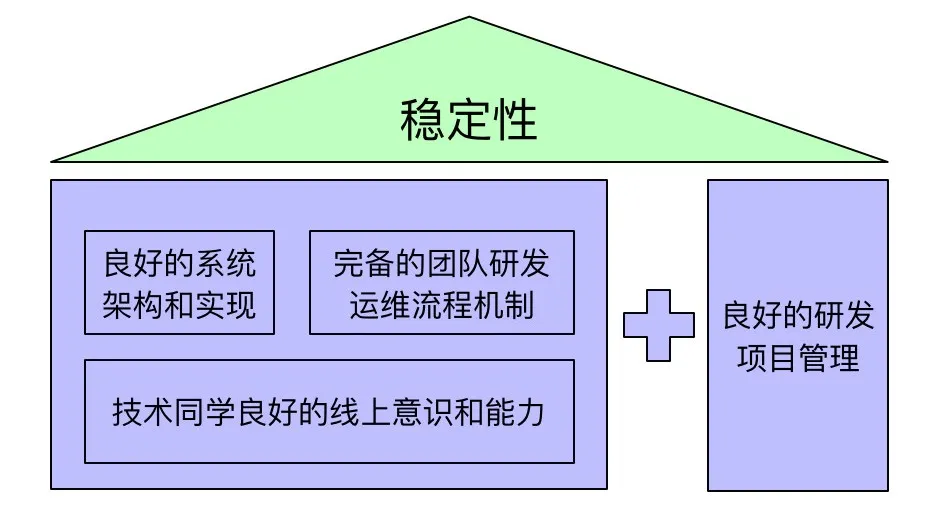
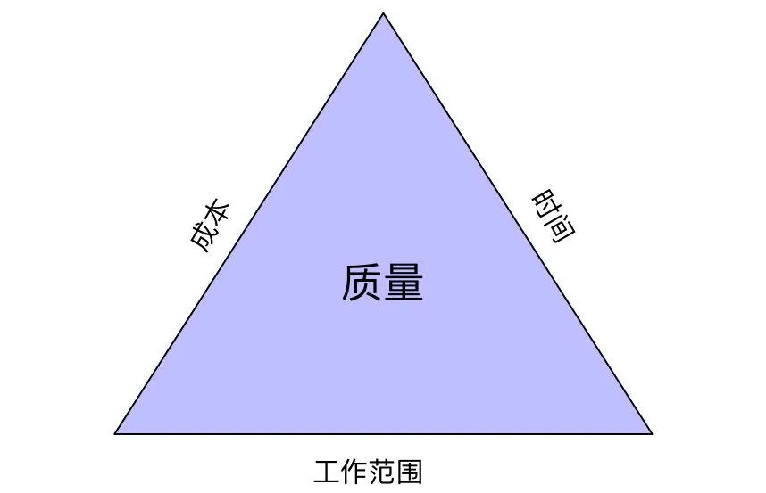

# 高可用系统建设导论

> [3+1保障：高可用系统稳定性是如何炼成的？](https://mp.weixin.qq.com/s/sg-1GCXv5k0wkekPtmygeA)「作者: 承霄」

## 一、概述

自己以及带领的团队曾经负责较多不同类型的互联网服务系统，如几十万应用数&亿级流量的云计算平台、年营收将近千亿的广告系统、亿级用户千万级日活的钉钉工作台系统、亿级交易额的钉钉市场&交易系统、算法在线离线工程系统等相关系统或子系统，整体而言无重大故障，达到定级故障数也很少，线上稳定性保障在一个不错的水位上。阶段性总结下我从团队技术负责人视角做好稳定性建设的实践性思考和简要思路，为感兴趣的技术同学提供一个实践指南。

我的团队稳定性建设思路包括了3大技术要素：良好的系统架构和实现、完备的团队研发运维流程机制、技术同学良好意识和能力，以及1个业务要素：良好的研发项目管理。

## 二、良好的系统架构和实现

### 1 架构设计

> 根据不同系统业务特点、不同发展阶段（系统规模、团队规模）、不同系统指标侧重性要求等，有很多不同的架构思路和折中考量，例如存储选型、服务化治理、中间件选型、中台系统抽象等。本文简要讲述会影响系统稳定性的一些架构设计点以供参考，设计考量点具体内容可自行搜索细看。

消除单点

>从请求发起侧到服务处理返回的调用全链路的各个环节上避免存在单点（某个环节只由单个服务器完成功能），做到每个环节使用相互独立的多台服务器进行分布式处理，要针对不同稳定性要求级别和成本能力做到不同服务器规模分布式，这样就避免单个服务器挂掉引发单点故障后进而导致服务整体挂掉的风险。可能涉及的环节有端动态获取资源服务(html& js &小程序包等)、域名解析、多服务商多区域多机房IP入口、静态资源服务、接入路由层、服务逻辑层、任务调度执行层、依赖的微服务、数据库及消息中间件。

* 消除单点的策略：
  * 在服务逻辑层采用多运营商多IP入口、跨地&同地多机房部署、同机房多机器部署、分布式任务调度等策略。
  * 在数据存储层采用数据库分库分表、数据库主从备集群、KV存储&消息等分布式系统集群多副本等策略。
  * 有分布式处理能力后，需要考虑单个服务器故障后自动探活摘除、服务器增删能不停服自动同步给依赖方等问题，这里就需引入一些分布式中枢控制系统，如服务注册发现系统、配置变更系统等，例如zookeeper是一个经典应用于该场景的一个分布式组件。

数据一致性

>在分布式处理以及微服务化后，相关联的数据会存在于不同的系统之中，相关联的数据库表、数据存储、缓存等数据会因为架构设计或子系统抖动故障失败等原因，导致彼此数据出现不一致，这也是一类稳定性故障。最简单的一致性，就是关系型数据库的同请求内同库相关联的多个数据表更新的一致性， 这个可通过数据库的事务以及不同事务级别来保证。从架构层面，数据一致性也会根据业务特点，做强一致性、最终一致性的架构选型，不同选型根据CAP理论，也会带来可用性以及分区容忍性的一些折衷。
>
>在做好SLA高的基础系统选型、分布式事务中间件使用、幂等设计，针对性提升好微服务本身SLA后，可根据不同数据一致性级别要求，考虑通过消息触发多系统对账、定时调度对账、子流程失败后主动投递消息延迟重试、消息消费失败后回旋重试、数据库记录过程中状态后做定时调度扫描未成功记录后重试、离线全量对账。缓存更新机制不合理也容易引发缓存和数据库之间数据不一致，一般在数据更新时考虑并发更新时缓存删除优先或固定单线程串行更新策略。
>
> 复杂分布式业务系统或微服务化治理后，基于消息中间件的解耦是普遍方式，这时选择一个确保自身不重不丢以及高SLA消息中间件非常重要，利用消息中间件自身的多次回旋重试基本能保障很高的最终一致性，数据一致性要求更高的，再配合不同级别对账机制即可。

强弱依赖梳理和降级

> 当服务依赖各类微服务时，避免强依赖（依赖服务挂掉会到自己服务挂掉），尽可能在对应服务出现问题时做到自动降级处理（弱依赖）或者手工降级，降级后依赖服务功能局部去掉或做合适局部提示，局部体验上有部分降级，但不会让主链路和整体功能挂掉。对于稳定性要求很好的关键系统，在成本可接受的情况下，同时维护一套保障主链路可用的备用系统和架构，在核心依赖服务出现问题能做一定时间周期的切换过渡（例如mysql故障，阶段性使用KV数据库等），例如钉钉IM消息核心系统就实现对数据库核心依赖实现一套一定周期的弱依赖备案，在核心依赖数据库故障后也能保障一段时间消息收发可用。
>
> 强依赖的服务越少，系统整体基础稳定性就越高。部分特殊数据依赖多于逻辑依赖的系统，做去依赖架构设计也是一个思路，将依赖服务数据统一整合到自有服务的数据存储中，通过消息 或定时更新的方式更新，做到不依赖 或少依赖其他系统，进而提高稳定性，但这样做也会有副作用：数据冗余可能会引发不同程度一定时间窗口数据不一致性。

热点或极限值处理

> 业务规模以及数据规模大的部分系统，在系统中会出现数据热点、数据极度倾斜、少量大客户超过极限阈值使用等极限场景，例如超级大客户广告投放物料、广告点击展示数据、API调用频次都是比普通客户大很多，如果按照客户维度分库分表，基本在物料更新、查询、报表查看等一系列的场景都可能导致单库抖动，这除了影响大客户自己外也会影响分布在该分库分表上所有普通客户。电商中极度畅销商品以及秒杀、企业IM中大组织群&大组织涉及全员关注更新行为、微博等订阅类明星大V的信息发布等都是少量极限场景可能会引发整体系统稳定性问题。因此，架构设计时，要分析自己系统中是否存在极限场景并设计对应方案做好应对。
>
> 极限场景中不同类型场景处理架构方案也不一样，可能的方式：
>
> * 大客户从普通客户分库分表中拆出来隔离建库表，隔离享用专有资源以及独立库表拆分路由逻辑以及隔离服务逻辑计算资源；
> * 大客户特定极限数据计算做预约计算以及预加载，在低峰期预约或提前优化完成；
> * 秒杀系统极限值可以考虑核心逻辑简化+消息解耦、同商品库存拆分独立交易、部分查询或处理KV存储替代关系型存储、数据提前预热加载、排队、限流策略等策略；
> * 大组织IM场景设计合适读扩散或写扩散的策略，同时针对业务特点（不同人延迟度不一样）做到不同人员体验平滑，或者为大组织或大V提供专属计算存储资源或专属查询更新逻辑。
> * 在特定极限值系统架构以及资源无法满足的情况，产品侧以及技术侧要明确采用最高阈值调用限制。

资金交易类系统要仔细考虑资损的风险

> 交易系统对于数据准确性、一致性、资金损失等都是很敏感的，这一块在是否使用缓存、事务一致性考量、数据时延、数据不丢不重、数据精准核对和恢复等需要额外架构设计考量。仔细评估交易以及营销的全链路各个环节，评估其中出现资损的可能性以及做好应对设计，例如增加多层级对账、券总额度控制、异常金额限制和报警等资损防控的考量等。不同层次不同维度不同时间延迟的对账以及预案是一个重要及时感知资损和止血的有效方式。全链路的过程数据要做好尽可能持久化和冗余备份，方便后续核对以及基于过程数据进行数据修复，同时尽量针对特殊数据丢失场景提供快速自动化修复处理预案（如交易消息可选择性回放和基于幂等原则的重新消费）。

离线数据流

> 基于数据的搜索推荐、机器学习算法系统、数据产品等，核心功能依赖离线产出 或 增量产出数据，这类数据可能规模大、来源广、生产链路长，在整体生产和传输链路中，很容易出现数据少量丢失、部分环节失败、数据生产延迟等情况，最终消费在线系统也很难感知少量数据错误进而导致故障。
>
> 针对离线数据流，要增加不同传输环节数据完整性校验、不同生产环节数据正确性校验、数据延迟监控、数据生产失败监控、端到端数据正确性规则校验、数据错误或延迟兜底预案、数据回滚重刷工具等机制。机器学习类系统还要考虑离线特征和线上特征数据一致性，确保离线训练的模型，线上预测应用效果是一致的，因此模型上线时以及线上定期做离线和线上特征数据一致性核对。

其他异常情况处理

> 整体系统架构，除了正向逻辑、性能、扩展性设计等外，要增加一个异常设计视角，穷尽思考各类异常情况以及设计应对策略。

### 2、容量评估设计

> 系统设计整体至少考虑应对5到10倍或近1到3年系统规模增长，要保障后续通过增加机器资源等快速方式能实现系统水平扩容。例如分库分表的规模提前设计好提前量，避免临时数据库能力不足导致需要临时重构扩容（增加分库分表以及修改路由以及迁移数据）；服务逻辑层设计持有数据状态导致无法加机器做服务层扩容。互联网产品发展变化较快，不一定会如期爆发，容量架构设计上也要注意不要过度提前设计，避免提前复杂化引发研发效率以及机器成本问题。
>
> 针对线上流量峰值，建议系统常态保持近期峰值3倍左右容量余量，上线前和上线后要定期做压测摸高，写流量可用影子表等方式做压测，压测可单接口以及模拟线上流量分布压测结合，根据压测结果优化架构或扩容，持续保持容量富余。
>
> 对于可能超过系统现有容量的突发峰值，限流策略是线上要配置的策略。入口侧入口流量调用 、不同渠道服务依赖调用、对依赖服务的调用都要评估可极限调研的上限值，通过中间件等合适方式限制超过阈值调用，避免引发雪崩效应。特定业务系统，对于超过峰值流量，可以通过消息架构以及合适体验设计做削峰填谷。针对恶意攻击流量也要考虑在入口层部署防DDOS攻击的流量清洗层。
>
> 部分系统峰值变化较大且需要持续尽可能承载保障，可考虑引入弹性伸缩策略，预约 或根据流量变化触发系统自动扩缩容，以确保以尽量小成本来自动化满足变化峰值。

### 3、运维方案设计

> 系统要考虑持续迭代发布变更以及线上运维的诉求，做到可灰度、可监控、可回滚。
>
> 可灰度保障及时在小流量情况，发现问题，避免引发大范围故障。因此在做系统任何变更时，要考虑灰度方案，特别是大用户流量系统。灰度方式可能有白名单用户、按用户Id固定划分后不同流量比例、机器分批发布、业务概念相关分组分比例（例如某个行业、某个商品、某类商品）等，灰度周期要和结合系统风险和流量做合适设计，重要系统灰度周期可能持续超过一周或更多。
>
> 监控项要系统性确认是否完备以及保持更新，可能监控项：错误日志前端js错误、用户体验到的性能和白屏率、接口成功率、依赖服务成功率、机器基础负载相关监控（CPU利用率、cpu Load、内存、IO、网络等）、服务基础监控（端口、进程、状态探活、JVM full gc、OOM等）、数据库负载监控、数据库慢请求、流量同比剧烈变化。监控项的报警策略也要根据业务系统特点以及监控项的特点，做不同报警策略设计，例如秒级&分钟级报警、错误率报警、错误日志次数报警、连续出错报警等。核心监控可摘要一个监控大盘，一个大盘快速判断服务稳定性情况。
>
> 可回滚：新增功能增加配置开关，当线上出现问题时，可通过关闭功能开关，快速下线最新升级 或部分有问题功能。针对不同出错场景，有配置驱动一些预案，例如降级对某个服务的依赖、提供合适功能维护中公告、切换到备用服务等预案，在特定问题出现时，可以快速做线上止损和恢复。发布功能注意提前考虑出现问题时快速回滚步骤，部分经常发布注意对回滚步骤做演练。

### 4、安全设计

> 数据以及应用安全问题一旦出现可能很致命，一定要加以考虑。安全是一个比较专业领域，常规在针对业务系统经典安全场景做好考量的同时，尽量引入专业安全技术同学评估。所有资源访问需要合适鉴权，避免越权访问；防Sql注入等攻击，做参数合法性校验；资源消耗频次管控，如短信资源等；用户防骚扰，设置用户通知、弹屏等触达阈值和频次；敏感信息过滤或脱敏等。

### 5、高质量的代码实现

> 合适实现和经典性实践是非常重要代码质量保障的方式，大量线上问题还是由少量代码细节考虑不周全和经验不足引发的。这方面考量不同语言都会有自己一些最佳的实践，例如Java，可以参考《Java开发手册》。比较通用保障方式是分支覆盖完备的单元测试 、线上引流回归测试、完备回归测试用例等测试质量保障措施。

## 三、团队研发运维流程机制

> 稳定性涉及团队所有不同水平同学、所有系统、研发所有环节、线上时时刻刻，单个同学是无法保障好的，必须建立团队流程机制来可持续保障。
>
> * 主要流程机制如下：
>   * 技术Review：不同体量设计安排经验更加丰富同学Review，架构师、主管、外部架构师的Review、定期系统整体Review等。
>   * 代 码Code Review：建立规范和标准，通过CR认证合格同学执行code review动作。
>   * 单测：不同风险的系统设定尽量高的行覆盖 & 分支覆盖率标准，复杂逻辑类追求100%分支覆盖。
>   * 回归测试：持续积累回归用例，在上线前和上线后执行回归动作；上线前线上引流测试也是一种模拟测试方式，端类型系统还可以用monkey工具做随机化测试。
>   * 发布机制：设计发布准入和审批流程，确保每次上线发布都是经过精细设计和审核的，上线过程要做到分批、灰度、支持快速回滚、线上分批观察（日志确认）、线上回归等核心动作。建立发布红线等机制，不同系统设计合适发布时段以及发布灰度观察周期。
>   * 团队报警值班响应机制 （报警群、短信、电话）：确保报警有合适人员即时响应处理，团队层面可定期做数据性统计通晒，同时建立主管或架构师兜底机制。
>   * 定期排查线上隐患：定期做线上走查和错误日志治理、告警治理，确保线上小的隐患机制化发现和修复。例如在钉钉针对企业用户早晚高峰的特点，设计早值班机制，用于高峰期第一时间应急以及每天专人花一定时间走查线上，该机制在钉钉技术团队持续践行多年，有效发现和治理了钉钉各个线上系统的隐患。
>   * 用户问题处理机制：Voc日清、周清等。在钉钉也经历Voc周清到日清的持续机制精进。
>   * 线上问题复盘机制：天内、周内问题及时复盘，确保针对每个线上问题做系统和团队精进。
>   * 代码质量抽查通晒：定期抽查团队同学代码，做评估和通晒，鼓励好的代码，帮助不好代码的改善。
>   * 成立稳定性治理专门topic：合适同学每周做好稳定性过程和精进。
>   * 定期压测机制：定期机制化执行，核查线上容量情况。
>   * 日常演练机制：预案演练，模拟线上故障的不通知的突袭演练提升团队线上问题应对能力。
>
> 流程机制要和团队同学共创达成一致后，配合建立topic负责人机制，对流程机制执行度和执行效果要做好过程监测和通晒，建立明确数字化标准和衡量机制（例如钉钉技术团队针对线上问题设定1-5-10标准，1分钟响应5分钟内定位10分钟内恢复），同时建立对应奖惩机制。流程机制也要根据系统状态进行精简或精进，确保流程机制可执行性和生命力。

## 四、技术同学意识和能力

> 人的意识是最重要的，专业能力可以锻炼培养。如果意识不足或松懈，好的能力以及机制流程也会形同虚设。
>
> 永远要对敬畏线上，敬畏客户体验。面向线上的稳定性战术上可以基于专业度锻炼后自信，但战略和思想上必须持续如履薄冰、三省吾身。线上稳定性保障是作为技术人自己专业度的追求和必须保持初心，始终保持敬畏。不因为业务繁忙、个人心情状态、团队是否重视而有变化，只要职责在，就要守护好。技术主管以及系统owner要有持续感知稳定性隐患和风险，保持锐度，集中性以及系统性查差补漏。

### 1、团队对线上敬畏的一些具象体现和要求

每个报警不要放过，每个报警及时响应处理

> 快速定位和快速恢复是个人以及团队专业能力沉淀，但快速报警响应是每个敬畏线上敬畏用户体验的技术同学可以做到的。
>
> 在监控完备和持续前提下，每个报警及时处理即可以降低故障影响范围，也会持续减少小的隐患。报警一些小的实践技巧：报警按照方向收敛报警群，建立报警天级值班机制，报警短信手机设置为震动模式（不打扰同空间家人或朋友情况下，自己第一时间感知），主管要订阅报警作为团队报警兜底处理人，报警响应好的同学和不好的同学要数据化表扬和批评。
>
> 从团队角度，报警及时响应必须配合报警治理进行，否则过多无效报警也会让有责任心的同学变得麻木。所以必须控制无效报警的数量，例如单应用无效报警（不需要线上问题进行定位以及修复处理的）不要超过5条，个人维度无效报警天级别不超过10条。

线上问题要复盘，不论是否为定级故障，不论问题大小

> 小的线上问题也要复盘，复盘准备度可以低于定级故障，但都需要思考反思以及落实优化Action。小的线上问题就是未来线上故障的前兆。我们团队周会上都会有一个环节，上周如有线上问题则会安排对触发人做复盘。

错误日志要重视

> 要定期分析线上错误日志，隐患的问题是藏在错误日志中的。我们现在技术团队会有早值班机制，每个方向每天都有一个技术同学走查线上，以发现线上隐患问题为导向，走查监控大盘、错误日志、用户反馈，通过这个例行机制，很好地防微杜渐。

每个用户反馈要重视，定位到根本原因

> 一个用户反馈背后必然有多个实际线上问题，只是这个用户无法忍受，知道反馈路径以及对这个产品有热爱 或强依赖才选择反馈的。彻底定位一个voc，就是修复了一类线上问题。而且到用户反馈的程度，这个线上问题就已经有一定程度用户体验影响了。我们现在技术团队有一个voc日清机制，针对线上voc问题对用户做好日内响应答复，也是一个不错对于这个意识的数字化衡量。

### 2、能力培养

> 单个技术同学个人技术以及稳定性保障能力是团队在每个稳定性任务上拿到结果的执行者和基础，因此技术主管重视识别不同同学个人优势和不足，针对性做工作安排以及培养锻炼。只要线上意识上足够重视，能力对于大部门技术同学是可以培养的。
>
> 团队内同学由于入行时间、历史经验等各方面原因，对于当前系统稳定性保障能力是有强弱的差异的，对于个人是正常情况，但对于团队而言，不能因为团队个别同学能力上存在不足而引入团队层面稳定性保障风险。需要主管很好熟悉以及判断同学能力段位，在负责系统和模块、流程机制约束、辅导人等方面做好差异化安排。例如校招同学X个月不做线上发布，前X个月发布有师兄协同发布机制，并发高 或资金交易等等风险高的系统让更加有经验的负责。同时设计培养机制，能力当前不足但有潜力的同学，可以安排由经验丰富的同学指导以及提供一些进阶实操路径，按照节奏从易到难逐渐承担更高风险的系统职责。
>
> 能力培养方式有技术Review、代码CR和辅导、参与团队稳定性保障机制、安排合适师兄指导、过程中主管指导、逐渐承担更高职责等。代码层面，对于Java同学来说， 《Java开发手册》是一个很好的实践性指南，超出代码风格，提供了日志、异常处理、集合等库使用、数据库设计、分层设计等多个提升代码质量的实践做法，我们自己团队所有Java研发同学都会100%通过阿里云上阿里巴巴代码认证考试，同时团队有一个团队内新人品码机制，同时钉钉大技术团队层面有一个品码会机制，这些都是不错地培养同学写出好代码的培养方式。
>
> 好多小团队、大团队、公司都有很多不错提升稳定性机制和案例，积极主动参考学习以及结合自己业务系统思考践行，是自己提升重要路径。架构上高可用以及架构相关经典书籍自我学习，从理论上做系统性认知也是有必要，相关书籍网上有很多推荐，例如《高性能网站建设》、《大型网站系统与Java中间件实践》等。
>
> 少量的同学在主管和团队尽可能帮助和辅导后在稳定性性保障的意识和能力上持续不能达标，这类同学要做好阶段性高风险系统隔离以及坚定做汰换。对业务、客户体验、团队内其他同学负责，及时汰换他以降低这一块稳定性风险。

## 五、良好的研发项目管理

> 从经验看，线上系统大部分故障是由新的变更引入和触发的，变更是业务和产品迭代演进方式，因此不可能没有变更，但我们可以对变更项目做合适质量管理，进而有效提高线上稳定性。
>
> 项目管理的四要素：工作范围（需求）、时间（交付时间）、质量、成本（人 & 机器资源等），简称STQC，这四个要素是相互关联的和制约的，形成一个项目管理质量管理铁三角，一个要素变动就会影响到其他要素，因此要保障好质量就必须要考虑怎么管理好其他三个要素。
>
> 此外，我们可以进一步理解项目成功的要素，以终为始聚焦考虑如何提升实际影响成功的质量，成功的项目不仅取决于项目本身从开始到结束的执行过程，还取决于开始前和结束后的努力。成功的项目应该取决于三个阶段的努力：
>
> * 项目开始前必须 “了解什么是客户的成功”，只有客户成功了项目才能成功；——理解客户真正的需求。
> * 项目执行中能够“担负客户成功的责任”，按要求完成承诺的工作。
> * 项目结束后能“帮助客户实现价值”，只有客户说项目成功了才是真正的成功。——帮助客户实现业务目标、用户价值目标、商业价值目标。
> 
>
> 互联网产品迭代速度很快，推崇快速推出、快速试错、快速占据市场先机，交付时间的快是互联网产品、业务同学对于研发团队显性的要求，而交付质量和线上持续稳定则是一个隐性需求，产品业务默认研发团队应该做到，但往往在时间、成本等方面没有给予显性考虑，这一块就需要研发项目管理同学主动评估考量进来，有自己专业判断和坚持。
>
> 理解好真正的客户需求和交付后客户价值的实现，可以帮助在四要素冲突的时候合适取舍需求来保障时间和质量，以及和业务产品&客户基于客户价值实现争取时间、资源来保障质量。项目管理角度稳定性保障基本动作包括确定和充分理解帮助客户成功的需求范围、控制好需求变更、预留质量保障环节时间、动态管控交付预期时间、争取充足人力以及机器等成本资源。进阶动作：在提前了解和理解甚至共同参与制定业务战略和策略基础上提前规划需求范围和研发节奏&人员排兵布阵&架构布局、深入理解业务基础上协助做需求取舍和优化。
