# [健身动作大全](http://www.sohu.com/a/200333526_753570)

## 双平举

- 目标肌：三角肌后束 背部肌群
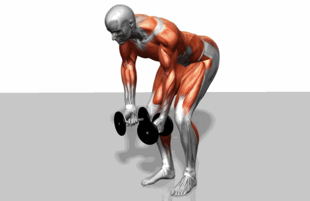

## 平板卧推

- 目标肌：胸部肌群 三角肌
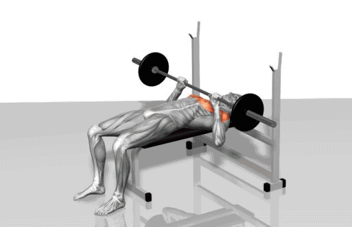

## 上斜板哑铃夹胸

- 目标肌：肩袖肌群 胸大肌
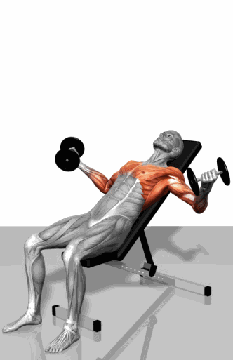

## 俯卧撑

- 目标肌：肩袖肌群 胸大肌
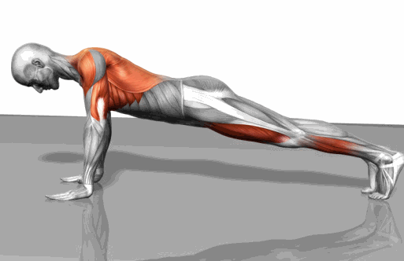

## 滚轮支点俯卧撑

- 上肢肌肉群 腰腹等核心部位
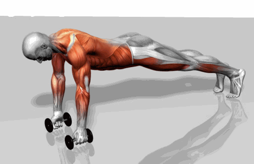

## 双杠臂屈伸

- 目标肌：肱三头肌
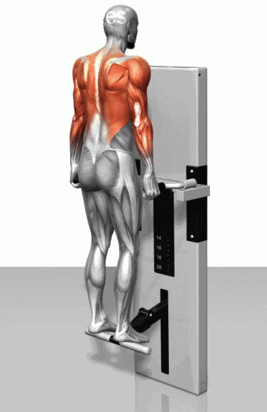

## 哑铃侧平提肩

- 目标肌：三角肌
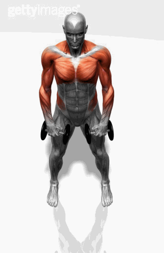

## 哑铃前平举

- 目标肌：三角肌前束
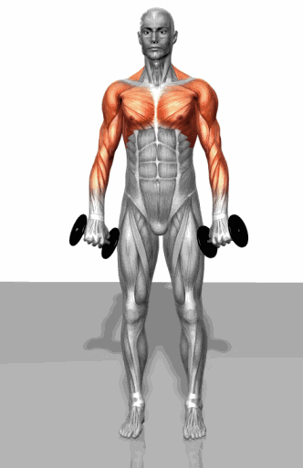

## 俯身哑铃划船

- 目标肌：背阔肌
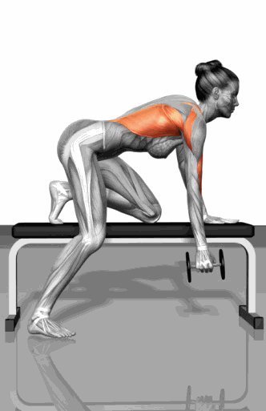

## 肢体哑铃推肩

- 目标肌：三角肌
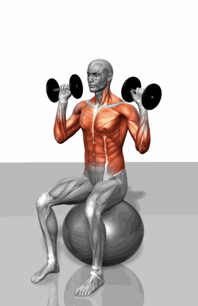

## 俯身背臀训练

- 目标肌：背部肌群 臀大肌
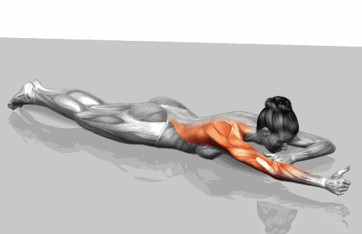

## 山羊挺身

- 目标肌：竖脊肌
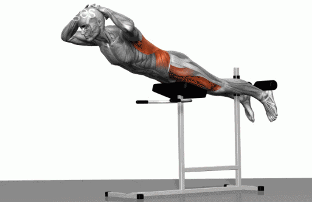

## 钢线下拉

- 目标肌：背阔肌
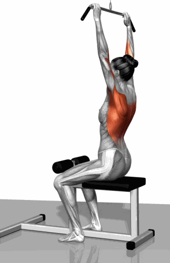

## 俯身杠铃双臂划船

- 目标肌：背部肌群
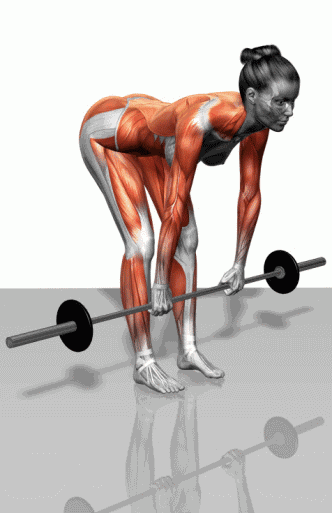

## 硬拉

- 目标肌：背腿臀等核心部位
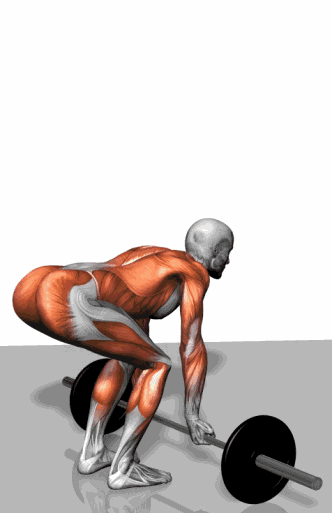
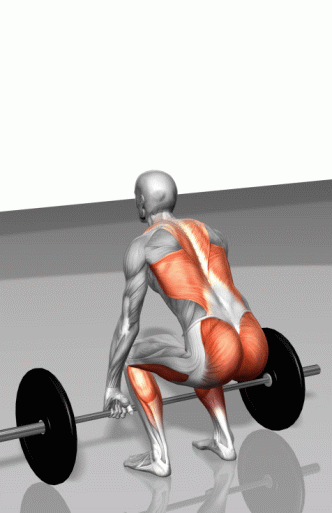

## 反手引体向上

- 目标肌：肱二头肌 背部肌群
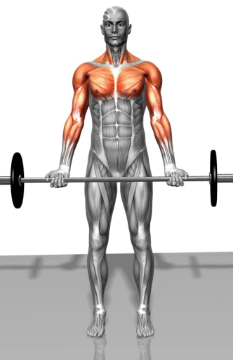

## 二头杠铃弯举

- 目标肌：肱二头肌
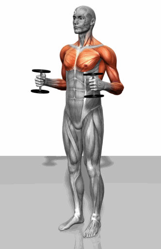

## 肱肌训练

- 目标肌：肱肌
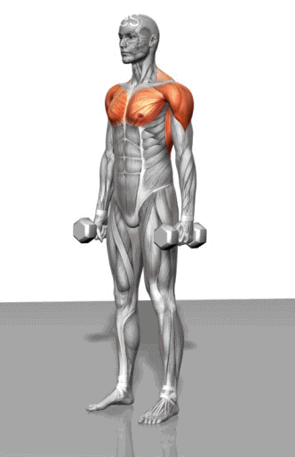

## 二头哑铃弯举

- 目标肌：三头肌
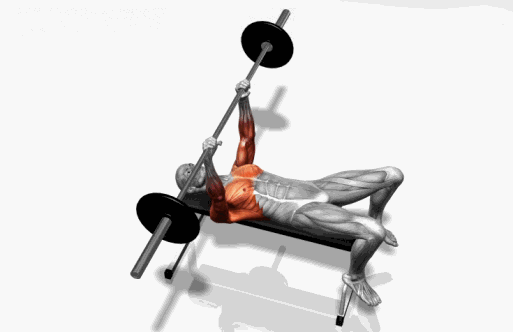

## 仰卧平板杠铃肱三弯举

- 目标肌：肱三头肌
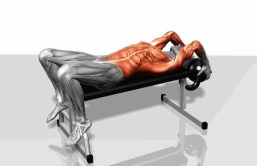

## 平凳肱三头肌训练

- 目标肌：肱三头肌
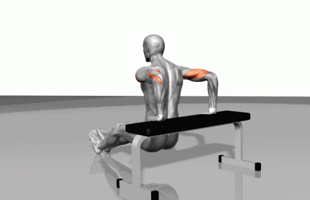

## 站姿哑铃提肩

- 目标肌：斜方肌
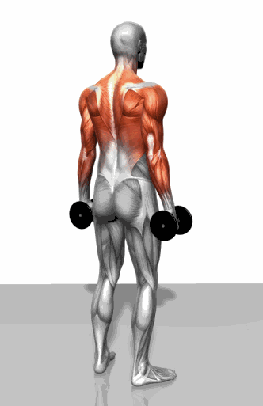

## 小臂伸收训练

- 目标肌：小臂
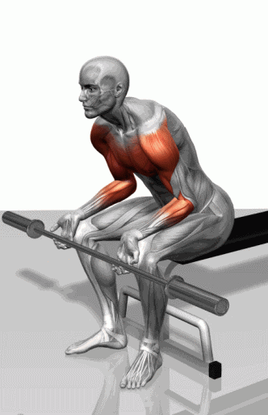

## 仰卧卷腹

- 目标肌：腹部肌群
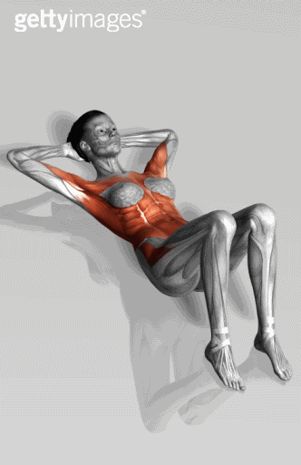

## 悬挂屈腿收腹

- 目标肌：腹部级群
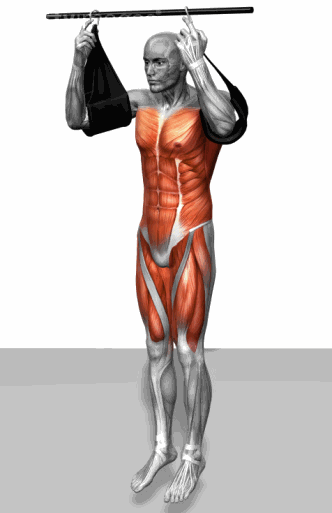

## 深蹲

- 目标肌：腿部肌群 臀大肌
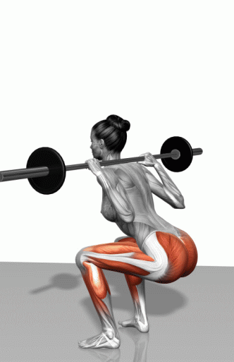

## 负重台阶单腿训练

- 目标肌：腿部肌群
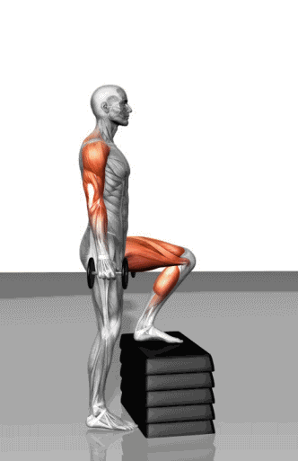

## 负重俯身单腿平衡训练

- 目标肌：腿部肌群、臀大肌
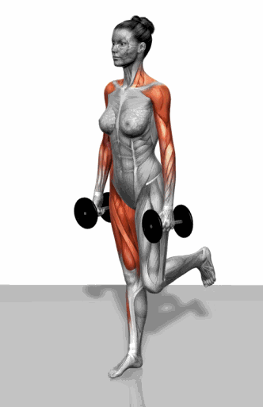

## 俯身单腿平衡训练

- 目标肌：大腿肌肉
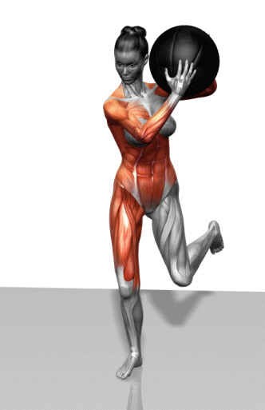